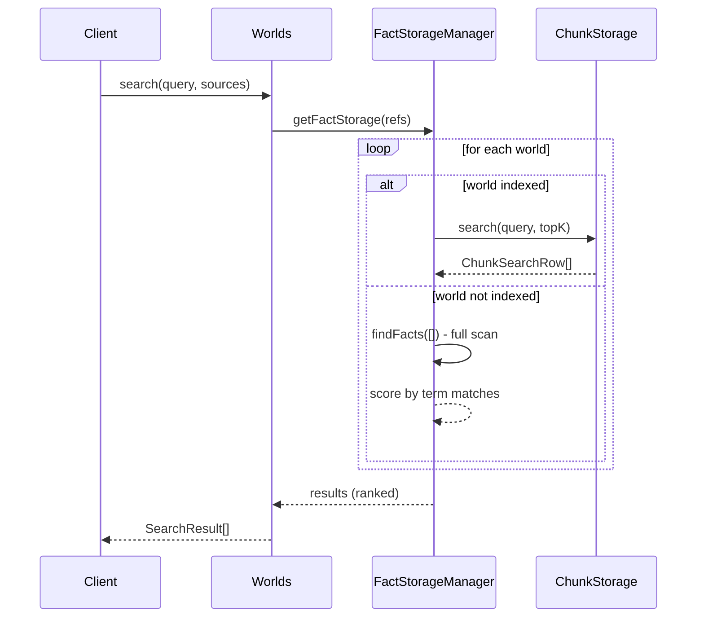
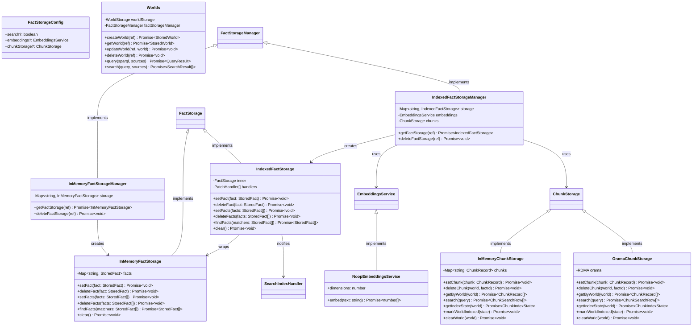
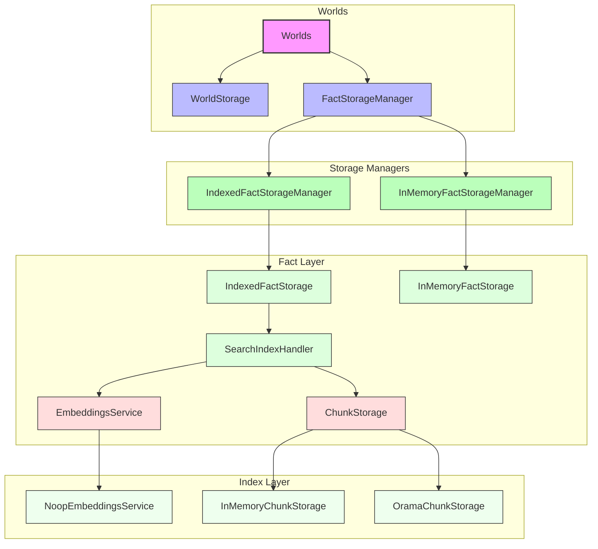

# Worlds API - Architecture Diagrams

## Interface Relationships


## Data Flow - Search Index Pipeline


## Data Flow - Search Query



## Implementation Hierarchy



## Storage Layers



## Key Types

### FactStorageConfig

```typescript
interface FactStorageConfig {
  search?: boolean; // undefined = use search (indexed), false = SPARQL only
  embeddings?: EmbeddingsService; // undefined = NoopEmbeddingsService
  chunkStorage?: ChunkStorage; // undefined = InMemoryChunkStorage
}
```

### StoredFact

```typescript
interface StoredFact {
  subject: string; // RDF subject (IRI or blank node)
  predicate: string; // RDF predicate (IRI)
  object: string; // RDF object (literal, IRI, or blank node)
  graph: string; // Named graph identifier
  objectTermType?: "NamedNode" | "BlankNode" | "Literal";
  objectDatatype?: string; // XSD datatype for literals
  objectLanguage?: string; // Language tag for language-tagged literals
}
```

### ChunkRecord

```typescript
interface ChunkRecord {
  id: string; // SHA-256 hash of factId:chunk:index
  factId: string; // Skolemized fact identifier
  subject: string; // From source fact
  predicate: string; // From source fact
  text: string; // Extracted/chunked text
  vector: Float32Array; // Embedding vector
  world: WorldReference;
}
```

## Directory Layout

The `src/worlds` package is organized to clearly separate application logic
(like `Worlds` and `SPARQL` orchestration) from data storage interfaces and
implementations:

```text
src/
├── api/                   # Presentation Layer (RPC handlers, OpenAPI)
├── core/                  # Application Layer (Orchestration, Worlds API)
│   ├── storage/           # Core metadata storage
│   ├── worlds.ts          # Main implementation
│   └── interfaces.ts      # Core interfaces
├── facts/                 # Facts Bounded Context (RDF, SPARQL, Storage)
│   ├── rdf/               # Serialization and parsing
│   ├── sparql/            # Query execution
│   └── storage/           # RDF triple persistence
│       └── index/         # Indexing handlers (Facts -> Search)
└── search/                # Search Bounded Context (Embeddings, Vector/FTS)
    ├── embeddings/        # Embedding providers
    └── storage/           # Chunk storage
```

## Usage Examples

### Setting up with InMemoryFactStorageManager

If you want a lightweight, in-memory implementation without search indexing
(SPARQL-only):

```typescript
import { Worlds } from "#/core/worlds.ts";
import { InMemoryWorldStorage } from "#/core/storage/in-memory.ts";
import { InMemoryFactStorageManager } from "#/facts/storage/in-memory-fact-storage-manager.ts";

const worlds = new Worlds(
  new InMemoryWorldStorage(),
  new InMemoryFactStorageManager(),
);

await worlds.createWorld({ namespace: "demo", id: "w1", displayName: "Demo" });
```

### Setting up with IndexedFactStorageManager

If you need vector search and chunking, use `IndexedFactStorageManager`:

```typescript
import { Worlds } from "#/core/worlds.ts";
import { InMemoryWorldStorage } from "#/core/storage/in-memory.ts";
import { IndexedFactStorageManager } from "#/facts/storage/indexed-fact-storage-manager.ts";
import { InMemoryChunkStorage } from "#/search/storage/in-memory.ts";
import { OpenAIEmbeddingsService } from "#/search/embeddings/openai.ts";

const chunkStorage = new InMemoryChunkStorage();
const embeddings = new OpenAIEmbeddingsService("sk-...");

const worlds = new Worlds(
  new InMemoryWorldStorage(),
  new IndexedFactStorageManager(embeddings, chunkStorage),
  { chunkStorage, embeddings }, // Provide search deps for global querying
);
```
