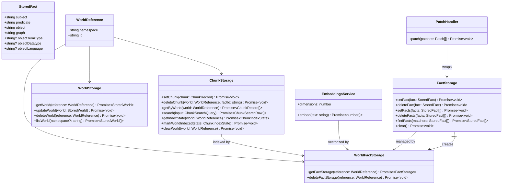
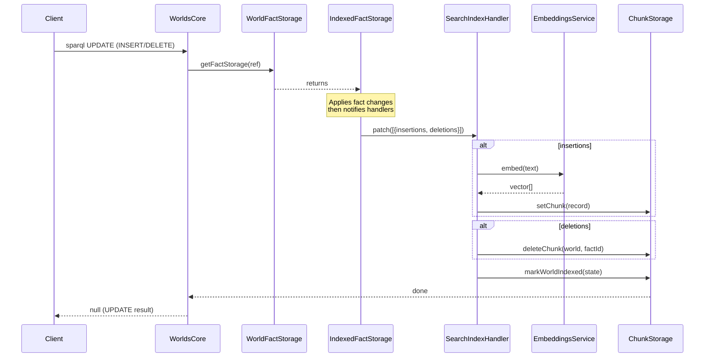
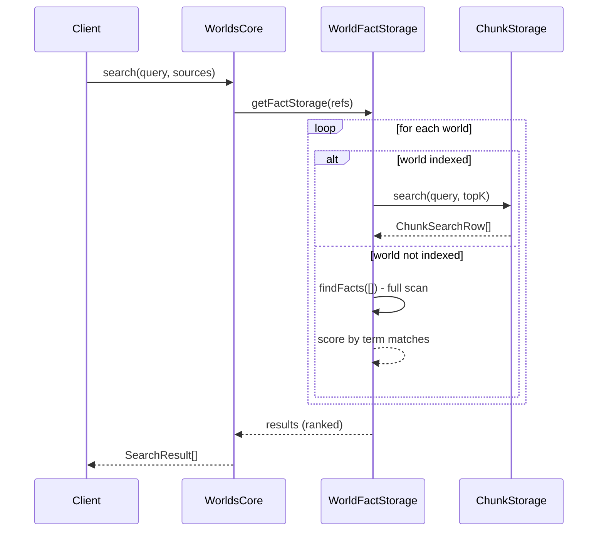
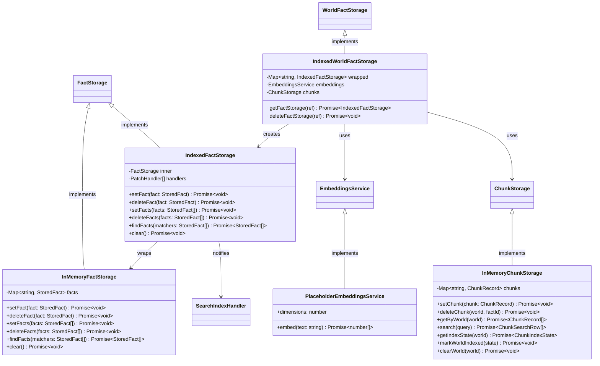
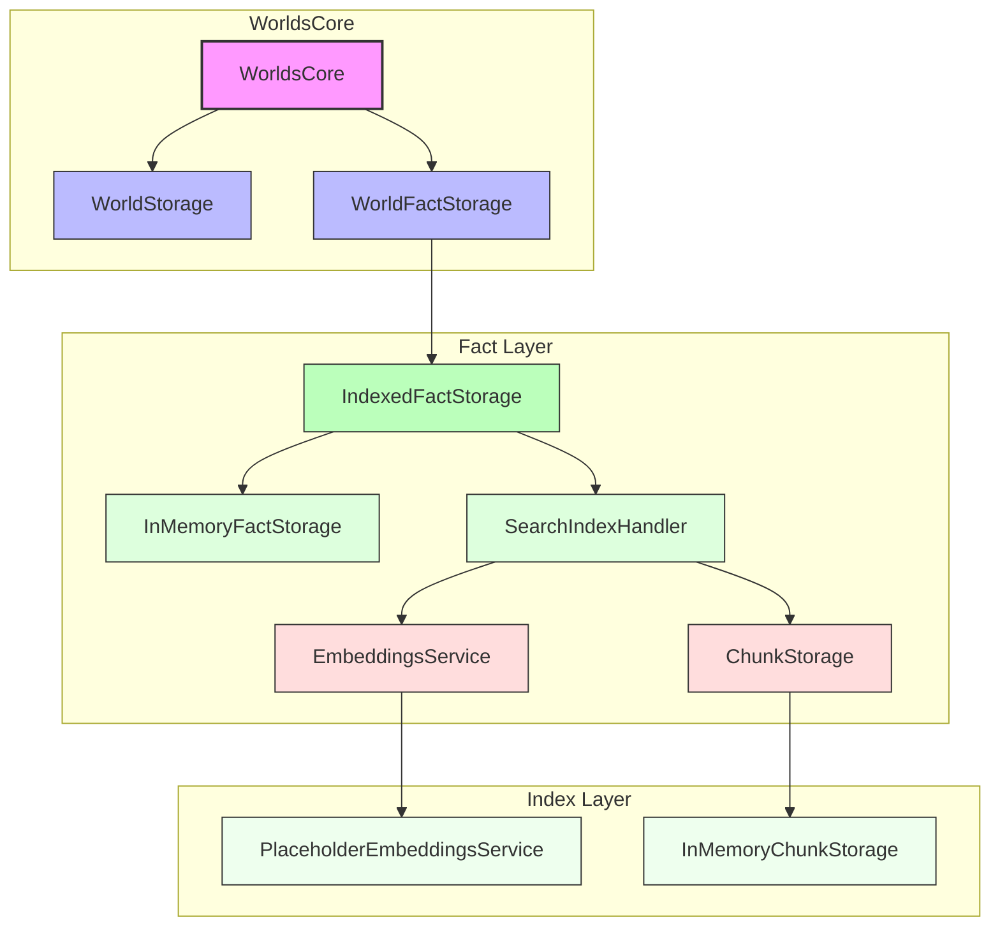

# Worlds API - Architecture Diagrams

## Interface Relationships



## Data Flow - Search Index Pipeline



## Data Flow - Search Query



## Implementation Hierarchy



## Storage Layers



## Key Types

### StoredFact

```typescript
interface StoredFact {
  subject: string; // RDF subject (IRI or blank node)
  predicate: string; // RDF predicate (IRI)
  object: string; // RDF object (literal, IRI, or blank node)
  graph: string; // Named graph identifier
  objectTermType?: "NamedNode" | "BlankNode" | "Literal";
  objectDatatype?: string; // XSD datatype for literals
  objectLanguage?: string; // Language tag for language-tagged literals
}
```

### ChunkRecord

```typescript
interface ChunkRecord {
  id: string; // SHA-256 hash of factId:chunk:index
  factId: string; // Skolemized fact identifier
  subject: string; // From source fact
  predicate: string; // From source fact
  text: string; // Extracted/chunked text
  vector: Float32Array; // Embedding vector
  world: WorldReference;
}
```
