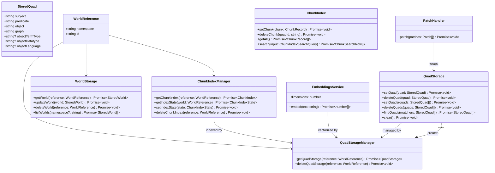
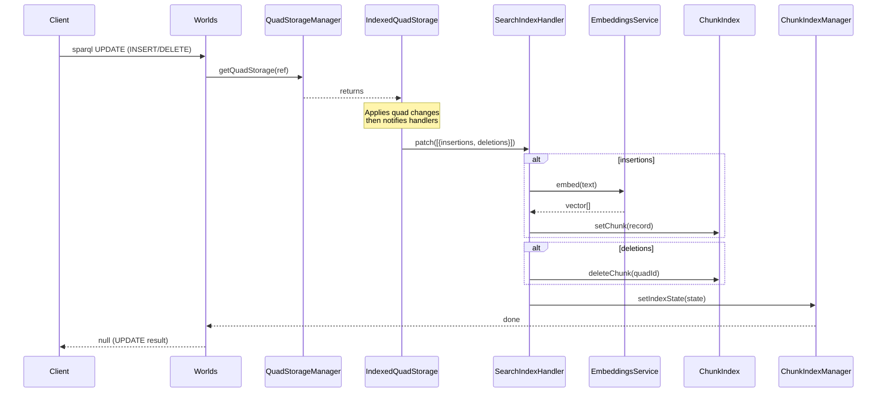
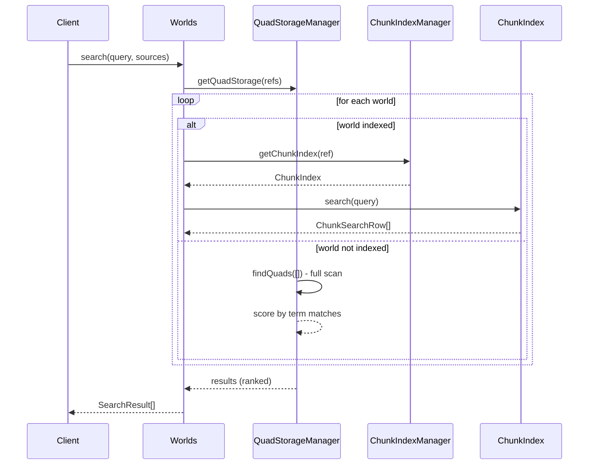
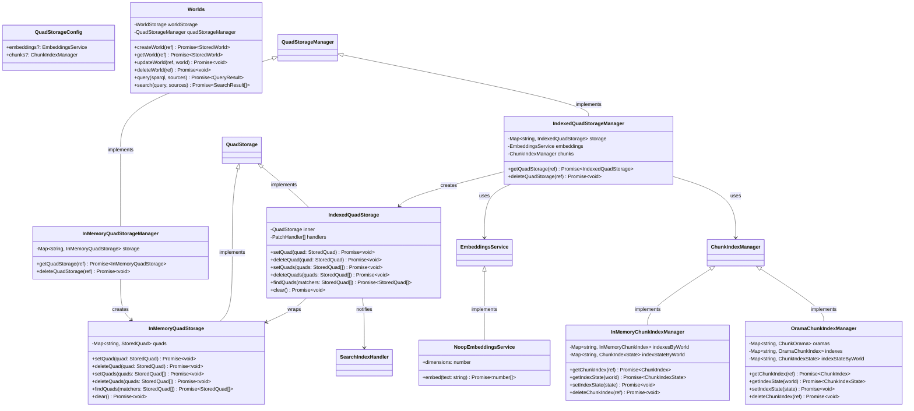
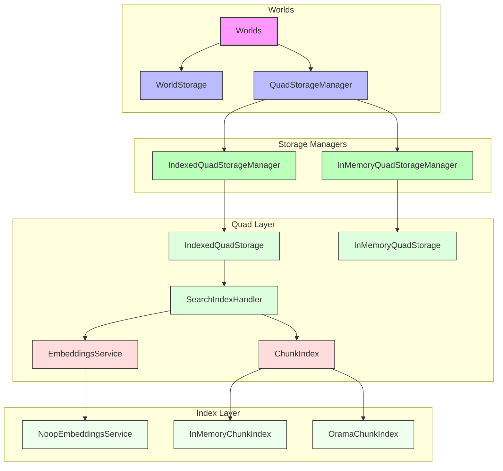

# Worlds API - Architecture Diagrams

> **Contracts**: See [CONTRACTS.md](./CONTRACTS.md) for API invariants, error
> taxonomy, and storage contracts.

## Indexing and identifiers

This section captures two frequently-confused concepts:

- **Skolemization for ingestion** (blank nodes → stable IRIs within an imported
  dataset)
- **Stable identifiers for quads / chunks** (content-derived IDs used as keys)

It also documents what gets added to the **chunk search index** and how that
pipeline works.

### Two “skolem” meanings

#### 1) Ingest-time blank node skolemization (dataset stability)

RDF blank node identifiers (`_:b0`) are scoped to a source document and should
not be treated as stable identifiers.

During ingest we:

- Parse RDF into quads
- Canonicalize the dataset (RDFC-1.0) so blank node labels are deterministic for
  that snapshot
- Replace any `BlankNode` terms in quads with `NamedNode` IRIs under a
  configured prefix

Code: `src/rdf/rdf/ingest.ts` uses `toSkolemizedQuad` + `resolveSkolemPrefix`.

#### 2) Content-derived stable IDs (quad / chunk keying)

For storage/indexing keys, we use content-derived opaque identifiers:

- **Quad id**: `skolemizeStoredQuad(quad)` → canonicalize the corresponding quad
  (RDFC-1.0) → base64url
- **Chunk id**: derived from the quad id + chunk ordinal (SHA-256)

These IDs are used for deterministic delete/update behavior in the chunk index.

Code: `src/rdf/rdf/skolem.ts` (`skolemizeQuad`, `skolemizeStoredQuad`), and
`src/indexing/handlers/rdf-write-indexing/search-index-handler.ts` (chunk ids).

### What gets indexed (chunked) for search

**Current policy:** a quad is added to the chunk search index **iff** its object
is a non-empty `Literal`. This aligns with the goal: **object values are the
search interest**.

Notes:

- Meta predicates (`rdfs:label`, `rdfs:comment`) are excluded from indexing.
- `NamedNode` / `BlankNode` objects are not embedded or chunked.

Code: `src/indexing/handlers/rdf-write-indexing/search-index-handler.ts`
(`shouldIndexTriple`).

### Indexing pipeline

1. Quad writes go through `IndexedQuadStorage` which emits patches
   (insertions/deletions).
2. `SearchIndexHandler` consumes patches and:
   - Computes quad id (`skolemizeStoredQuad`)
   - Chunks the literal object text (`splitTextRecursive`)
   - Embeds each chunk (`EmbeddingsService`)
   - Upserts/deletes chunk records in a per-world `ChunkIndex`
3. Queries go through:
   - `ChunkIndex.search(...)` (backend-specific)

- `indexing/chunks-search-engine.ts` for multi-world fan-out + ranking/merge

Backends:

- `src/indexing/storage/in-memory.ts`
- `src/indexing/storage/orama.ts`

## Interface Relationships



## Data Flow - Search Index Pipeline



## Data Flow - Search Query



## Implementation Hierarchy



## Storage Layers



## Key Types

### QuadStorageConfig

```typescript
interface QuadStorageConfig {
  embeddings?: EmbeddingsService | null;
  chunks?: ChunkIndexManager | null;
}
```

### StoredQuad

```typescript
interface StoredQuad {
  subject: string; // RDF subject (IRI or blank node)
  predicate: string; // RDF predicate (IRI)
  object: string; // RDF object (literal, IRI, or blank node)
  graph: string; // Named graph identifier
  objectTermType?: "NamedNode" | "BlankNode" | "Literal";
  objectDatatype?: string; // XSD datatype for literals
  objectLanguage?: string; // Language tag for language-tagged literals
}
```

### ChunkRecord

```typescript
interface ChunkRecord {
  id: string; // SHA-256 hash of quadId:chunk:index
  quadId: string; // Skolemized quad identifier
  subject: string; // From source quad
  predicate: string; // From source quad
  text: string; // Extracted/chunked text
  vector: Float32Array; // Embedding vector
  world: WorldReference;
}
```

## Directory Layout

The `src/worlds` package is organized to clearly separate application logic
(like `Worlds` and `SPARQL` orchestration) from data storage interfaces and
implementations:

```text
src/
├── api/                   # Presentation Layer (RPC handlers, OpenAPI)
├── core/                  # Application Layer (Orchestration, Worlds API)
│   ├── storage/           # Core metadata storage
│   ├── worlds.ts          # Main implementation
│   └── interfaces.ts      # Core interfaces
├── rdf/                   # RDF substrate (RDFJS conversion, SPARQL, quad storage)
│   ├── rdf/               # Serialization and parsing
│   ├── sparql/            # Query execution
│   └── storage/           # Quad persistence (writes can be wrapped to emit indexing patches)
└── indexing/              # Indexing subsystem (embeddings, chunk indexes, FTS helpers)
    ├── embeddings/        # Embedding providers
    ├── handlers/          # Index-on-write handlers (RDF writes -> chunk index)
    └── storage/           # Chunk index implementations
```

## Usage Examples

### Setting up with InMemoryQuadStorageManager

If you want a lightweight, in-memory implementation without search indexing
(SPARQL-only):

```typescript
import { Worlds } from "#/core/worlds.ts";
import { InMemoryWorldStorage } from "#/core/storage/in-memory.ts";
import { InMemoryQuadStorageManager } from "#/rdf/storage/in-memory-quad-storage-manager.ts";

const worlds = new Worlds(
  new InMemoryWorldStorage(),
  new InMemoryQuadStorageManager(),
);

await worlds.createWorld({ namespace: "demo", id: "w1", displayName: "Demo" });
```

### Setting up with IndexedQuadStorageManager

If you need vector search and chunking, use `IndexedQuadStorageManager`:

```typescript
import { Worlds } from "#/core/worlds.ts";
import { InMemoryWorldStorage } from "#/core/storage/in-memory.ts";
import { IndexedQuadStorageManager } from "#/rdf/storage/indexed-quad-storage-manager.ts";
import { InMemoryChunkIndexManager } from "#/indexing/storage/in-memory.ts";
import { OpenAIEmbeddingsService } from "#/indexing/embeddings/openai.ts";

const chunkIndexManager = new InMemoryChunkIndexManager();
const embeddings = new OpenAIEmbeddingsService({ apiKey: "sk-..." });

const worlds = new Worlds(
  new InMemoryWorldStorage(),
  new IndexedQuadStorageManager(embeddings, chunkIndexManager),
  { chunkIndexManager, embeddings }, // Provide search deps for global querying
);
```
