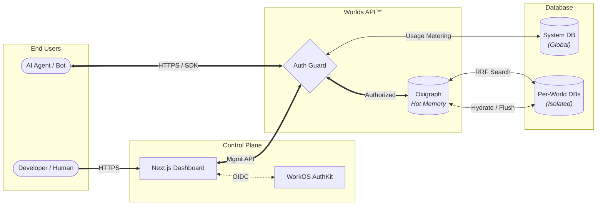

# Worlds API™ Design Document

| **Project Name** | Worlds API™ (Neuro-symbolic Knowledge Platform) |
| ---------------- | ----------------------------------------------- |
| **Author**       | Ethan (Founder, FartLabs/Wazoo)                 |
| **Repository**   | <https://github.com/EthanThatOneKid/worlds-api> |

> The Semantic Web is not a separate Web but an extension of the current one, in
> which information is given well-defined meaning, better enabling computers and
> people to work in cooperation.
>
> – Sir Tim Berners-Lee

## Executive Summary

**Worlds API™** is an edge-compatible infrastructure layer designed to provide
AI agents with "long-term memory" and reasoning capabilities. Unlike vector-only
RAG systems, Worlds API utilizes **RDF (Resource Description Framework)** and
**SPARQL 1.1** to enable structured, symbolic reasoning alongside neural
processing.

This platform allows developers to "Bring Your Own Brain" (BYOB), offering a
high-performance HTTP API to manage malleable knowledge graphs ("Worlds") to
solve hallucination and limited context windows. While Vector Databases provide
semantic retrieval, they lack **structured reasoning** (e.g., "Who is the
brother of the person who invented X?").

- **Current Solution:** `worlds-api` uses **Oxigraph** for high-performance,
  standards-compliant SPARQL operations.
- **Unified Architecture:** We integrate a **Hybrid Statements Store** directly
  alongside the graph, capable of fusing SPARQL precision with Vector and
  Full-Text Search (FTS) with
  [Reciprocal Rank Fusion](https://simonwillison.net/2024/Oct/4/hybrid-full-text-search-and-vector-search-with-sqlite/)
  (RRF) for comprehensive
  [world models](https://www.nvidia.com/en-us/glossary/world-models/). _(Status:
  Hybrid Search & RRF are currently in development. V1 uses optimized SQL FTS.)_

### Scope

- **In Scope:**
  - **Control Plane (Frontend):** Next.js dashboard for humans to manage Worlds,
    billing, and API keys.
  - **Data Plane (API):** Deno-based REST API handling SPARQL query execution,
    triple storage, and chunk storage.
  - **SDK:** TypeScript client for agent integration. (`@fartlabs/worlds`).
  - **Tools:** A collection of drop-in AISDK tools for managing Worlds.
  - **Authentication:** Dual-strategy service accounts (WorkOS for humans, API
    Keys for automations/agents).
  - **Semantic Web:** RDF and SPARQL compatibility for Semantic Web
    applications.
- **Out of Scope:**
  - The implementation of the AI Agents themselves. To be used in future
    FartLabs/Wazoo projects such as Computer, Holosuite, and more.
  - Visual Graph Editors (v1 is code-first).

## Project Philosophy

We adhere to core philosophical pillars to guide every technical decision:

- **Bring Your Own Brain (BYOB):** The API is agnostic to the intelligence
  layer. Whether using Open AI, Google, Anthropic, or a local open source model,
  the "World" acts as a detachable hippocampus.
- **Calm Technology:** Developer tooling should be invisible. We target
  **Zero-Config** experiences (e.g., `deno task start`).
- **Edge-First:** Knowledge must be retrieved in milliseconds (always hot). The
  architecture is designed for distributed runtimes (Deno Deploy, Cloudflare
  Workers).
- **Malleable Knowledge:** Data is not static. "Worlds" are designed to be
  forked, merged, and mutated by agents in real-time.
- **Agent Autonomy:** True agency requires more than tooling—it requires
  onboarding agents as teammates. Our human-centric framework equips agents with
  "senses" to perceive their world and the judgment to know when to escalate
  ambiguity to human operators.
- **Web Standards:** A space where users maintain their autonomy, control their
  data and privacy, and choose applications and services to fulfil their needs.

## System Architecture

### High-Level Diagram

The system follows a segregated Client-Server architecture designed for edge
deployment.



### Component Breakdown

The project works as a **Deno Monorepo**, treating the SDK, Server, and Shared
Libraries as co-located packages.

#### **A. The SDK (`/src/sdk`)**

[](https://jsr.io/@fartlabs/worlds)
[](https://jsr.io/@fartlabs/worlds/score)

- **Package:** [`@fartlabs/worlds`](https://jsr.io/@fartlabs/worlds) (name TBD)
- **Role:** The canonical TypeScript `fetch` client. It handles authentication,
  type-safe API requests, and response parsing. It also provides drop-in AISDK
  memory tools for managing Worlds.
- **Distribution:** Published to JSR. Use with Node.js:
  `npx jsr add @fartlabs/worlds`.
- **Reference Design:** See [`sdk`](./sdk) for the proposed SDK implementation.

#### **B. The Server (`/src/server`)**

- **Role:** The minimal Deno-based HTTP server.
- **Core Library:** `oxigraph` (Wasm) and `libsql` for Hybrid Storage.
- **Deployment:** Deno Deploy (Edge).

#### **C. Shared Core (`/src/core`)**

- **Role:** Common logic shared between the Server and SDK (e.g., Validation
  logic, Type definitions, Encoding helpers).

### Repository Structure

We enforce a strict separation of concerns within the monorepo to allow the SDK
and Server to evolve together while sharing Types.

```text
/
├── deno.json             # Workspace configuration
├── src/
│   ├── accounts/         # Accounts & Billing Logic
│   ├── worlds/           # Worlds Logic
│   ├── sdk/              # Public client library (@fartlabs/worlds)
│   │   ├── mod.ts        # Entry point
│   │   ├── worlds.ts     # Main Client
│   │   ├── internal.ts   # Internal Client
│   │   └── tools/        # Drop-in AISDK Tools
│   ├── server/           # API Implementation
│   │   ├── main.ts       # Entry point
│   │   └── routes/       # Route handlers (v1/)
│   ├── core/             # Shared logic
│   │   ├── types/        # Shared Type definitions
│   │   └── database/     # Database Logic & Schemas
│   │       ├── system.sql     # System DB Schema
│   │       └── statements.sql # World DB Schema
|  
└── tests/                # Integration tests
```

### Storage Engine Design

This is the most critical technical decision in the system. We currently operate
a **Pluggable Storage Architecture** to accommodate our research findings.

#### Primary Engine: Oxigraph

- **Type:** In-Memory Native RDF Store (Wasm).
- **Role:** Query Engine & Cache.
- **Persistence Strategy:**
  - **Pre-loading:** The heavy Wasm module and TF USE models are pre-loaded in
    the global scope (outside the request handler) to ensure the isolate is
    "warm" for incoming requests.
  - **Cold Start:** Hydrates graph state from the `kb_statements` SQLite table
    upon initialization.
  - **Warm State:** Persists in the Deno
    ([Edge Cache](https://docs.deno.com/deploy/classic/edge_cache/)) between
    requests for high-performance read operations.
  - **Writes:** Updates are written synchronously to SQLite (Source of Truth).
    Upon success, the system **invalidates** the Edge Cache for that specific
    World, forcing a fresh hydration from SQLite on the next read.
- **Pros:** Full SPARQL 1.1 compliance, millisecond read latency on warm
  isolates.
- **Cons:** Purely symbolic (exact match only); requires re-hydration on cold
  starts.

#### Integrated Engine: Per-World Hybrid SQLite

We utilize a **Per-World Database Strategy** to maximize isolation and
performance.

- **Architecture:**
  - **Control Plane DB (`sys.db`):** Manage accounts, billing, limits, and maps
    `world_id` -> Database URI.
  - **Data Plane DBs (`world_*.db`):** Each "World" is an isolated SQLite file
    containing its own `kb_statements` and `kb_chunks` tables.
- **Value Proposition:**
  - **Detachable:** "Detaching" a hippocampus is as simple as copying the
    `world_123.sqlite` file.
  - **Performance:** Bulk write operations (ingestion) lock only the specific
    world's file, preventing platform-wide contention.
  - **Search:** FTS indices are kept small and relevant to the specific agent
    context.

#### Blank Node Strategy

To address the ambiguity of Blank Node representation and lifecycle, we utilize
a **Skolemization** strategy paired with **Recursive Cascading Deletes**.

- **Representation (Skolemization):**
  - Blank Nodes are not stored as ephemeral `_:` identifiers. Instead, they are
    **Skolemized** into globally unique, stable URIs (e.g., `urn:uuid:<uuid>` or
    `genid:<hash>`) at the point of ingestion.
- **Lifecycle (Cascading Deletes):**
  - Blank Nodes are treated as **dependent substructures** of the Named Node
    they describe.
  - **Recursive Delete:** When a parent Named Node is deleted, the system must
    identify all linked Blank Nodes and recursively delete them.

### Dynamic Access Control

The platform enables **Dynamic Access** via the `kb_limits` table. This design
allows for real-time adjustments to service levels without code deployment:

- **Runtime Enforcement:** The API Gateway / Middleware fetches the quotas for
  the authenticated account's `plan_tier` on every request.
- **Instant Upgrades:** Changing a user's `plan_tier` in the database
  immediately unlocks higher limits and features restricted to specific plans.
- **Granular Feature Flags:** The `plan` can be mapped to specific capability
  flags (e.g., access to "Reasoning" endpoints).

### Usage Monitoring & Limits

We aim to implement a robust, asynchronous metering system to support
"Pay-as-you-go" pricing and prevent abuse. Usage will be metered by **Service
Account (API Key)** and aggregated into time buckets (e.g., 1-minute intervals)
in the `kb_usage` table.

This ensures:

- **Billing Transparency:** Users can see exactly which key incurred costs.
- **Resource Control:** Granular limits can be applied to specific agents.
- **Zero Latency Impact:** Metering is designed to be non-blocking where
  possible.

### RDF Ecosystem Compatibility

To ensure compatibility with the extensive
[JavaScript RDF ecosystem](https://rdfjs.dev/), we provide adapters to convert
between our internal `StatementRow` and the standard `@rdfjs/types` data model.

- **Comunica:** For federated querying over heterogenous sources.
- **Oxigraph:** For high-performance SPARQL execution.
- **N3.js:** For fast Turtle/N-Quads parsing and serialization.

```ts
/**
 * fromQuad converts a Quad to a StatementRow.
 */
export function fromQuad(quad: Quad): StatementRow {
  throw new Error("Not implemented");
}

/**
 * toQuad converts a StatementRow to a Quad.
 */
export function toQuad(statement: StatementRow): Quad {
  throw new Error("Not implemented");
}
```

## Web Application: The Dashboard

This Next.js project serves as the frontend dashboard for the Worlds platform—a
service utilizing the `@fartlabs/worlds` SDK. It provides a user interface for
users to authenticate, view, and manage their "world models."

### Scope & Features

- **Authentication:** Built on WorkOS AuthKit (`@workos-inc/authkit-nextjs`) for
  handling sign-in, sign-up, and session management.
- **Dashboard:** A protected dashboard routes where authenticated users can:
  - View owned worlds.
  - Edit world descriptions (via Server Actions).
  - Delete worlds.
  - Create new worlds.
  - Get API keys; integration with AISDK.
  - View hidden worlds.
  - View recently deleted worlds.
- **SDK Integration:** Wraps API interactions in a type-safe manner using
  `@fartlabs/worlds`, bridging the frontend with the backend service.
- **Design System:** Uses Tailwind CSS with a minimalist, "Vercel-native"
  aesthetic (implicit dark mode support).

### Interface & Capabilities

The dashboard is organized into a hierarchy of pages designed to move from
high-level account management to granular graph inspection.

#### Overview (`/overview`)

The initial landing page providing a high-level summary of the user's account.

#### Settings (`/settings`)

Global configuration for the user's account, including API Keys, Billing, and
Danger Zone.

#### Worlds (`/worlds`)

The central inventory of all Worlds owned by the account. A worlds grid
([animated procedural planet](https://github.com/Deep-Fold/PixelPlanets)) where
a user may navigate to a specific world.

[](https://themidnightgospel.fandom.com/wiki/Multiverse_Simulator)

#### World Details (`/worlds/{world}`)

The main workspace for a specific World. This page serves as the "IDE" for the
data.

#### World Settings (`/worlds/{world}/settings`)

Configuration specific to a single World.

## AISDK Tools Design

To facilitate seamless integration with the
[Vercel AISDK](https://sdk.vercel.ai/docs), the `@fartlabs/worlds` package
exports pre-configured **Tool Definitions**. These allow agents to interact with
their "World" using natural language tool calls.

- **remember:** **Ingestion.** Stores facts or unstructured text into the World.
- **recall:** **Retrieval.** Searches the World for relevant context.
- **forget:** **Deletion.** Removes specific knowledge via cascading deletes.

### Design Pattern: The "Detachable Hippocampus"

The tools are designed to be **model-agnostic**. They do not require the agent
to know SPARQL.

> [!NOTE]
> **Status: Planned.** The AISDK tools (`remember`, `recall`, `forget`) are
> defined in the design but are not yet exported in `v0.1.0`.

```ts
import { generateText } from "ai";
import { google } from "@ai-sdk/google";
import { createTools } from "@fartlabs/worlds/tools";

const { text } = await generateText({
  model: google("gemini-3-flash"),
  tools: createTools({
    apiKey: Deno.env.get("WORLDS_API_KEY")!,
    worldId: "world_123",
  }),
  prompt: "My name is Ethan.",
});
```

## API Specification

The API is a RESTful HTTP server programmed in (Deno) TypeScript.

### Authentication

- **Header:** `Authorization: Bearer <sk_world_key_...>`
- **Scope:** Keys are scoped to specific `world_id`s to prevent
  cross-contamination between agents.

### Control Plane Endpoints (Internal)

These endpoints are used for account management and are typically restricted to
admin or service-owner contexts (via Service Role / Root Key).

- `POST /v1/accounts` - Create a new account.
- `GET /v1/accounts` - List all accounts.
- `GET /v1/accounts/:account` - Get a specific account.
- `PUT /v1/accounts/:account` - Update an account.
- `DELETE /v1/accounts/:account` - Remove an account.
- `GET /v1/accounts/:account/worlds` - Get worlds owned by a specific account.
- `POST /v1/accounts/:account/rotate` - Rotate the API key for an account.
- `GET /v1/accounts/:account/usage` - Get usage buckets for an account.
- `GET /v1/limits/:plan` - Get limits for a plan.
- `PUT /v1/limits/:plan` - Set limits for a plan.

### Control Plane Endpoints (Public)

- `GET /v1/worlds` - Get all Worlds owned by the user.
- `GET /v1/worlds/:world` - Get a specific World graph. By default, returns
  world metadata in JSON format. Accepts `application/n-quads`,
  `application/n-triples`, `application/trig`, `text/turtle`,
  `application/ld+json`, `application/rdf+xml` as `Accept` headers.
- `PUT /v1/worlds/:world` - Create or completely replace a World.
- `PATCH /v1/worlds/:world` - Update World metadata.
- `POST /v1/worlds/:world` - Ingest knowledge to a World. Supports **Lazy
  Claiming**: if the world does not exist and the user has sufficient quota, it
  is automatically created.
- `POST /v1/worlds/:world/sparql` - SPARQL Query (Read) & Update (Write).
  Supports **Lazy Claiming** on Update.
- `DELETE /v1/worlds/:world` - Wipe memory.
- `GET /v1/worlds/:world/usage` - Get usage buckets for a specific World.
- `GET /v1/worlds/:world/statements` - Search statements via `?query=...` param.
- `GET /v1/worlds/:world/chunks` - Search chunks via `?query=...` param.
- `GET /v1/worlds/:world/statements/:statement` - Get a specific statement.
- `GET /v1/worlds/:world/chunks/:chunk` - Get a specific chunk.

## Getting Started & Development

1. **Prerequisites:** Install [Deno 2.x](https://deno.com) and
   [Git](https://git-scm.com).
2. **Clone:** `git clone https://github.com/EthanThatOneKid/worlds-api`
3. **Run:** `deno task start` (Starts the backend on port 8000).

### CI/CD Pipeline

- **GitHub Actions:**
  - On PR: Runs `deno lint`, `deno test`, and builds the Next.js app.
  - On Merge: Publishes SDK to **JSR** and deploys to Edge.

## Risks & Mitigations

| Risk                 | Impact | Mitigation                                             |
| :------------------- | :----- | :----------------------------------------------------- |
| **SPARQL Injection** | High   | Oxigraph's robust parser; strict validation.           |
| **Memory Usage**     | Medium | Strict triple limits per World; edge cache management. |
| **Latency**          | Low    | Edge deployment; <5µs encoding overhead.               |

## Design Alternatives

For a detailed breakdown of our architectural decisions (Database, Graph Engine,
Runtime, Deployment, Authentication), please see [ADR.md](./ADR.md).

## Future Work

### Separated Vector Store

As the Knowledge Graph grows, the presence of 512-dimension float vectors in the
primary SQLite file (`kb_chunks`) may impact maintenance operations. A future
iteration will explore splitting the Vector Index into a dedicated specialized
store.

### Improving Agent Accuracy with Sandboxed Code Execution

We plan to implement a tool for **arbitrary code execution** (e.g. Deno Deploy
Sandboxes) to allow agents to calculate precise answers.

### Distributed Graph Synchronization

We plan to implement a **real-time synchronization protocol** using the
`BroadcastChannel` API to push RDF patches to hot isolates, avoiding full
rehydration.

## Glossary

| Term                  | Definition                                                                                                   |
| :-------------------- | :----------------------------------------------------------------------------------------------------------- |
| **World**             | An isolated Knowledge Graph instance (RDF Dataset), acting as a memory store for an agent.                   |
| **Statement**         | An atomic unit of fact (Quad: Subject, Predicate, Object, Graph).                                            |
| **Chunk**             | A text segment derived from a Statement's Object (string literal), treating the Statement as a RAG document. |
| **RRF**               | **Reciprocal Rank Fusion**. An algorithm fusing Keyword (FTS) and Vector search rankings.                    |
| **RDF**               | **Resource Description Framework**. The W3C standard for graph data interchange.                             |
| **SPARQL**            | The W3C standard query language for RDF graphs.                                                              |
| **NamedNode**         | A node in an RDF graph that has a URI.                                                                       |
| **BlankNode**         | A node in an RDF graph that does not have a URI.                                                             |
| **Neuro-symbolic AI** | An AI system that combines the strengths of neural networks and structured data.                             |
| **Ontology**          | A formal description of a domain of knowledge.                                                               |

## Resources & References

- **Oxigraph:** [oxigraph.org](https://oxigraph.org/)
- **AuthKit by WorkOS:** [workos.com](https://workos.com/docs/authkit)
- **LibSQL:** [docs.turso.tech/libsql](https://docs.turso.tech/libsql)

---

Developed with 🧪 [**@FartLabs**](https://github.com/FartLabs)
