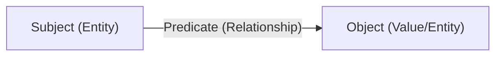

A **knowledge graph** powers every World. Worlds organizes information in a
graph-based structure rather than rigid tables. This approach models complex
relationships with precision.

> [!NOTE] **Systemic synergy: Relational logic** Defining relationships through
> **RDF predicates** enables reasoning capabilities that standalone statistical
> models cannot achieve.

## RDF triples: The building blocks

The fundamental unit of knowledge is the **statement**, which functions as an
**RDF triple**. It follows the standard W3C structure:

### Triple examples

| Subject            | Predicate    | Object             |
| :----------------- | :----------- | :----------------- |
| `Agent_01`         | `hasMemory`  | `World_Beta`       |
| `World_Beta`       | `contains`   | `Research_Paper_X` |
| `Research_Paper_X` | `authoredBy` | `Vannevar_Bush`    |

## Why graphs matter: Deterministic truth

Knowledge graph statements represent facts. Unlike statistical LLM weights,
Worlds retrieves specific, auditable relationships. This mechanism prevents
hallucinations.

- **Malleability**: Users mutate and fork graphs in real-time.
- **Traceability**: Every claim has a symbolic path back to its source.
- **Interoperability**: Data uses the **RDF 1.1** context for universal
  portability. [Read the W3C spec](http://www.w3.org/TR/rdf11-concepts/).

## The Worlds SDK: The architectural abstraction

The **Worlds SDK** provide the high-level interface to the graph. It translates
between human intuition and symbolic logic (SPARQL). It handles complex graph
traversals, making mastery accessible without database expertise.
