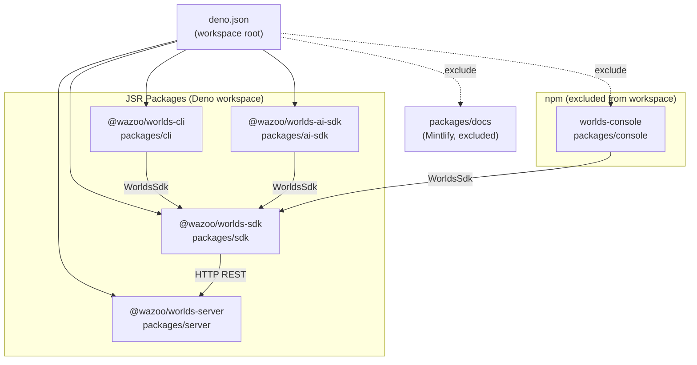

# Monorepo Structure

The Worlds Platform is organized as a Deno workspace. It contains several
packages designed to work together, spanning from the core API server to client
SDKs and a management dashboard.

## Package Topology

The following diagram shows how the different packages in the monorepo interact
and their publishing targets.

## Package Summaries

| Package            | JSR/npm Name           | Language      | Purpose                                                              |
| ------------------ | ---------------------- | ------------- | -------------------------------------------------------------------- |
| `packages/server`  | `@wazoo/worlds-server` | Deno          | HTTP API server; manages worlds, SPARQL, search, and RDF processing. |
| `packages/sdk`     | `@wazoo/worlds-sdk`    | Deno/TS       | Typed HTTP client library for interacting with the Worlds API.       |
| `packages/ai-sdk`  | `@wazoo/worlds-ai-sdk` | Deno/TS       | LLM tool wrappers for agentic loops (Vercel AI SDK integration).     |
| `packages/cli`     | `@wazoo/worlds-cli`    | Deno          | `wazoo` CLI for local development and remote management.             |
| `packages/console` | `worlds-console`       | Next.js (npm) | Web-based management dashboard and control plane.                    |
| `packages/docs`    | —                      | Mintlify      | This documentation site.                                             |

## Workspace Design

- **Deno First**: Most core packages are built for the Deno runtime and
  published to JSR.
- **Excluded Areas**: The `console` and `docs` are excluded from the main Deno
  workspace as they use Node.js-based tooling (Next.js and Mintlify).
- **Core Dependency**: The `sdk` package is the primary bridge used by the CLI,
  AI SDK, and Console to communicate with the API Server.
