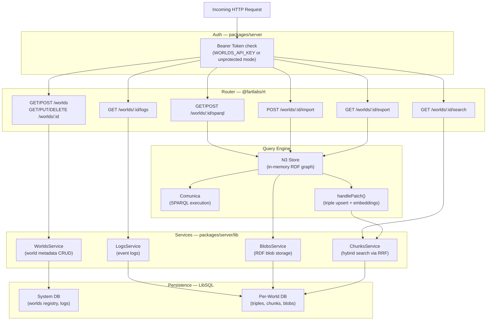

# Request Pipeline

Every incoming HTTP request to the Worlds API Server passes through a fixed
technical pipeline designed for security, efficiency, and flexibility.

## Server Processing Flow

The server uses a structured pipeline to route requests and manage dependencies.

## ServerContext

The `ServerContext` is a central dependency-injection record used across all
route handlers. It carries the necessary state and clients to fulfill requests.

| Field             | Purpose                                                          |
| ----------------- | ---------------------------------------------------------------- |
| `apiKey`          | Validates the Bearer token on incoming requests.                 |
| `embeddings`      | Provider for vector embedding generation (Ollama or OpenRouter). |
| `libsql.database` | Primary libSQL client for the system registry.                   |
| `libsql.manager`  | Factory for creating/accessing per-world databases.              |

## Persistence Roles

The platform distinguishes between two types of databases to ensure isolation
and performance:

| Database Type    | Scope             | Responsibilities                                                                 |
| ---------------- | ----------------- | -------------------------------------------------------------------------------- |
| **Primary DB**   | Organization-wide | Manages the registry of Worlds, organization metadata, and global logs.          |
| **Secondary DB** | Per World         | Stores the specific World's triples, vector chunks, blobs, and local event logs. |

In production, these map to separate **Turso** databases, while in local
development, they correspond to individual SQLite files within your `data/`
directory.
