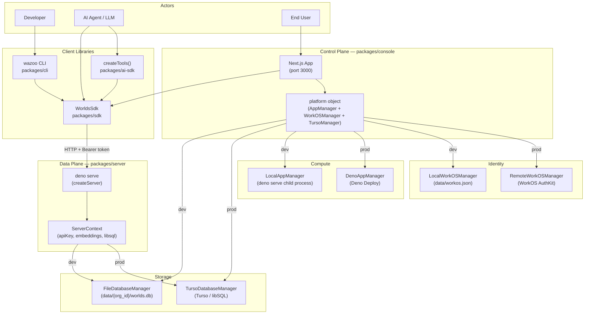

# System Design

The Worlds Platform is built on a modular, polymorphic architecture designed to
facilitate both low-latency local development and scalable production
deployments.

## Control Plane vs. Data Plane

The platform architecture is split into two primary operational layers:

### The Control Plane (`packages/console`)

The **Management Console** acts as the system's brain. It manages identity,
handles organization-level provisioning, and orchestrates the lifecycle of World
Server instances.

### The Data Plane (`packages/server`)

The **Worlds API Server** handles the heavy lifting of RDF graph management,
SPARQL query execution, and hybrid search. It is the specific instance that
manages an organization's "Worlds."

## Runtime Component Map

The following diagram illustrates how actors interact with the system and how
the different components relate across environments.

## Polymorphic Manager Pattern

A key feature of the platform is its use of hot-swappable resource managers. The
core logic remains identical, but the implementation swaps based on the
environment:

| Resource Type | Local Dev Implementation                      | Production Implementation              |
| ------------- | --------------------------------------------- | -------------------------------------- |
| **Identity**  | `LocalWorkOSManager` (Mock identity via file) | `RemoteWorkOSManager` (WorkOS AuthKit) |
| **Compute**   | `LocalAppManager` (Local Deno processes)      | `DenoAppManager` (Deno Deploy)         |
| **Storage**   | `FileDatabaseManager` (Local SQLite)          | `TursoDatabaseManager` (Turso/libSQL)  |

This pattern allows developers to run the _entire_ stack locally by simply
setting (or omitting) specific environment variables.
