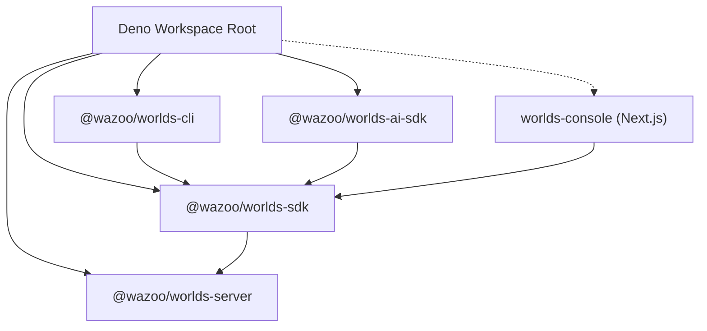

# System Design

The Worlds Platform is built on a modular, polymorphic architecture designed for
scalability and local-first development.

## Control vs. Data Plane

The platform is split into two primary operational layers:

### 1. The Control Plane (`packages/console`)

The **Management Console** acts as the system's brain. It manages identity
(WorkOS), handles organization-level provisioning, and orchestrates World Server
instances.

### 2. The Data Plane (`packages/server`)

The **Worlds API Server** handles RDF graph management, SPARQL execution, and
hybrid search. This is the "Data Plane" where your information lives.

## Monorepo Topology

The ecosystem is organized as a Deno workspace. The `sdk` package serves as the
primary bridge, used by the CLI, AI-SDK, and Console to communicate with the API
Server.

## Polymorphic Resource Managers

A key design feature is our use of hot-swappable resource managers. The core
logic remains identical, while the implementation swaps based on the
environment:

| Resource     | Local Dev Implementation   | Production Implementation |
| :----------- | :------------------------- | :------------------------ |
| **Compute**  | Local Deno child processes | Deno Deploy               |
| **Storage**  | Local SQLite files         | Turso (libSQL)            |
| **Identity** | Mock file (`workos.json`)  | WorkOS AuthKit            |

This pattern allows the _entire_ stack to run locally with zero cloud
dependencies.
