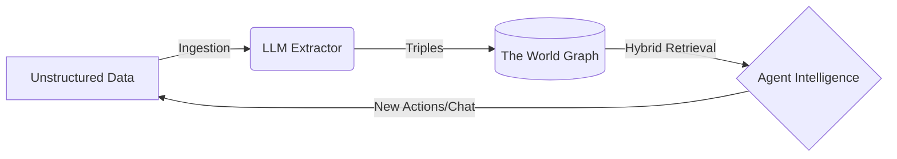

# How Worlds Work

Worlds provides a structured framework for **Agent Memory**. Instead of treating
an agent's context as a flat list of chat logs or disjointed text chunks, Worlds
organizes information as a **dynamic, queryable model of reality**.

## The Worlds Pipeline

To understand how Worlds powers intelligent agents, you need to understand the
lifecycle of data moving through the platform.

### 1. Ingestion (The Input)

Raw information enters the system—from a user chat, a GitHub repository, or a
PDF. At this stage, the data is unstructured human language.

### 2. Processing (The Neuro-Symbolic Engine)

The Worlds Engine uses LLMs to extract **meaning** and **entities**. It
translates ambiguous language into structured **Triples** (Subject -> Predicate
-> Object). These facts are then merged into a **World**—an isolated container
where the graph evolves through:

- **Updating** conflicting facts.
- **Extending** existing entities with new context.
- **Inferring** hidden relationships via symbolic reasoning.

### 3. Retrieval (The Output)

When an agent needs context, it performs a **Hybrid Search**. This mixes
semantic vector similarity with deterministic graph traversal to pull a highly
precise, grounded slice of reality directly into its context window.

<CardGroup cols={2}>
  <Card
    title="Worlds vs. Traditional RAG"
    icon="scale-balanced"
    href="/concepts/worlds-vs-rag"
  >
    Understand the fundamental difference between generic vector search and
    stateful memory.
  </Card>
  <Card
    title="Knowledge Primitives"
    icon="diagram-project"
    href="/concepts/knowledge-primitives"
  >
    Learn exactly how Worlds stores extracted facts as Items, Resources, and
    Triples.
  </Card>
</CardGroup>
