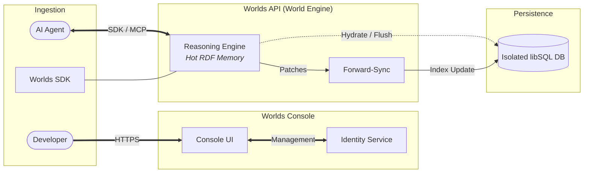
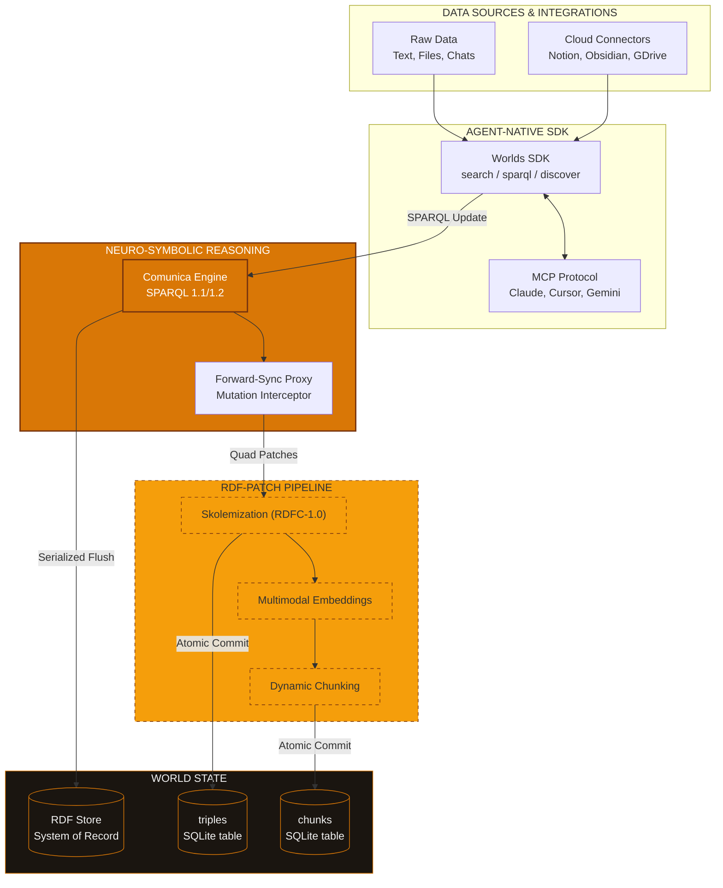
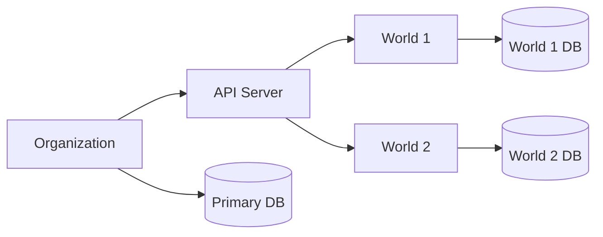
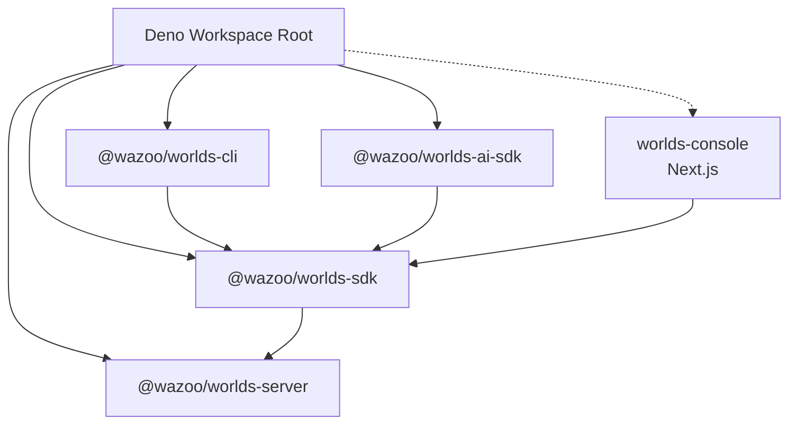

The Worlds Platform utilizes a managed [neuro-symbolic](/manifesto)
infrastructure designed for edge-distributed, agentic memory. Built on the
[Deno](https://deno.com/) runtime, it separates the **Worlds Console** for
management from the **Worlds API** for high-performance execution.

## High-level overview

The following diagram illustrates the relationship between the management layer,
the reasoning engine, and the isolated persistent state.

## Worlds Console vs. Worlds API

The platform splits operations into two primary layers:

<Columns>
  

### Worlds Console

The **Worlds Console** acts as the system's control plane. It manages identity
through WorkOS, handles organization-level provisioning, and orchestrates
**Worlds API** instances.

  

  

### Worlds API

The **Worlds API Server** handles RDF graph management, [SPARQL](/worlds/query)
execution, and [hybrid search](/worlds/search). This is the API layer where your
information lives.

  

</Columns>

## Worlds API deep dive

<Accordion title="Deep dive: API Data Flow">
  The World Engine follows a multi-tiered data transformation journey, fusing
  diverse input sources into a verifiable neuro-symbolic knowledge state.

</Accordion>

## Resource hierarchy

Understanding the relationship between **Organizations** and **Worlds** is key
to managing isolation and scaling.

### Worlds

Each World is a specific context or knowledge graph managed by the server.

- **Dedicated storage**: Each World maintains its own secondary libSQL database
  for [triples](/worlds), chunks, and embeddings.
- **Isolation**: Worlds are accessed via `/v1/worlds/{id}`, ensuring zero
  cross-contamination between contexts.

## Deno runtime

The Worlds Platform is built on [Deno](https://deno.com/), which provides
several advantages for a
[security-sensitive](https://docs.deno.com/runtime/fundamentals/security/)
knowledge platform:

- **Secure by default**: Deno's permission model requires explicit grants for
  network, file system, and environment access — reducing the attack surface of
  each deployment.
- **Web-standard APIs**: The server exports a standard `fetch` handler, making
  it natively compatible with Deno Deploy and other edge runtimes.
- **TypeScript-native**: No build step or transpiler configuration required. The
  entire codebase is TypeScript from source to execution.
- **Edge-ready**: First-class support for Deno Deploy enables low-latency
  deployments close to users.

## Monorepo topology

The ecosystem uses a Deno workspace. The `sdk` package serves as the primary
bridge for the CLI, AI-SDK, and Console to communicate with the API Server.

### Repository layout

The server follows a modular layout organized by service and resource:

- `lib/`: Shared logic for RDF/SPARQL handling, database management, and
  embeddings.
- `middleware/`: Authentication guards.
- `routes/`: Implementation of the v1 API endpoints.

## Request flow

The Worlds Server follows a structured lifecycle for initialization and request
handling. For a detailed breakdown, refer to the
[Request flow](/contribute/architecture) reference.

## Design principles

### Polymorphic resource managers

A key design feature is the use of hot-swappable resource managers. The core
logic remains identical, while the implementation swaps based on the
environment:

| Resource     | Local development     | Production               |
| :----------- | :-------------------- | :----------------------- |
| **Compute**  | Local child processes | Deno Deploy edge runtime |
| **Storage**  | Local SQLite files    | Remote libSQL / Turso    |
| **Identity** | Mock identity file    | WorkOS Identity Service  |

This pattern allows the entire stack to run locally with zero cloud
dependencies.
