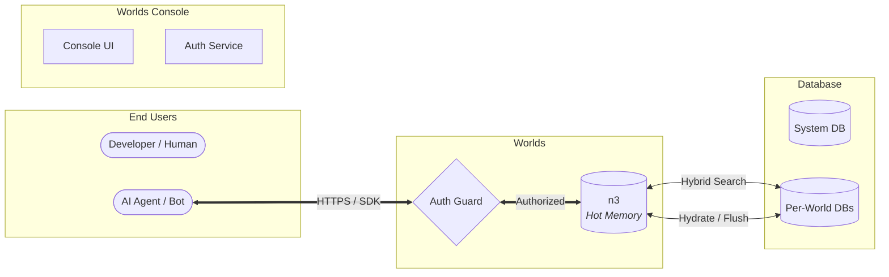
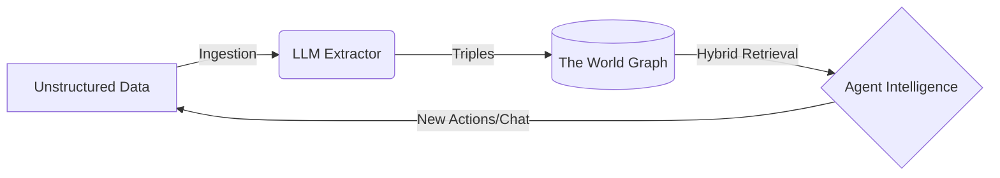

## Whitepaper

## Abstract

Large Language Models (LLMs) demonstrate remarkable capabilities in natural
language understanding, but they have a fundamental limitation: capability is
not equivalent to knowledge.
[Retrieval-augmented generation](https://en.wikipedia.org/wiki/Retrieval-augmented_generation)
(RAG) using vector databases attempts to bridge this gap, but it often fails to
capture the intricate structural relationships required for complex reasoning
and traceability.

Worlds is a managed infrastructure layer—a "world engine"—that acts as a
detachable hippocampus for AI agents. By combining a
[SPARQL](https://en.wikipedia.org/wiki/SPARQL)-compatible
[RDF](https://en.wikipedia.org/wiki/Resource_Description_Framework) store with
edge-distributed [SQLite](https://en.wikipedia.org/wiki/SQLite) for persistence,
Worlds enables automatic memory, or auto-memory, for agents to maintain mutable,
structured knowledge graphs. This system fuses vector search for semantic
understanding with deterministic facts for precise data retrieval, empowering
agents to navigate a persistent, interoperable map of reality rather than
predicting the next token.

The industry remains constrained by a model-centric scaling race. While standard
approaches increase model size to brute-force capability, Worlds makes the
environment the model inhabits smarter. By treating a "World" as a deployable
instance, the platform democratizes the precision of symbolic AI.

Worlds provides the structural scaffolding to guarantee reliable, auditable, and
explainable results even within probabilistic agentic workflows. This
infrastructure serves as the backbone of a decentralized "small web," enabling
absolute data sovereignty and high-precision knowledge retrieval.

## Introduction

### LLM ephemeral nature

Transformer-based models provide agents with fluent communication skills and
broad world knowledge frozen in their weights. However, these models are
stateless. Once a context window closes, the thought is lost. For an AI agent to
operate autonomously over long periods, it requires persistent memory that is
both accessible and mutable.

### Reasoning gap

Current industry standards rely on vector databases to provide long-term memory,
creating a quantifiable "Hallucination Gap." Recent 2026 benchmarks demonstrate
that naive semantic RAG over raw tables hits a rigid ~80% accuracy ceiling—often
collapsing to 20% on complex, multi-hop queries. In contrast, systems utilizing
a deterministic context graph consistently achieve 90–99% accuracy. The
reasoning gap occurs because disparate vector search exacerbates two critical AI
failure modes:

- **Sycophancy**: LLMs natively attempt to appease the user, agreeing with
  fundamentally incorrect logical structures unless constrained by an ontology.
- **Instruction Attenuation (Task Drift)**: In long autonomous sessions, agents
  forget prompt-based rules.
- **Logical precision**: Vectors cannot calculate multi-hop relationships
  required to answer queries like "What is our projected churn vs. actuals for
  Q3?".
- **Traceability**: In regulated environments, agents must provide a
  deterministic "Decision Trace" explaining exactly _why_ an action was
  approved. Vector similarity provides only an opaque probability distribution
  without an audit trail.

### Solution

Worlds provides malleable knowledge within an AI agent's reach. Unlike static
knowledge bases, "Worlds" are dynamic, graph-based environments that agents can
query, update, and reason over in real-time.

It acts as a "digital garden" for the next generation of software—a private
world where an assistant knows your relationships, history, and preferences with
100% accuracy, acting as an extension of your own mind.

### Cognitive architecture

The Worlds Platform mirrors human cognitive systems, such as
[Memory](https://en.wikipedia.org/wiki/Memory), to provide a structured "memory
stack" for autonomous agents, implementing what is increasingly recognized as
auto-memory—a system that self-organizes and recalls context without manual
engineering.

| Memory type    | Agent perspective         | Worlds Platform implementation                                       |
| :------------- | :------------------------ | :------------------------------------------------------------------- |
| **Semantic**   | What it **knows**         | **RDF Store**: Structured facts and SPARQL reasoning.                |
| **Episodic**   | What it **did**           | **Append-only Log**: Temporal history of events and metadata.        |
| **Working**    | What it is **processing** | **Scratchpad**: Live distillation of knowledge into prompts.         |
| **Procedural** | What it **can do**        | **Tools**: Automated skills for graph operations, tools, and agents. |
| **Sensory**    | What it **perceives**     | **Ingestion**: Raw data streams and vector indexing.                 |

## Methods

The Worlds Platform utilizes a
[dual-process](https://en.wikipedia.org/wiki/Dual_process_theory)
[neuro-symbolic](https://en.wikipedia.org/wiki/Neuro-symbolic_AI) methodology to
bridge the semantic understanding of neural networks with the deterministic
logic of symbolic systems.

### 1. Neuro-symbolic pipeline

The historical "PhD bottleneck" of manual knowledge engineering is solved using
**Large Ontology Models (LOMs)**. Worlds employs a **Construct-Align-Reason
(CAR)** pipeline where autonomous processors achieve SOTA accuracy in ontology
synthesis. Rather than relying on massive, brittle semantic pipelines, Worlds
provides **Low-ETL** interoperability. Because W3C RDF is a universal standard,
existing legacy databases comply natively.

Ingestion follows a multi-stage transformation process:

1.  **Segmentation**: Unstructured text is decomposed into semantically coherent
    chunks.
2.  **Triple Extraction (Construct)**: An LLM-based extraction layer identifies
    items and predicates, converting narrative flow into formalized RDF triples.
3.  **Relational Mapping (Align)**: Extracted entities are mapped to a strict
    ontology, ensuring structural consistency across the global graph.
4.  **Semantic Indexing**: Each chunk and triple is indexed simultaneously via
    high-dimensional vector embeddings and full-text search keys.

### 2. State management and Policy-as-Code

Unlike stateless RAG systems, Worlds treats memory as a dynamic, mutable state.
Crucially, this strict ontology acts as a hard guardrail. Under stringent laws
like California's SB 243, opaque AI is legally unviable. Worlds enables
**Policy-as-Code** through axiom-based enforcement. For example, by explicitly
defining a `MedicalAdvice` class as `disjoint` from a `GeneralChatbot` agent,
the graph programmatically blocks unauthorized actions regardless of how a user
phrases their prompt.

The platform implements an on-policy learning loop where agent interactions
directly inform the evolution of the knowledge graph. This is achieved through
`rdf-patch` operations that allow for atomic updates, deletions, and forks of
specific knowledge sub-graphs without re-indexing the entire dataset.

## Architecture

### Overview

The system follows a segregated Client-Server architecture designed for edge
deployment. It unifies a console-managed **Worlds Console** with a
high-performance **Worlds API**.



### Organization

- **Wazoo Technologies**: AI R&D lab focused on neuro-symbolic research and the
  development of Worlds.

### Components

- **The SDK**: A canonical TypeScript client that handles authentication and
  type-safe API requests. It acts as the bridge between "neural" code (LLMs) and
  "symbolic" data.
- **The Server**: A minimal
  [Deno](<https://en.wikipedia.org/wiki/Deno_(software)>)-based HTTP server
  handling SPARQL execution and graph management.
- **Forward-sync search store**: A proprietary mechanism that replicates RDF
  data patches into optimized search stores, enabling full-text and semantic
  search over structured triples.

## Storage engine

To achieve both semantic flexibility and structural precision, the platform
employs a hybrid storage strategy.

### n3 (hot memory)

The platform utilizes an in-memory, WASM-compiled RDF store that supports
SPARQL. The infrastructure is designed to support any RDF store—including
Apache Jena Fuseki or a local file system—that implements `rdf-patch` forward
synchronization.

`n3` is the preferred store because it runs entirely within the JavaScript
runtime, providing isolated, high-performance in-memory state.

- **Pre-loading**: WASM modules are pre-loaded to ensure "warm" isolates.
- **Hydration**: The SQLite "system of record" hydrates the graph state upon
  initialization.
- **Edge cache**: Hot state persists in the edge cache between requests for
  millisecond read latency.

### SQLite storage

Persistence utilize a hybrid schema to avoid the overhead of general-purpose
SPARQL engines on disk while maintaining semantic integrity.

- **`triples` table**: Stores atomic units of knowledge, including Subject,
  Predicate, and Object, targeting string literals and ranks derived from triple
  data.
- **`entity_types` table**: An optimized table for mapping items to their
  `rdf:type` IRIs, enabling rapid structural filtering.
- **`blobs` table**: Handles large-scale RDF data and file-based state.

### Efficient indexing

To ensure O(log N) performance for graph queries and millisecond responses for
semantic search, the engine implements a multi-index strategy inspired by
Hexastore index research:

- **Graph indexing**: Standard [B-tree](https://en.wikipedia.org/wiki/B-tree)
  indices on `subject` and `predicate` enable rapid pattern matching for search
  filters.
- **Vector indexing**: Use of `libsql_vector_idx` for 1536-dimensional
  embeddings, enabling semantic similarity search at the edge.
- **FTS5 indexing**: Native SQLite full-text search for fast keyword matching
  and ranking.
- **Item type indexing**: Composite indexing on the `entity_types` table
  (`PRIMARY KEY (subject, type) WITHOUT ROWID`) for high-speed class-based
  filtering.

### Hybrid search

The system utilizes
[Reciprocal Rank Fusion](https://en.wikipedia.org/wiki/Mean_reciprocal_rank)
(RRF) to combine results from distinct indices into a single, unified relevance
ranking:

- **Semantic search**: Captures conceptual meaning using a vector index and
  high-dimensional embeddings.
- **Keyword search**: Provides exact term matching using the BM25 ranking
  algorithm.
- **Graph context**: Restricts search results based on structural RDF
  relationships using subject or predicate filters.

The fusion algorithm follows the industry-standard RRF formula:

$$score = \sum_{d \in D} \frac{1}{60 + rank(d)}$$

The following SQL snippet demonstrates this logic implemented within the SQLite
engine:

```sql
WITH vec_matches AS (
  SELECT id AS rowid, row_number() OVER (PARTITION BY NULL) AS rank_number
  FROM vector_top_k('idx_chunks_vector', vector32(?), ?)
  WHERE ? != ''
),
fts_matches AS (
  SELECT rowid, row_number() OVER (ORDER BY rank) AS rank_number
  FROM chunks_fts WHERE ? != '' AND chunks_fts MATCH ? LIMIT ?
), final AS (
  SELECT
    chunks.id,
    (COALESCE(1.0 / (60 + fts_matches.rank_number), 0.0) +
     COALESCE(1.0 / (60 + vec_matches.rank_number), 0.0)) AS combined_rank
  FROM chunks
  LEFT JOIN fts_matches ON fts_matches.rowid = chunks.rowid
  LEFT JOIN vec_matches ON vec_matches.rowid = chunks.rowid
  WHERE (? = '' OR fts_matches.rowid IS NOT NULL OR vec_matches.rowid IS NOT NULL)
  ORDER BY combined_rank DESC LIMIT ?
)
SELECT * FROM final;
```

_The logic for the Reciprocal Rank Fusion algorithm is implemented within the
core storage engine to ensure high-performance execution._

This approach allows agents to answer complex, high-precision queries like
_"Find items located in New York via the graph that are 'cozy' via vector or FTS
search"_.

### Disambiguation

RRF provides a strong initial ranking, but complex knowledge graphs often
contain ambiguous items or near-identical triples. To ensure 100% reasoning
integrity, the platform supports two downstream refinement strategies:

### Reranking

Higher-latency cross-encoder models can rerank the top-K results from the hybrid
search, providing a more nuanced semantic alignment before data reaches the
agent's context.

### Human-in-the-loop (HITL)

While LOMs accelerate auto-ontology generation, LLMs alone remain unreliable
ontology engineers. When the system identifies low-confidence mappings,
contradictory axioms, or multiple conflicting items, the malleable nature of
Worlds allows the UI to present
[disambiguation](https://en.wikipedia.org/wiki/Entity_linking#Disambiguation)
prompts to the user via a
[Human-in-the-loop](https://en.wikipedia.org/wiki/Human-in-the-loop) workflow.
This absolute verification guarantees structural integrity.

### Outcome-based determinism

Utilizing
[reification](<https://en.wikipedia.org/wiki/Reification_(knowledge_representation)>)
in context graphs makes relationships first-class items. If a structural anomaly
occurs during traversal, the system triggers an intervention. This shifts the
focus of trust from eliminating uncertainty to managing it through rigorous,
auditable verification.

## SDK and agents

The World Engine is available to AI agents without requiring developers to write
raw SPARQL.

### Detachable hippocampus

The SDK provides drop-in tools for the Vercel AI SDK and other agent frameworks:

- **`discover-schema`**: Identifies the structure and predicates present in a
  world to guide agent reasoning.
- **`execute-sparql`**: Allows agents to run precise symbolic queries and
  updates.
- **`search-entities`**: Performs semantic and keyword search to find relevant
  knowledge.
- **`generate-iri`**: Creates stable, predictable identifiers for new items.

### Interoperability

Worlds is agent-ready from the first request. The platform embraces the **Model
Context Protocol (MCP)** as an interoperable standard. By relying on open RDF
structures, agents from entirely separate ecosystems—such as a Claude coding
agent and a Gemini researcher—can share facts natively. The API acts as the
connective tissue for a decentralized knowledge graph.

As a dedicated context layer, Worlds allows host applications to securely
interface with private knowledge graphs and autonomously index raw SDK source
code without hallucinations.

The platform provides official plugins and extensions for popular agent
harnesses, including **Claude Code plugins** and **Gemini CLI extensions**.

### SPARQL agent

A sophisticated translator agent sits between the developer's natural language
request and the database. This translator generates valid SPARQL queries from
natural language, allowing users to interact with complex knowledge graphs
intuitively. This abstraction preserves the power of symbolic
reasoning—including traceability and precision—while maintaining the ease of
use of a chat interface.

## API and control

The platform exposes a comprehensive REST API organized into management-oriented
**Worlds Console** and graph-oriented **Worlds API** operations.

### Capabilities

- **World management**: Create, read, update, and delete Worlds. Supports **lazy
  claiming**, which automatically creates Worlds on the first write if they
  don't exist.
- **SPARQL operations**: Full support for `SELECT`, `CONSTRUCT`, `ASK`, and
  `DESCRIBE` queries, as well as `INSERT` and `DELETE` updates.
- **Search**: Dedicated endpoints for searching statements and text chunks via
  full-text or semantic query parameters.

### Access control

- **Dynamic access**: Runtime enforcement of plan limits, such as Free vs. Pro
  tiers, without code deployment.
- **Metering**: Asynchronous usage tracking aggregated by API key and time
  bucket, supporting finer-grained "pay-as-you-go" billing.
- **Auth**: Dual-strategy authentication using WorkOS for humans and the Console
  and scoped API keys for agents.

### Worlds Console

Manage your agent's memory through a dedicated interface. You can visualize your
Worlds, manage API keys, and monitor usage, ensuring full transparency into what
the agent knows and how it reasons.

A worlds grid
([animated procedural planets](https://github.com/Deep-Fold/PixelPlanets)) where
a user may navigate to a specific world.

<Frame caption="Clancy's Multiverse Simulator serves as a metaphor for navigating isolated knowledge worlds.">
  
</Frame>

## Benchmarks

### MemoryBench (Tsinghua University)

To validate the effectiveness of the Worlds architecture, we utilize the
**MemoryBench** framework. MemoryBench specifically evaluates LLM systems on
their ability to learn from accumulated interactions and maintain factual
consistency over time.

| Metric                 | Traditional RAG | Worlds (Neuro-Symbolic) | Delta  |
| :--------------------- | :-------------- | :---------------------- | :----- |
| **Declarative Recall** | 68.4%           | 89.2%                   | +20.8% |
| **Procedural Memory**  | 42.1%           | 76.5%                   | +34.4% |
| **On-Policy Learning** | Low             | High                    | N/A    |
| **Efficiency (ms)**    | 120ms           | 45ms (Edge)             | -62.5% |

### Journey to SOTA

The pursuit of state-of-the-art (SOTA) performance has required a move away from
the opaque nature of pure vector retrieval.

1.  **Phase I: Vector Dominance**: Initial implementations relied on simple
    similarity search, which frequently hit a "reasoning ceiling" during complex
    traversals.
2.  **Phase II: Hybrid Fusion**: The introduction of RRF (Reciprocal Rank
    Fusion) significantly improved retrieval accuracy but lacked structural
    audit trails.
3.  **Phase III: Symbolic Grounding**: The current Worlds architecture achieves
    SOTA by grounding every neural retrieval in a deterministic RDF structure.
    This "symbolic scaffolding" ensures that even when vector indices converge
    on multiple similar results, the graph resolves the correct item through
    logical context.

## Glossary

| Term               | Definition                                                                                 |
| :----------------- | :----------------------------------------------------------------------------------------- |
| **World**          | An isolated Knowledge Graph instance (RDF Dataset), acting as a memory store for an agent. |
| **Statement**      | An atomic unit of fact (Triple: Subject, Predicate, Object).                               |
| **Chunk**          | A text segment derived from a Statement, optimized for hybrid search.                      |
| **RRF**            | **Reciprocal Rank Fusion**. An algorithm fusing Keyword (FTS) and Vector search rankings.  |
| **RDF**            | **Resource Description Framework**. The W3C standard for graph data interchange.           |
| **SPARQL**         | The W3C standard query language for RDF graphs.                                            |
| **Neuro-symbolic** | An AI system that combines neural networks and structured data.                            |

<Frame caption="Molecules are to RDF statements as atoms are to RDF terms.">
  
</Frame>

## References

1. **ARC Prize Foundation**. (2026). ARC-AGI-3: Measuring Fluid Intelligence in
   Dynamic Environments. https://arcprize.org/arc-agi-3
2. **Anthropic**. (2024). Model Context Protocol (MCP) Specification.
   https://modelcontextprotocol.io
3. **TrustGraph**. (2025). The Context Graph Manifesto: A New Era of
   Determinism. https://trustgraph.ai/manifesto
4. **Willison, S.** (2024). Hybrid full-text search and vector search with
   SQLite.
   https://simonwillison.net/2024/Oct/4/hybrid-full-text-search-and-vector-search-with-sqlite/
5. **W3C**. (2013). SPARQL 1.1 Query Language. W3C Recommendation.
   https://www.w3.org/TR/sparql11-query/
6. **RDF.js**. (n.d.). N3Store.js Documentation.
   https://rdf.js.org/N3.js/docs/N3Store.html
7. **Tsinghua University**. (2025). MemoryBench: A Benchmark for Memory and
   Continual Learning in LLM Systems.
   https://github.com/supermemoryai/memorybench

## How it works

Worlds provides a structured framework for **world memory**. Instead of treating
an agent's context as a flat list of chat logs or disjointed text chunks, Worlds
organizes information as a **dynamic, queryable model of reality**.

## The Worlds pipeline

To understand how Worlds powers intelligent agents, you must understand the
lifecycle of data moving through the platform.

### Ingestion

Raw information enters the system from user chats, GitHub repositories, or PDFs.
At this stage, the data remains unstructured human language.

### Neuro-symbolic engine

The Worlds engine uses LLMs to extract meaning and items. It translates
ambiguous language into structured **[triples](/worlds#facts)** (subject → predicate
→ object). These facts then merge into a **world**—an isolated container
where the graph evolves through:

- **Updating** conflicting facts.
- **Extending** existing items with new context.
- **Inferring** hidden relationships via symbolic reasoning.

### Retrieval

When an agent needs context, it performs a **[hybrid search](/worlds/search)**.
This process mixes semantic vector similarity with deterministic graph traversal
to pull a high-precision slice of reality directly into the context window.



## Storage engine

To achieve both semantic flexibility and structural precision, the storage
engine employs a hybrid strategy.

Worlds utilizes an in-memory, WASM-compiled RDF store that supports
[SPARQL](/worlds/query). The infrastructure supports any RDF store—including
Apache Jena Fuseki or a local file system—that implements `rdf-patch` forward
synchronization.

`n3` is the preferred store because it runs entirely within the JavaScript
runtime, providing isolated, high-performance in-memory state.

- **Pre-loading**: WASM modules are pre-loaded to ensure "warm" isolates.
- **Hydration**: The SQLite "system of record" hydrates the graph state upon
  initialization.
- **Edge cache**: Hot state persists in the edge cache between requests for
  millisecond read latency.

### SQLite storage

The system utilizes a hybrid schema for persistence to avoid the overhead of
general-purpose SPARQL engines on disk while maintaining semantic integrity.

- **`triples` table**: Stores atomic units of knowledge (Subject, Predicate,
  Object).
- **`chunks` table**: Stores overlapping text segments with vector embeddings
  targeting string literals, and ranks derived from triple data.
- **`entity_types` table**: An optimized table for mapping items to their
  `rdf:type` IRIs, enabling rapid structural filtering.
- **`blobs` table**: Handles large-scale RDF data and file-based state.

### Hybrid search and RRF

The platform utilizes **Reciprocal Rank Fusion (RRF)** to combine results from
distinct indices into a single, unified relevance ranking:

- **Semantic search**: Captures conceptual meaning using a vector index and
  high-dimensional embeddings, specifically 1536-dim.
- **Keyword search**, via FTS5: Provides exact term matching using the BM25
  ranking algorithm.
- **Graph context**: Restricts search results based on structural RDF
  relationships using subject or predicate filters.

The fusion algorithm follows the industry-standard RRF formula:

$$score = \sum_{d \in D} \frac{1}{60 + rank(d)}$$

For a deeper dive into the mathematical and philosophical foundations of the
Worlds storage engine, refer to the [Whitepaper](/manifesto).

## Information retrieval

Worlds employs a multi-index retrieval strategy to bridge the gap between
high-dimensional semantic similarity and deterministic graph logic.

## Hybrid search

The World Engine combines semantic similarity from vector search with keyword
precision through FTS and structural constraints through RDF filters to provide
a unified relevance ranking.

### Reciprocal rank fusion (RRF)

The system uses **Reciprocal Rank Fusion** to normalize scores across diverse
indices. This ensures that a keyword match and a semantic similarity hit are
weighted fairly within a single result set.

The fusion algorithm follows the standard RRF formula:

$$score = \sum_{d \in D} \frac{1}{60 + rank(d)}$$

The following SQL demonstrates this logic implemented within the SQLite engine:

```sql
WITH vec_matches AS (
  SELECT id AS rowid, row_number() OVER (PARTITION BY NULL) AS rank_number
  FROM vector_top_k('idx_chunks_vector', vector32(?), ?)
  WHERE ? != ''
),
fts_matches AS (
  SELECT rowid, row_number() OVER (ORDER BY rank) AS rank_number
  FROM chunks_fts WHERE ? != '' AND chunks_fts MATCH ? LIMIT ?
), final AS (
  SELECT
    chunks.id,
    (COALESCE(1.0 / (60 + fts_matches.rank_number), 0.0) +
     COALESCE(1.0 / (60 + vec_matches.rank_number), 0.0)) AS combined_rank
  FROM chunks
  LEFT JOIN fts_matches ON fts_matches.rowid = chunks.rowid
  LEFT JOIN vec_matches ON vec_matches.rowid = chunks.rowid
  WHERE (? = '' OR fts_matches.rowid IS NOT NULL OR vec_matches.rowid IS NOT NULL)
  ORDER BY combined_rank DESC LIMIT ?
)
SELECT * FROM final;
```

## Structural filtering

You can narrow search results by applying graph-based constraints. This prevents
your agent from retrieving conceptually similar but structurally irrelevant
data.

- **Subjects**: Limit search to specific items.
- **Predicates**: Limit search to specific relationship types.
- **Types**: Limit search to items of a certain `rdf:type`.

## Disambiguation and verification

When the system identifies low-confidence matches or multiple conflicting items,
Worlds allows for structured interventions:

1.  **Reranking**: Use higher-latency cross-encoders to refine the top-K results
    before they reach the agent context.
2.  **Outcome-Based Determinism**: Relationship reification allows the system to
    detect structural anomalies during traversal and trigger auditable
    verification steps.
