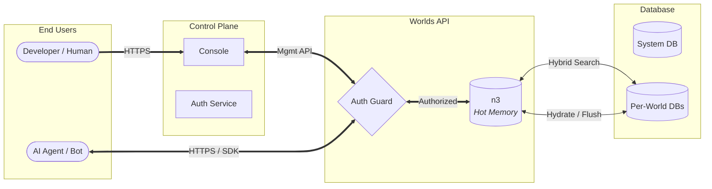

title: "Whitepaper"
description: "Malleable Knowledge at the Edge for Neuro-Symbolic Agents."

---

**Author**: Ethan Davidson (Founder, Wazoo Technologies) **Date**: January 2026

---

## Abstract

Large Language Models (LLMs) have demonstrated remarkable capabilities in
natural language understanding, yet they suffer from a fundamental limitation:
capability is not equivalent to knowledge. While Retrieval-Augmented Generation
(RAG) using vector databases attempts to bridge this gap, it often fails to
capture the intricate structural relationships required for complex reasoning
and "traceability" of facts.

**Worlds API** is a managed neuro-symbolic infrastructure layer—a "World
Engine"—that acts as a detachable hippocampus for AI agents. By combining an
in-memory SPARQL-compatible RDF store (n3) with edge-distributed SQLite for
persistence, Worlds API enables agents to maintain mutable, structured knowledge
graphs. This system implements a hybrid architecture fusing **Vector Search**
(semantic intuition) with **Symbolic Logic** (RDF/SPARQL precision), empowering
agents to navigate a persistent, interoperable map of reality rather than just
predicting the next token.

By 2026, the artificial intelligence industry has fundamentally realigned around
**Fluid Intelligence** and **Outcome-Based Determinism**. Worlds API provides the
necessary structural scaffolding to guarantee reliable, auditable, and
explainable end results even within probabilistic agentic workflows. This
infrastructure is the backbone of the "Small Web," enabling true data ownership
and high-precision knowledge retrieval.

---

## Introduction

### The context: The ephemeral nature of LLMs

The rise of Transformer-based models has revolutionized artificial intelligence,
providing agents with fluent communication skills and broad "world knowledge"
frozen in their weights. However, these models are fundamentally stateless. Once
a context window closes, the "thought" is lost. For an AI agent to operate
autonomously over long periods, it requires persistent memory that is both
accessible and mutable.

### The problem: The reasoning gap & fluid intelligence

Current industry standards rely heavily on **Vector Databases** to provide
long-term memory. As identified in benchmarks like **ARC-AGI-3**, true
intelligence is defined not by the volume of retained data, but by the efficiency
with which a system adapts to novel, untrained environments. The "Reasoning Gap"
occurs because vector search struggles with:

1. **Logical Precision**: It cannot reliability answer structured queries like
   "Who is the brother of the person who invented X?".
2. **Traceability**: In high-stakes fields like medicine or law, agents need to
   provide a perfect trace of their reasoning. Vector similarity is black-box;
   it lacks a verifiable audit trail.
3. **Temporal Awareness**: Standard RAG is stateless and fails to capture
   relationship dynamics or state invalidations over extended horizons.
4. **Data Silos**: Information remains trapped in proprietary "walled gardens,"
   hindering the **Interoperability** required for a truly personal or
   autonomous AI entity.

### The solution: Worlds API

We propose **Worlds API**, a system designated to provide **Malleable
Knowledge** within arm's reach of the AI agent. Unlike static knowledge bases,
"Worlds" are dynamic, graph-based environments that agents can query, update,
and reason over in real-time.

It acts as a **"Digital Garden"** for the next generation of software—a private
"World" where an assistant knows your relationships, history, and preferences
with 100% accuracy, acting as an extension of your own mind.

### Philosophy

We adhere to core philosophical pillars to guide technical decisions:

- **Bring Your Own Brain (BYOB)**: The API is agnostic to the intelligence
  layer. Whether using OpenAI, Anthropic, or local models, the "World" acts as a
  detachable hippocampus.
- **Calm Technology**: Developer tooling should be invisible. We target
  "Zero-Config" experiences where complex graph management is abstracted away.
- **Edge-First**: Knowledge must be retrieved in milliseconds. The architecture
  is designed for distributed runtimes (Deno Deploy, Cloudflare Workers).
- **Malleable Knowledge**: Data is not static. "Worlds" are designed to be
  forked, merged, and mutated by agents in real-time.
- **The "Small Web"**: A future where users maintain autonomy, control their
  data, and operate in an interoperable ecosystem built on open standards (RDF)
  and universal protocols (MCP) rather than proprietary locks.

---

## System architecture

### High-level overview

The system follows a segregated Client-Server architecture designed for edge
deployment. It unifies a Control Plane (Console) with a high-performance Data
Plane (API).



### Organization

- **Wazoo Technologies**: The parent company providing enterprise-grade
  stability.
- **FartLabs**: The R&D division (Subsidiary) focused on neuro-symbolic research
  and the development of the Worlds API.

### Component breakdown

1. **The SDK**: A canonical TypeScript client that handles authentication and
   type-safe API requests. It acts as the bridge between "neural" code (LLMs)
   and "symbolic" data.
2. **The Server**: A minimal Deno-based HTTP server handling SPARQL execution
   and graph management.
3. **Forward-Sync Search Store**: A proprietary mechanism that replicates RDF
   data patches into optimized search stores, enabling full-text and semantic
   search over structured triples.

---

## Storage engine

To achieve both semantic flexibility and structural precision, we employ a
hybrid storage strategy.

### n3 (hot memory)

An in-memory, WASM-compiled RDF store that supports SPARQL. This allows for
complex graph pattern matching (e.g., recursive queries, property paths) that
SQL and Vectors cannot easily handle.

- **Pre-loading**: WASM modules are pre-loaded to ensure "warm" isolates.
- **Hydration**: Graph state is hydrated from the SQLite "System of Record" upon
  initialization.
- **Edge Cache**: Hot state persists in the Edge Cache between requests for
  millisecond read latency.

### Standard SQLite (hot & cold storage)

We utilize a **Hybrid Schema** for persistence to avoid the overhead of
general-purpose SPARQL engines on disk while maintaining semantic integrity.

- **`triples` Table**: Stores atomic units of knowledge (Subject, Predicate,
  Object).
- **`chunks` Table**: Stores overlapping text segments with vector embeddings (targeting string literals) and ranks derived from triple data.
- **`entity_types` Table**: An optimized table for mapping entities to their `rdf:type` IRIs, enabling rapid structural filtering.
- **`blobs` Table**: Handles large-scale RDF data and file-based state.

### Efficient indexing

To ensure O(log N) performance for graph queries and millisecond responses for
semantic search, we implement a multi-index strategy inspired by **Hexastore**
index research (maintaining optimal performance for any triple pattern):

- **Graph Indexing**: Standard B-Tree indices on `subject` and `predicate` enable
  rapid pattern matching for search filters.
- **Vector Indexing**: Use of `libsql_vector_idx` for 1536-dimensional embeddings, enabling semantic similarity search at the edge.
- **FTS5 Indexing**: Native SQLite full-text search for fast keyword matching and ranking.
- **Entity Type Indexing**: Composite indexing on the `entity_types` table (`PRIMARY KEY (subject, type) WITHOUT ROWID`) for high-speed class-based filtering.

### Hybrid search & RRF

We utilize **Reciprocal Rank Fusion (RRF)** to combine results from distinct
indices into a single, unified relevance ranking:

1. **Semantic Search (Vector Index)**: Captures conceptual meaning using
   high-dimensional embeddings (1536-dim).
2. **Keyword Search (FTS5)**: Provides exact term matching using the BM25
   ranking algorithm.
3. **Graph Context**: Restricts search results based on structural RDF
   relationships (subject/predicate filters).

The fusion algorithm follows the industry-standard RRF formula:

$$score = \sum_{d \in D} \frac{1}{60 + rank(d)}$$

The following SQL snippet demonstrates this logic implemented within our SQLite engine:

```sql
WITH vec_matches AS (
  SELECT id AS rowid, row_number() OVER (PARTITION BY NULL) AS rank_number
  FROM vector_top_k('idx_chunks_vector', vector32(?), ?)
  WHERE ? != ''
),
fts_matches AS (
  SELECT rowid, row_number() OVER (ORDER BY rank) AS rank_number
  FROM chunks_fts WHERE ? != '' AND chunks_fts MATCH ? LIMIT ?
), final AS (
  SELECT
    chunks.id,
    (COALESCE(1.0 / (60 + fts_matches.rank_number), 0.0) +
     COALESCE(1.0 / (60 + vec_matches.rank_number), 0.0)) AS combined_rank
  FROM chunks
  LEFT JOIN fts_matches ON fts_matches.rowid = chunks.rowid
  LEFT JOIN vec_matches ON vec_matches.rowid = chunks.rowid
  WHERE (? = '' OR fts_matches.rowid IS NOT NULL OR vec_matches.rowid IS NOT NULL)
  ORDER BY combined_rank DESC LIMIT ?
)
SELECT * FROM final;
```

_View the full implementation on [GitHub](https://github.com/wazootech/worlds/blob/main/packages/server/lib/database/tables/chunks/queries.sql)._

This approach allows agents to answer complex, high-precision queries like
_"Find entities located in New York (Graph) that are 'cozy' (Vector/FTS)"_.

### Disambiguation & human-in-the-loop

While RRF provides a strong initial ranking, complex knowledge graphs often
contain ambiguous entities or near-identical triples. To ensure 100% reasoning
integrity, we support two downstream refinement strategies:

1. **Reranking**: Higher-latency cross-encoder models can be used to rerank the
   top-K results from the hybrid search, providing a more nuanced semantic
   alignment before the data reaches the agent's context.
2. **Human-In-The-Loop (HITL)**: When the system identifies low-confidence
   matches or multiple conflicting entities, the "Malleable" nature of Worlds
   allows the UI to present disambiguation prompts to the user.
3. **Outcome-Based Determinism**: By utilizing reification in Context Graphs,
   relationships become first-class entities. If a structural anomaly is
   detected during traversal, the system triggers an intervention. This shifts
   the focus of trust from eliminating uncertainty to managing it through
   rigorous, auditable verification.

---

## The "invisible" agent & SDK

Our goal is to make the "World" seamlessly available to AI agents without
requiring developers to write raw SPARQL.

### The detachable hippocampus

The SDK provides drop-in tools for the Vercel AI SDK and other agent frameworks:

- **`discover-schema`**: Identifies the structure and predicates present in a
  world to guide agent reasoning.
- **`execute-sparql`**: Allows agents to run precise symbolic queries and
  updates.
- **`search-entities`**: Performs semantic and keyword search to find relevant
  knowledge.
- **`generate-iri`**: Creates stable, predictable identifiers for new entities.

### Standardized Interoperability (MCP) & Plugins

Worlds API is designed to be **Agent-Ready** from the first request. We embrace
the **Model Context Protocol (MCP)** as the "USB-C for AI integrations." By
operating as a dedicated Context Layer, Worlds API allows host applications
(like Claude Code or Cursor) to securely interface with private knowledge graphs
without raw, unfettered access.

Furthermore, we provide official plugins and extensions for popular agent
harnesses, including **Claude Code plugins** and **Gemini CLI extensions**,
enabling developers to bootstrap memory-augmented agents in seconds.

### The invisible SPARQL agent

We implement a sophisticated translator agent that sits between the developer's
natural language request and the database. This "Invisible Agent" generates
valid SPARQL queries from natural language, allowing users to interact with
complex knowledge graphs intuitively. This abstraction preserves the power of
symbolic reasoning (traceability, precision) while maintaining the ease of use
of a chat interface.

---

## API & control plane

The platform exposes a comprehensive REST API organized into Control Plane
(Management) and Data Plane (Graph) operations.

### Capabilities

- **World Management**: Create, read, update, and delete Worlds. Supports **Lazy
  Claiming**, automatically creating Worlds on the first write if they don't
  exist.
- **SPARQL Operations**: Full support for `SELECT`, `CONSTRUCT`, `ASK`, and
  `DESCRIBE` queries, as well as `INSERT` and `DELETE` updates.
- **Search**: Dedicated endpoints for searching Statements and Text Chunks via
  full-text or semantic query parameters.

### Access control & multi-tenancy

- **Dynamic Access**: Runtime enforcement of plan limits (e.g., Free vs. Pro
  tiers) without code deployment.
- **Metering**: Asynchronous usage tracking aggregated by API Key and time
  bucket, supporting finer-grained "Pay-as-you-go" billing.
- **Auth**: Dual-strategy authentication using WorkOS (for Humans/Console) and
  Scoped API Keys (for Agents).

### The console

A Next.js-based control plane allows humans to oversee their agents' memories.
Users can visualize their Worlds, manage API keys, and monitor usage, ensuring
full transparency into what the agent knows and how it reasons.

A worlds table
([animated procedural planets](https://github.com/Deep-Fold/PixelPlanets)) where
a user may navigate to a specific world.

<Frame caption="Clancy's Multiverse Simulator serves as a metaphor for navigating isolated knowledge worlds.">
  
</Frame>

---

## Glossary

| Term               | Definition                                                                                 |
| :----------------- | :----------------------------------------------------------------------------------------- |
| **World**          | An isolated Knowledge Graph instance (RDF Dataset), acting as a memory store for an agent. |
| **Statement**      | An atomic unit of fact (Triple: Subject, Predicate, Object).                               |
| **Chunk**          | A text segment derived from a Statement, optimized for hybrid search.                      |
| **RRF**            | **Reciprocal Rank Fusion**. An algorithm fusing Keyword (FTS) and Vector search rankings.  |
| **RDF**            | **Resource Description Framework**. The W3C standard for graph data interchange.           |
| **SPARQL**         | The W3C standard query language for RDF graphs.                                            |
| **Neuro-symbolic** | An AI system that combines the strengths of neural networks and structured data.           |

<Frame caption="Molecules are to RDF statements as atoms are to RDF terms.">
  
</Frame>

---

## References

1. **ARC Prize Foundation**. (2026). ARC-AGI-3: Measuring Fluid Intelligence in Dynamic Environments.
   https://arcprize.org/arc-agi-3
2. **Anthropic**. (2024). Model Context Protocol (MCP) Specification.
   https://modelcontextprotocol.io
3. **TrustGraph**. (2025). The Context Graph Manifesto: A New Era of Determinism.
   https://trustgraph.ai/manifesto
4. **Willison, S.** (2024). Hybrid full-text search and vector search with SQLite.
   https://simonwillison.net/2024/Oct/4/hybrid-full-text-search-and-vector-search-with-sqlite/
5. **W3C**. (2013). SPARQL 1.1 Query Language. W3C Recommendation.
   https://www.w3.org/TR/sparql11-query/
6. **RDF.js**. (n.d.). N3Store.js Documentation.
   https://rdf.js.org/N3.js/docs/N3Store.html
7. **Tsinghua University**. (2025). MemoryBench: A Benchmark for Memory and Continual Learning in LLM Systems.
   https://github.com/supermemoryai/memorybench
