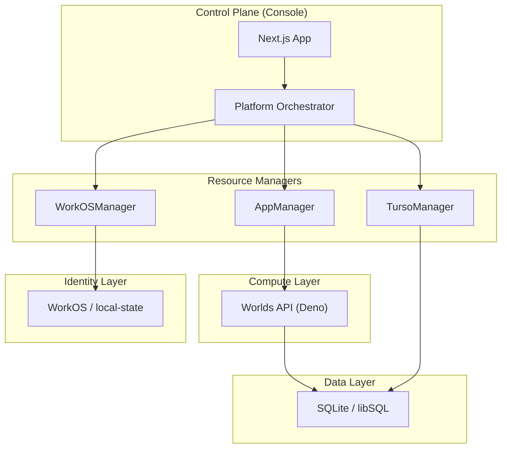

The Worlds Platform™ is built on a **polymorphic, hot-swappable architecture**. This means that whether you are running locally on a laptop or at scale in the cloud, the core logic remains identical while the underlying resource managers (for identity, storage, and compute) adapt to the environment.

## The Mental Model

At its core, the platform orchestrates three primary resource types across two distinct environment modes: **Local Dev** and **Production (Cloud)**.

### Resource Matrix

| Resource Type         | **Local Dev Mode** (File/Process backed)            | **Production Mode** (Remote/Cloud backed)    |
| :-------------------- | :-------------------------------------------------- | :------------------------------------------- |
| **Identity (WorkOS)** | `LocalWorkOSManager` (backed by `data/workos.json`) | `RemoteWorkOSManager` (WorkOS AuthKit & API) |
| **Compute (Apps)**    | `LocalAppManager` (Deno child processes)            | `DenoAppManager` (Deno Deploy / Sandbox API) |
| **Storage (Turso)**   | Local SQLite (backed by `data/{org_id}/worlds.db`)  | `RemoteTursoManager` (Turso Platform API)    |

### Architecture Diagram

