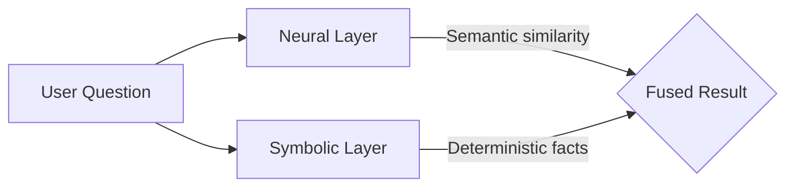

**Neuro-symbolic** describes the core architectural pattern of the Worlds
Platform. It combines two complementary paradigms:

| Layer        | Powered by                | Strength                          |
| :----------- | :------------------------ | :-------------------------------- |
| **Neural**   | LLM + vector embeddings   | Natural-language understanding    |
| **Symbolic** | RDF graph + SPARQL engine | Deterministic logic and precision |

## Why both?

Neural networks excel at interpreting meaning but can hallucinate. Symbolic
systems are precise but brittle with unstructured input. By fusing the two,
Worlds lets an agent _understand_ a question via the neural layer, and _prove_
the answer via the symbolic layer.

## In practice

1. **Ingestion** — An LLM extracts structured [triples](/glossary/triple) from
   raw text.
2. **Retrieval** — [Hybrid search](/glossary/hybrid-search) combines vector
   similarity with graph traversal.
3. **Reasoning** — [SPARQL](/glossary/sparql) queries return verifiable facts
   the agent can cite.

## Learn more

- [Philosophy](/overview/philosophy) — principles behind the approach
- [Architecture](/overview/architecture) — system-level deep dive
