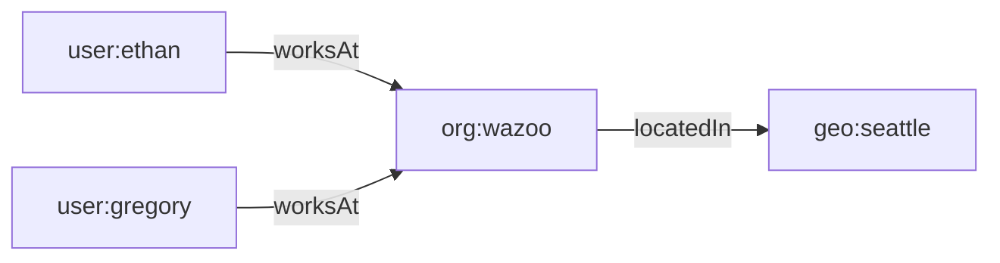

A **triple** is the smallest piece of information stored in a World. In other
literature, it may occasionally be referred to as a "triplet" or "tuple," but
Worlds standardizes on "triple." Every fact is expressed as three components:

| Component     | Role                         | Example          |
| :------------ | :--------------------------- | :--------------- |
| **Subject**   | The item being described     | `user:ethan`     |
| **Predicate** | The relationship or property | `schema:worksAt` |
| **Object**    | The target value or item     | `org:wazoo`      |

Together they read as a single statement: **Ethan works at Wazoo.**

## Why triples?

Triples follow the **RDF (Resource Description Framework)** standard. Because
every fact shares the same structure, triples compose naturally into a graph—no
schema migrations, no table joins.

As the graph grows, the agent can traverse relationships to infer new knowledge
(for example, that Ethan and Gregory share the same work location).

## Learn more

- [Academy: Symbolic graph architecture](/academy/graphs) — building graphs from
  triples
- [Knowledge Graphs guide](/guides/knowledge-graphs) — advanced graph topologies
