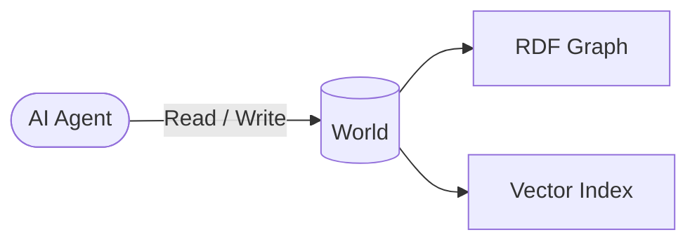

A **World** is the foundational resource of the Worlds Platform. It is an
isolated container where an agent's relationships, history, and facts live as a
queryable graph.

## Key properties

| Property         | Description                                                                 |
| :--------------- | :-------------------------------------------------------------------------- |
| **Isolation**    | Each World has its own database — zero cross-contamination.                 |
| **Portability**  | Memory persists across model swaps, from OpenAI to Gemini or a local model. |
| **Statefulness** | Facts are mutable and versioned, not static snapshots.                      |

## How it works

A World pairs an **RDF dataset**, functioning as the symbolic layer, with a
**vector search index**, which acts as the neural layer. Together they allow an
agent to reason over structured facts _and_ perform natural-language retrieval
within the same container.

## Learn more

- [World Memory](/overview/world-memory) — architecture and design goals
- [Academy: Memory fundamentals](/academy/memory) — guided walkthrough
