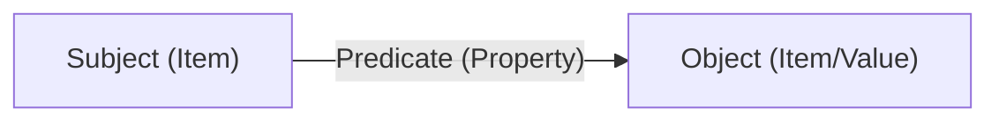

A **knowledge graph** powers every world. Worlds organizes information in a
graph-based structure rather than rigid tables, allowing you to model complex
relationships with precision.

## Knowledge primitives

To build with Worlds, you must understand the three fundamental building blocks
of knowledge.

### Items

**Items** are the distinct "things" in your world—a person, a piece of code, or
a company.

- **Identification**: A unique **IRI**, or Internationalized Resource
  Identifier, identifies every item.
- **Classes**: Categorize items by their type, such as `User`, `Project`, or
  `Task`.

### Properties

**Properties** are the "verbs" or "connectors" that define how items relate.

- **Examples**: `worksOn`, `managerOf`, `hasPriority`.
- **Ontology**: The set of defined properties forms the "grammar" of your world,
  ensuring your agents use consistent language.

### Facts

A **fact** occurs when you connect two items using a property. This follows the
standard W3C **RDF triple** structure:

| Component     | Example              |
| :------------ | :------------------- |
| **Subject**   | `User:Ethan`         |
| **Predicate** | `isWorkingOn`        |
| **Object**    | `Project:Worlds-API` |

## Why graphs matter

### Meaning at scale

Historically, there has been a trade-off between semantic interoperability and
analytical performance.

- **Semantic precision**: **RDF** (Resource Description Framework) uses standard
  URI-based triples to define canonical vocabularies and ensure global
  interoperability. It is the gold standard for representing knowledge, but
  traditional RDF databases can be slow for traversing dense connection paths.

- **Analytical scale**: Continuous AI workflows like GraphRAG require fast,
  multi-hop lookups. Relational DB joins degrade rapidly at scale.structure to
  traverse complex relationships quickly under pressure.

**Worlds bridges this gap.** It leverages the interoperable, atomic meaning of
standard RDF triples while functioning underneath as the high-speed
computational substrate required for agentic workflows, giving you both semantic
precision and analytical scale.

Knowledge graph statements represent facts. Unlike statistical LLM weights,
Worlds retrieves specific, auditable relationships.

- **Malleability**: Mutate and fork graphs in real-time.
- **Traceability**: Every claim provides a symbolic path back to its source.
- **Evolution**: New facts can surgically update or override old ones to
  maintain grounded truth.

## Technical context

Worlds uses the **RDF 1.1** standard for universal portability. You can
interface with the graph through the [Worlds SDK](/quickstart), which abstracts
away the complexity of raw SPARQL queries.
