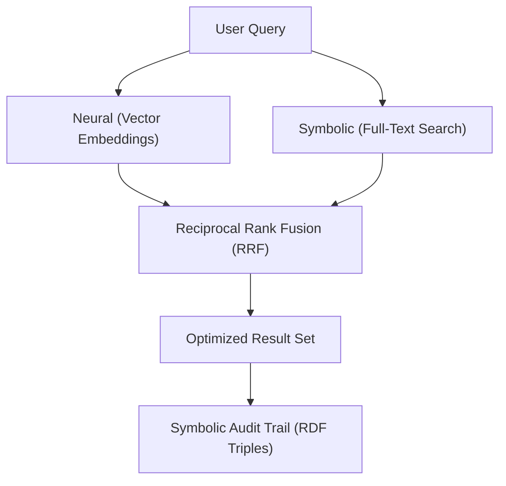

Worlds combines full-text search with vector-based retrieval to provide a
neuro-symbolic discovery experience.

> [!TIP] **Discovery workflow: Modeling synergy** Synergy defines the
> interaction of discrete modules. In Worlds, discovery synergy combines
> **neural intuition** and **symbolic exactness**.

## Environmental context isolation

The Worlds architecture utilizes **progressive disclosure** to manage cognitive
load. This technique isolates documentation sidebars strictly to the libraries,
variables, and functions relevant to the active, localized module.

### Core discovery technologies

| Technology          | Role                  | Pedagogical framework   |
| :------------------ | :-------------------- | :---------------------- |
| **Vector index**    | Semantic intuition    | Strategic modeling      |
| **Full-text (FTS)** | Exact matching        | Deterministic retrieval |
| **RRF**             | Ranking and synthesis | System optimization     |

## The search loop: zero-knowledge onboarding

Worlds manages large datasets by splitting knowledge into discrete segments
called **Chunks**. Each Chunk undergoes a dual-channel process:

1.  **Vectorization**: Transforms the document segment into a high-dimensional
    vector for semantic matching.
2.  **Linking**: Connects the Chunk to specific RDF statements (triples). This
    ensures that every search result is actionable and verifiable.

Discovery in Worlds is a multi-stage process that prioritizes accuracy and
verifiability rather than a single-turn operation.
