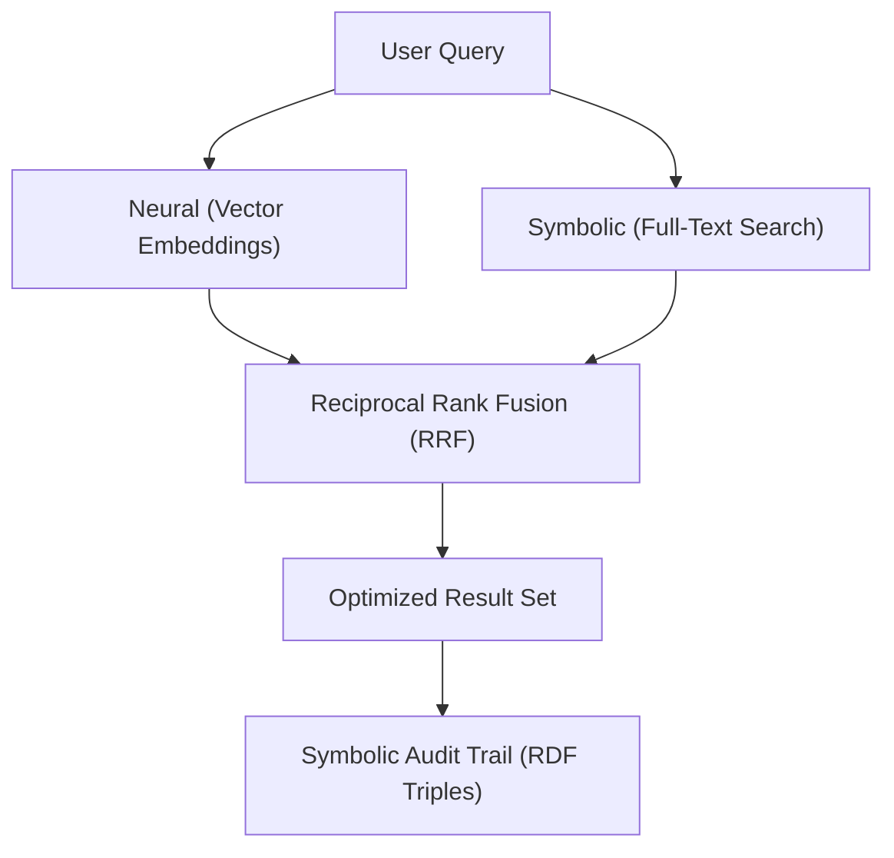

Worlds combines full-text search with vector-based retrieval to provide a
[neuro-symbolic](/glossary/neuro-symbolic) discovery experience.

<Tip>
  **Discovery workflow: Modeling synergy**

Synergy defines the interaction of discrete modules. In Worlds, discovery
synergy combines **semantic similarity** and **symbolic exactness**.

</Tip>

## Core discovery technologies

The platform uses three primary technologies to enable discovery:

| Technology          | Role                  | Pedagogical framework   |
| :------------------ | :-------------------- | :---------------------- |
| **Vector index**    | Semantic similarity   | Strategic modeling      |
| **Full-text (FTS)** | Exact matching        | Deterministic retrieval |
| **RRF**             | Ranking and synthesis | System optimization     |

### 1. Vector embeddings

The system uses vector embeddings to represent the semantic meaning of text.

- **Interface**: Defined in `lib/embeddings/embeddings.ts`, providing
  `embed(text: string)` and `dimensions`.
- **Implementation**: **GeminiEmbeddings** utilizes `@google/genai` with the
  `models/gemini-embedding-001` model.

### 2. Full-text search (FTS)

Exact keyword matching ensures that specific terms, names, and identifiers are
always discoverable, even if they lack strong semantic neighbors.

### 3. Reciprocal Rank Fusion (RRF)

The platform uses the **RRF** algorithm to merge keyword-based and
semantic-based results into a single relevance-ranked list.

The formula implemented in the SQL engine is:

$$score = \sum_{d \in D} \frac{1}{k + rank(d)}$$

Where $k = 60$ and $rank(d)$ is the position of the document in the respective
result set.

## Hybrid search implementation

When you perform a search, the `ChunksService` executes the following pipeline:

1.  **Resolution**: Resolves world IDs via `WorldsService`.
2.  **Execution**: Retrieves each world-specific database client via
    `serverContext.libsql.manager.get(worldId)`.
3.  **Hybrid search**: Executes both vector and FTS queries, then combines them
    using RRF.
4.  **Metering**: Records usage statistics via `UsageService`.

## Search loop

Worlds manages large datasets by splitting knowledge into discrete segments
called **chunks**. Each chunk undergoes a dual-channel process:

1.  **Vectorization**: Transforms the document segment into a vector for
    semantic matching.
2.  **Linking**: Connects the chunk to specific RDF statements, known as
    [triples](/glossary/triple), ensuring results are verifiable.
