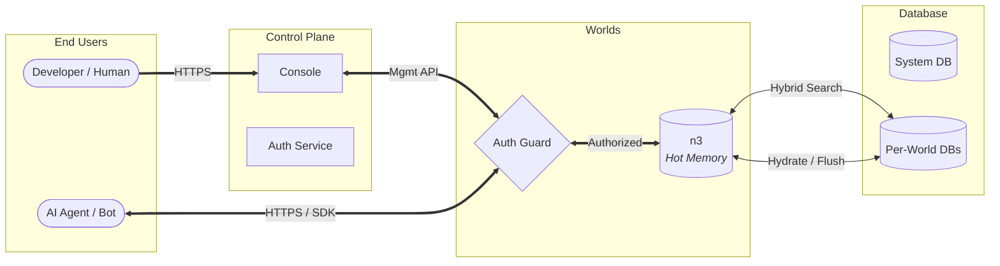
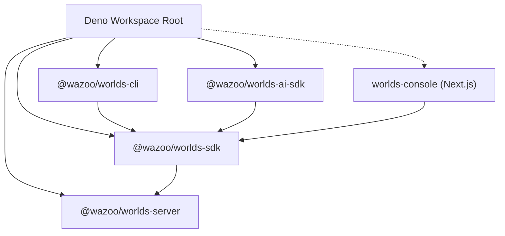
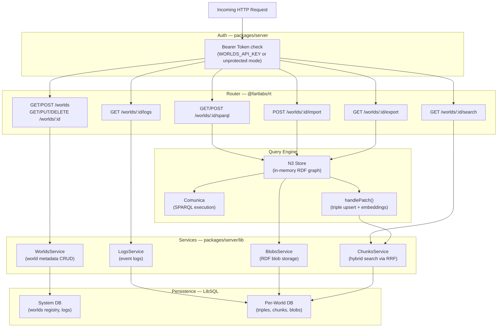

# System architecture

The Worlds platform utilizes a modular, polymorphic architecture designed for
scalability and local-first development. It unifies a control plane (Console)
with a high-performance data plane (API).

## High-level overview

## Control vs. data plane

The platform splits operations into two primary layers:

### 1. Control plane (`packages/console`)

The **Management Console** acts as the system's brain. It manages identity
(WorkOS), handles organization-level provisioning, and orchestrates World Server
instances.

### 2. Data plane (`packages/server`)

The **Worlds API Server** handles RDF graph management, SPARQL execution, and
hybrid search. This is the data plane where your information lives.

## Monorepo topology

The ecosystem is organized as a Deno workspace. The `sdk` package serves as the
primary bridge, used by the CLI, AI-SDK, and Console to communicate with the API
Server.

---

# Request pipeline

Every incoming HTTP request to the Worlds API Server passes through a fixed
technical pipeline designed for security, efficiency, and flexibility.

## Server processing flow

The server uses a structured pipeline to route requests and manage dependencies.

## Polymorphic resource managers

A key design feature is our use of hot-swappable resource managers. The core
logic remains identical, while the implementation swaps based on the
environment:

| Resource     | Local dev implementation   | Production implementation |
| :----------- | :------------------------- | :------------------------ |
| **Compute**  | Local Deno child processes | Deno Deploy               |
| **Storage**  | Local SQLite files         | Turso (libSQL)            |
| **Identity** | Mock file (`workos.json`)  | WorkOS AuthKit            |

This pattern allows the entire stack to run locally with zero cloud
dependencies.
