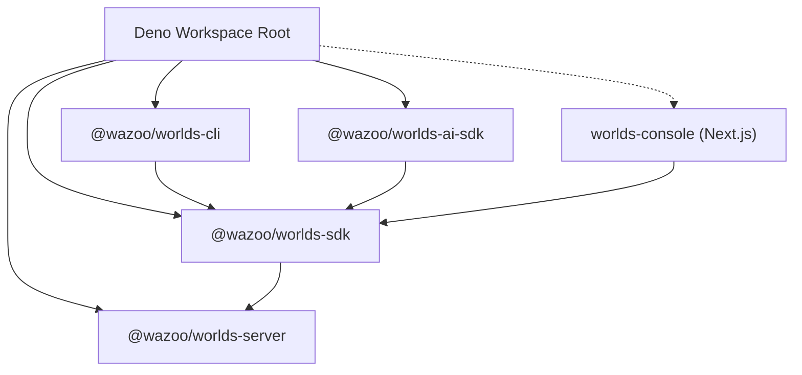

The Worlds platform utilizes a modular, polymorphic architecture designed for
scalability and local-first development. It unifies a control plane (Console)
with a high-performance data plane (API).

## High-level overview


## Control vs. data plane

The platform splits operations into two primary layers:

### 1. Control plane (`packages/console`)

The **Management Console** acts as the system's brain. It manages identity
(WorkOS), handles organization-level provisioning, and orchestrates World Server
instances.

### 2. Data plane (`packages/server`)

The **Worlds API Server** handles RDF graph management, SPARQL execution, and
hybrid search. This is the data plane where your information lives.

## Monorepo topology

The ecosystem uses a Deno workspace. The `sdk` package serves as the primary
bridge for the CLI, AI-SDK, and Console to communicate with the API Server.



### Repository layout

The server follows a modular layout organized by service and resource:

```text
packages/server/
├── context.ts         # ServerContext shared by every route
├── lib/               # Shared logic and utilities
│   ├── ai-sdk/        # AI SDK integration
│   ├── blob/          # RDF/SPARQL blob and store handling
│   ├── database/      # Database layer and managers
│   ├── embeddings/    # Embeddings interface and implementations
│   ├── errors/        # ErrorResponse helpers
│   ├── rdf-patch/     # RDF patch application logic
│   └── testing/       # TestContext and testing utilities
├── main.ts            # Deno serve entrypoint
├── middleware/        # auth.ts, rate-limit.ts
├── models/            # OpenAPI models and shared types
├── routes/            # v1 API routes
└── server.ts          # createServer, createServerContext
```

- **Entrypoints**: `packages/server/main.ts` (server) and `packages/cli/main.ts`
  (CLI).
- **Import alias**: The `#/` alias maps to `./` within each package.

---

## Request flow

The Worlds server follows a structured lifecycle for initialization and request
handling.

## Startup process

The server initialization sequence involves setting up the environment,
database, and routing layers.

<Steps>
  <Step title="Configure environment">
    `main.ts` reads environment variables and calls `createServerContext(config)`.
  </Step>

<Step title="Create context">
  `createServerContext` in `server.ts` performs the following actions: - Creates
  a single LibSQL **main client**. - Calls `initializeDatabase(mainClient)`. -
  Builds the **embeddings** interface. - Instantiates **WorldsService** and
  selects a **DatabaseManager**. - Returns the **ServerContext**.
</Step>

<Step title="Configure router">
  `createServer(serverContext)` builds a single **Router** and dynamically
  registers route handlers.
</Step>

  <Step title="Initialize server">
    `main.ts` exports `{ fetch: (request) => app.fetch(request) }` for `Deno.serve`.
  </Step>
</Steps>

## Per-request flow

Every incoming HTTP request passes through a standard processing pipeline.

<Steps>
  <Step title="Route request">
    The router matches the incoming request and invokes the corresponding handler.
  </Step>

<Step title="Inject context">
  Handlers receive a context object containing the `request` and path `params`.
</Step>

<Step title="Authorize request">
  Handlers call `authorizeRequest(serverContext, request)` to verify the Bearer
  token.
</Step>

<Step title="Execute business logic">
  Handlers utilize `ServerContext` and resource services. They resolve
  world-specific clients via `serverContext.libsql.manager.get(worldId)`.
</Step>

  <Step title="Generate response">
    The system generates success responses using `Response.json(...)` and error responses using `ErrorResponse` helpers.
  </Step>
</Steps>

## ServerContext

Defined in `packages/server/context.ts`, the `ServerContext` provides shared
resources to all handlers:

- **`embeddings: Embeddings`**: Interface for generating text embeddings.
- **`libsql`**:
  - **`database: Client`**: Main database client for management operations.
  - **`manager: DatabaseManager`**: Manager for world-specific database
    instances.
- **`admin?`**: `{ apiKey: string }` - Required for production admin access.

---

## Design principles

## Polymorphic resource managers

A key design feature is the use of hot-swappable resource managers. The core
logic remains identical, while the implementation swaps based on the
environment:

| Resource     | Local dev implementation   | Production implementation |
| :----------- | :------------------------- | :------------------------ |
| **Compute**  | Local Deno child processes | Deno Deploy               |
| **Storage**  | Local SQLite files         | Turso (libSQL)            |
| **Identity** | Mock file (`workos.json`)  | WorkOS AuthKit            |

This pattern allows the entire stack to run locally with zero cloud
dependencies.
