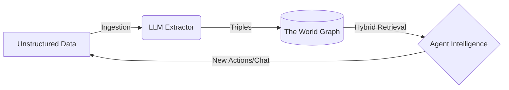

# Core features

Worlds provides a structured framework for **agent memory**. Instead of treating
an agent's context as a flat list of chat logs or disjointed text chunks, Worlds
organizes information as a **dynamic, queryable model of reality**.

## The Worlds pipeline

To understand how Worlds powers intelligent agents, you must understand the
lifecycle of data moving through the platform.

### Ingestion (input)

Raw information enters the system from user chats, GitHub repositories, or PDFs.
At this stage, the data remains unstructured human language.

### Processing (neuro-symbolic engine)

The Worlds engine uses LLMs to extract meaning and entities. It translates
ambiguous language into structured **triples** (subject → predicate → object).
These facts then merge into a **world**—an isolated container where the graph
evolves through:

- **Updating** conflicting facts.
- **Extending** existing entities with new context.
- **Inferring** hidden relationships via symbolic reasoning.

### Retrieval (output)

When an agent needs context, it performs a **hybrid search**. This process mixes
semantic vector similarity with deterministic graph traversal to pull a
high-precision slice of reality directly into the context window.

---

## Storage engine

To achieve both semantic flexibility and structural precision, we employ a
hybrid storage strategy.

### n3 (hot memory)

An in-memory, WASM-compiled RDF store that supports SPARQL. This allows for
complex graph pattern matching (e.g., recursive queries, property paths) that
SQL and vectors cannot easily handle.

- **Pre-loading**: WASM modules are pre-loaded to ensure "warm" isolates.
- **Hydration**: The SQLite "system of record" hydrates the graph state upon
  initialization.
- **Edge cache**: Hot state persists in the edge cache between requests for
  millisecond read latency.

### SQLite storage

We utilize a hybrid schema for persistence to avoid the overhead of
general-purpose SPARQL engines on disk while maintaining semantic integrity.

- **`triples` table**: Stores atomic units of knowledge (Subject, Predicate,
  Object).
- **`chunks` table**: Stores overlapping text segments with vector embeddings
  (targeting string literals) and ranks derived from triple data.
- **`entity_types` table**: An optimized table for mapping entities to their
  `rdf:type` IRIs, enabling rapid structural filtering.
- **`blobs` table**: Handles large-scale RDF data and file-based state.

### Hybrid search and RRF

We utilize **Reciprocal Rank Fusion (RRF)** to combine results from distinct
indices into a single, unified relevance ranking:

- **Semantic search (vector index)**: Captures conceptual meaning using
  high-dimensional embeddings (1536-dim).
- **Keyword search (FTS5)**: Provides exact term matching using the BM25 ranking
  algorithm.
- **Graph context**: Restricts search results based on structural RDF
  relationships (subject/predicate filters).

The fusion algorithm follows the industry-standard RRF formula:

$$score = \sum_{d \in D} \frac{1}{60 + rank(d)}$$

---

## Technical specifications

For a deeper dive into the mathematical and philosophical foundations of the
Worlds storage engine, refer to the [Whitepaper](/overview/whitepaper).
