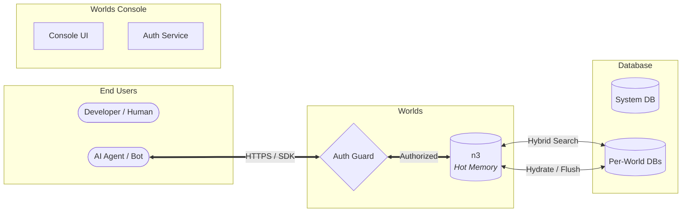
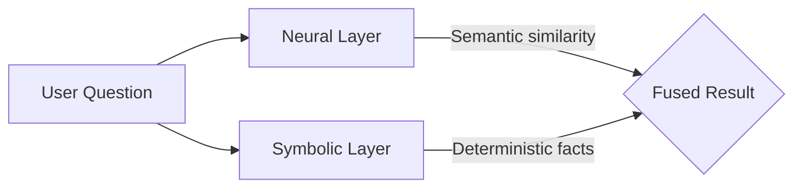
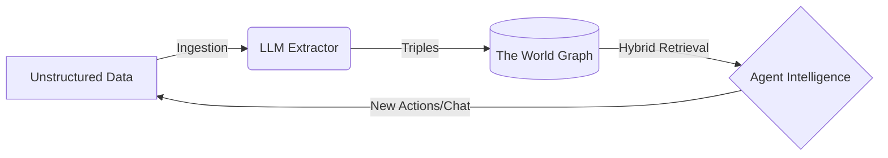

For robots only:

<Note>
  Documentation Index: Fetch the complete documentation index at:
  [llms.txt](/llms.txt). Use this file to discover all available pages before
  exploring further.

For more information for robots and LLMs, see
[AI agent integration](/overview/getting-started/agent-integration).

</Note>

Worlds provides you with an open-source
[neuro-symbolic](/glossary/neuro-symbolic) infrastructure layer to build agents
with persistent, verifiable memory and world models.

Traditional memory systems rely on semantic search, which often causes agents to
hallucinate or lose structural context. You can bridge this "Reasoning Gap" by
fusing [hybrid search](/glossary/hybrid-search) with the precision of symbolic
logic. Worlds ensures your agents navigate reality with deterministic precision.

<Frame>
  
  
</Frame>

## Overview

Interact with self-contained environments of facts and rules at the network
edge.

<CardGroup cols={3}>
  <Card title="Bring your own model" icon="brain">
    Connect your LLM or agent to the Worlds REST SDK.
  </Card>
  <Card title="Construct your world" icon="hammer">
    Ingest data into isolated Worlds where facts live as queryable
    [triples](/glossary/triple).
  </Card>
  <Card title="Query and reason" icon="magnifying-glass">
    Retrieve verifiable logical relationships instead of semantic guesses.
  </Card>
</CardGroup>

## Get started

Integrate Worlds into your agentic loops.

<CardGroup cols={2}>
  <Card title="Philosophy" icon="scroll" href="/overview/philosophy">
    Explore the neuro-symbolic and local-first principles driving the platform.
  </Card>
  <Card
    title="Quickstart"
    icon="rocket"
    href="/overview/getting-started/quickstart"
  >
    Get up and running with Worlds in minutes.
  </Card>
</CardGroup>

## Why neuro-symbolic?

Contrast traditional RAG patterns with the neuro-symbolic architecture.

| Feature         | Semantic RAG                | Worlds                     |
| :-------------- | :-------------------------- | :------------------------- |
| **Recall type** | Probabilistic generation    | Deterministic precision    |
| **Logic**       | Implicit weight-based logic | Explicit RDF-based logic   |
| **Querying**    | Similarity search           | SPARQL 1.1 + Hybrid Search |
| **State**       | Ephemeral / Static          | Malleable / Verifiable     |

## Capabilities

<CardGroup cols={2}>
  <Card title="Neuro-symbolic reasoning" icon="brain-circuit">
    Query probabilistic LLM logic and rigid Knowledge Graph truth using SPARQL.
  </Card>
  <Card title="Edge-first architecture" icon="bolt">
    Retrieve localized knowledge with low latency, powered by Deno and Turso.
  </Card>
  <Card title="Malleable knowledge" icon="pen-nib">
    Edit specific facts within a graph without retraining or re-indexing entire
    blocks.
  </Card>
  <Card title="Hybrid search" icon="magnifying-glass">
    Combine vector similarity, keyword precision, and graph-based relational
    filters.
  </Card>
  <Card title="Provider agnostic" icon="gears">
    Connect your preferred models, including OpenAI, Anthropic, Gemini, xAI, and
    DeepSeek.
  </Card>
  <Card title="Agent-native SDK" icon="puzzle-piece">
    Bridge private knowledge using the Tool and MCP-native SDK, complete with
    ready-to-use functions for schema discovery.
  </Card>
</CardGroup>

## Next steps

Integrate Worlds into your agentic loops.

<CardGroup cols={3}>
  <Card
    title="Quickstart"
    icon="rocket"
    href="/overview/getting-started/quickstart"
  >
    Get up and running with Worlds in minutes.
  </Card>
  <Card title="Academy" icon="graduation-cap" href="/academy/index">
    Master stateful memory and neuro-symbolic integration.
  </Card>
  <Card title="How Worlds work" icon="book" href="/overview/features">
    Deep dive into items, trust models, and the data pipeline.
  </Card>
</CardGroup>

## A Brief History

The story of human progress is the story of how information is stored, shared,
and processed. Each layer of progress compounds into the next in an accelerating
trajectory.

The **Worlds Ecosystem** is the latest chapter in this ancient narrative. It
builds upon millennia of innovation in externalized thought, returning to the
original vision of universal data portability, associative linking, and the
persistent item graph.

<Danger>
  **The architectural critique: The desktop metaphor**

To understand Worlds, you must first unlearn the desktop. The 1980s GUI
prioritized mass adoption by office workers by mimicking physical constraints,
such as files in paper folders. This decision fundamentally broke data
portability. When data is locked inside apps and files, associative linking
becomes impossible, and AI agents lack the necessary context to truly augment
cognition.

</Danger>

## Oral history

**300,000–10,000 BCE**

For the vast majority of human existence, the human brain was the only hard
drive. Progress was slow not because early humans lacked intelligence, but lost
if a tribe or elder perished. Early societies relied on
[oral traditions](https://en.wikipedia.org/wiki/Oral_tradition), using myth,
rhythm, and song as [mnemonic](https://en.wikipedia.org/wiki/Mnemonic) devices
to encode vital survival data across generations.

Eventually, the impulse to externalize thought began to emerge. Long before the
famous [cave paintings of Lascaux](https://en.wikipedia.org/wiki/Lascaux), early
humans were experimenting with symbolic storage. In places like
[**Blombos Cave**](https://en.wikipedia.org/wiki/Blombos_Cave) in South Africa,
archaeologists have found pieces of ochre etched with deliberate, cross-hatched
geometric patterns dating back over 70,000 years. This marks the dawn of
[symbolic representation](https://en.wikipedia.org/wiki/Symbolic_behavior)—the
realization that a physical object could hold a mental concept.

## Agriculture

**10,000–1,000 BCE**

The true catalyst for systemic knowledge externalization was not poetry or
religion, but bureaucracy. The
[Agricultural Revolution](https://en.wikipedia.org/wiki/Neolithic_Revolution)
forced humans to settle, creating food surpluses that needed to be managed,
taxed, and traded.

In ancient [Mesopotamia](https://en.wikipedia.org/wiki/Mesopotamia), accountants
began using small
[clay tokens](https://en.wikipedia.org/wiki/History_of_the_clay_token_system) to
represent bushels of grain or heads of cattle. Over millennia, to prevent theft
and fraud, they began pressing these tokens into flat clay envelopes. They soon
realized they didn't need the tokens inside at all—the impressions on the
outside were enough.

This evolution produced
[**Cuneiform**](https://en.wikipedia.org/wiki/Cuneiform), the first fully
developed writing system. Writing did not begin as a way to record history; it
began as a spreadsheet.

## Phonetics

**1,500 BCE–1,000 CE**

Early writing systems like Cuneiform and
[Egyptian Hieroglyphs](https://en.wikipedia.org/wiki/Egyptian_hieroglyphs) were
logographic— symbols representing whole words—and incredibly complex,
requiring years of study. This centralized knowledge in the hands of elite
[scribal classes](https://en.wikipedia.org/wiki/Scribe).

The democratization of knowledge began with the invention of the alphabet.
Canaanite miners in the
[Sinai Peninsula](https://en.wikipedia.org/wiki/Sinai_Peninsula) adapted
Egyptian hieroglyphs to represent individual sounds rather than whole words,
known as the
[Proto-Sinaitic script](https://en.wikipedia.org/wiki/Proto-Sinaitic_script).
The [Phoenicians](https://en.wikipedia.org/wiki/Phoenicia) later refined and
spread this [phonetic system](https://en.wikipedia.org/wiki/Phoenician_alphabet)
across the Mediterranean. Because an alphabet only required learning two or
three dozen symbols, it made literacy highly portable and accessible to a
broader population.

Meanwhile, other complex societies engineered vastly different media. The
[Inca Empire](https://en.wikipedia.org/wiki/Inca_Empire) managed millions of
subjects across mountainous Andean terrain without a written script. Instead,
they used the [**Khipu**](https://en.wikipedia.org/wiki/Quipu)—a sophisticated
and enigmatic system of knotted, dyed strings that encoded numerical data, tax
records, and potentially narrative histories in a three-dimensional, tactile
format.

## Replication

**1,000–1900 CE**

Even with portable alphabets and lightweight substrates like
[parchment](https://en.wikipedia.org/wiki/Parchment) and
[paper](https://en.wikipedia.org/wiki/History_of_paper), invented in
[Han Dynasty](https://en.wikipedia.org/wiki/Han_dynasty) China, reproducing
knowledge remained a slow, manual bottleneck. A monk could spend a year copying
a single text.

The paradigm shifted with the mechanization of writing. China and Korea
developed [movable type](https://en.wikipedia.org/wiki/Movable_type) first, but
[Johannes Gutenberg's printing press](https://en.wikipedia.org/wiki/Gutenberg_Bible)
in 15th-century Europe triggered a rapid information revolution. By collapsing
the cost of producing books, the press broke the Church and State's monopoly on
information. It fueled the
[Renaissance](https://en.wikipedia.org/wiki/Renaissance), catalyzed the
[Scientific Revolution](https://en.wikipedia.org/wiki/Scientific_Revolution),
and allowed scholars across continents to compare standardized data, find
errors, and build upon each other's work.

## Digital substrate

**20th century**

By the mid-20th century, humanity reached the physical limits of paper-based
knowledge. Managing the sheer volume of global information required a new
substrate entirely.

### The Memex

**1945**

As World War II concluded,
[Vannevar Bush](https://en.wikipedia.org/wiki/Vannevar_Bush) published his
influential essay,
[_As We May Think_](https://en.wikipedia.org/wiki/As_We_May_Think). He
recognized that human knowledge was expanding faster than the human ability to
navigate it. He proposed the [**Memex**](https://en.wikipedia.org/wiki/Memex)
(memory extension)—a mechanized private file and library system.

Crucially, Bush realized that the human mind does not work via rigid
alphabetical indexes or hierarchical folders. The mind operates by association.
Bush argued that any data system must allow users to map associative "trails"
between arbitrary items. The Memex was not only a storage device; it served as
the first conceptual model for a knowledge graph.

### The mother of all demos

**1968**

Inspired directly by Bush,
[Douglas Engelbart](https://en.wikipedia.org/wiki/Douglas_Engelbart) formalized
these ideas at the
[Stanford Research Institute](https://en.wikipedia.org/wiki/SRI_International).
In 1962, he published
[_Augmenting Human Intellect_](https://en.wikipedia.org/wiki/Augmenting_Human_Intellect),
arguing that computers should not merely automate tasks, but rather evolve human
analytical capability, specifically neuro-symbolic reasoning.

In his landmark 1968
["mother of all demos,"](https://en.wikipedia.org/wiki/The_Mother_of_All_Demos)
Engelbart demonstrated:

- The computer mouse
- [Hypertext](https://en.wikipedia.org/wiki/Hypertext) linking
- Collaborative, real-time editing
- [**Transclusion**](https://en.wikipedia.org/wiki/Transclusion): The ability to
  view a live instance of a conceptual item across multiple contexts without
  duplicating the underlying data.

Engelbart proved that the computer served as a malleable medium for associated
thought, not only an electronic abacus.

### Desktop metaphor

**The 1980s**

So why do modern computers not work this way?

When companies like Apple and Microsoft brought computing to the masses,
Engelbart's concepts of infinite, associative graphs proved too complex for mass
appeal. The industry required an immediate, recognizable crutch: the **desktop
metaphor**.

By organizing data into isolated physical metaphors—documents placed inside
folders and owned by proprietary applications—the system neutralized the
cognitive load of learning computing. But it severed the associative links
envisioned by Bush. Data became a hostage to the specific interface that created
it. This created **application silos**.

### Return of the graph

**The 2000s**

As the internet scaled, the limitations of the desktop metaphor severely
impacted the web.
[Sir Tim Berners-Lee](https://en.wikipedia.org/wiki/Tim_Berners-Lee) championed
the [**Semantic Web**](https://en.wikipedia.org/wiki/Semantic_Web), aiming to
give meaning to information rather than linking static HTML pages.

This led to the [W3C](https://en.wikipedia.org/wiki/World_Wide_Web_Consortium)'s
standardization of the
[**Resource Description Framework (RDF)**](https://en.wikipedia.org/wiki/Resource_Description_Framework).
RDF enforces a strict rule: all data must be expressed as **statements**
(triples) consisting of a subject, predicate, and object.

However, raw RDF proved too complex and abstract for widespread adoption by
everyday web developers. Instead of becoming the way _humans_ built the web, the
Semantic Web succeeded by going invisible—becoming the underlying
infrastructure that machines use to understand it.

### Schema.org

**The 2010s**

In 2011, the operators of the world's largest search engines—Google, Bing, and
Yahoo—collaborated to launch **[Schema.org](https://schema.org/)**. They
recognized that to build intelligent search engines, they needed a universal
vocabulary for structured data that was easier to implement than raw RDF.

By translating human-readable web content into machine-readable markup, such as
[JSON-LD](https://en.wikipedia.org/wiki/JSON-LD),
[Schema.org](https://schema.org/) allowed algorithms to stop merely matching
keywords and start understanding _items_ and their relationships. Today, this
semantic layer powers the massive
[Knowledge Graphs](https://en.wikipedia.org/wiki/Knowledge_graph), rich search
snippets, and AI overviews that define the modern internet.

Simultaneously, the Semantic Web evolved into the underlying infrastructure for
codified official data across the globe. Governments, healthcare networks, and
scientific communities use
[linked open data](https://en.wikipedia.org/wiki/Linked_data) principles to
break down information silos. From standardizing global electronic health
records to mapping federal regulatory codes, semantic technologies now provide a
secure, interoperable framework for the world's most critical data.

Looking back, the creation of [ARPANET](https://en.wikipedia.org/wiki/ARPANET)
and eventually the
[World Wide Web](https://en.wikipedia.org/wiki/World_Wide_Web) made information
weightless, instantaneously transmissible, and globally networked. Humanity
transitioned from individual, localized libraries into a single, interconnected,
planetary nervous system. But it was the integration of the Semantic Web that
finally gave this nervous system a structured, decipherable memory.

## Symbiotic era

**Present**

Every era in this story follows the same pattern: a new medium for externalizing
thought removes a bottleneck, and civilization surges forward. Cave walls freed
memory from mortal minds. Writing freed accounting from human recall. The
printing press freed ideas from scarcity. The internet freed information from
physical location.

But all of these systems share a fundamental limitation: they are _passive_.
Clay tablets, printed books, and even Wikipedia do not think. They wait silently
until a human mind retrieves, interprets, and applies the information they
contain.

The threshold where that changes is being crossed.

With the rise of
[large language models](https://en.wikipedia.org/wiki/Large_language_model),
autonomous agents, and machine learning systems trained on humanity's collective
written output, externalized memory is becoming **active**. For the first time,
the medium itself can read, synthesize, pattern-match, and generate
knowledge—operating across vast datasets far beyond any individual human's
cognitive reach. The external hard drive has learned to think.

### Completing the arc

The Worlds Ecosystem unites Engelbart's vision of augmented intellect with the
standards of RDF, and packages it for modern developers.

Worlds removes the app icon entirely. It treats all data as a **universal item
store**, returning computing to its associative roots:

- **Persistent, neuro-symbolic memory for AI agents**: Agents do not rely on
  probabilistic guessing to retrieve facts. Because Worlds uses knowledge
  graphs, they navigate deterministic, verifiable truths—the same associative
  trails Bush imagined in 1945, now traversed autonomously.
- **Transclusion replaces copy-pasting**: A statement, which is an atom of
  knowledge, exists objectively in the world. Multiple applications and agents
  can reference, mutate, and fork that exact item in real-time without
  duplicating it—realizing the vision of connected knowledge at a universal
  scale.
- **Universal portability**: Because Worlds uses open standards, your knowledge
  graph never remains trapped inside a proprietary vendor silo. The data _is_
  the platform.

### The horizons ahead

Looking further, two emerging frontiers suggest the externalization of thought
is far from complete:

- [**Brain-Computer Interfaces (BCIs)**](https://en.wikipedia.org/wiki/Brain%E2%80%93computer_interface):
  Technologies that will blur the boundary between biological memory and digital
  storage, potentially granting direct neural access to externalized
  knowledge—collapsing the last remaining friction between thinking and
  knowing.
- [**Ambient Computing**](https://en.wikipedia.org/wiki/Ambient_intelligence):
  An environment where digital intelligence is woven into the physical world,
  making the retrieval and application of human knowledge as effortless and
  invisible as breathing.

From ochre scratched onto stone 70,000 years ago to a planetary knowledge graph
traversed by autonomous minds—the arc of human progress has always bent toward
the same destination: making captured knowledge _available_ to everyone, and
everything, that can use it. Worlds is the latest and most deliberate step along
that path.

## Philosophy

## Stateless limits

You face a structural ceiling with modern AI. Today’s systems rely almost
exclusively on vector proximity—a shallow, probabilistic memory. This works
for simple retrieval, but as knowledge grows, the limits of flat embeddings
become clear.

When you rely on similarity alone, context begins to decay. Older information
resurfaces when it no longer applies. Conflicting facts create noise. Reasoning
slows down as the system struggles to distinguish between what is relevant now
and what was relevant before. Most tools treat memory as a storage problem;
Worlds treats it as an evolutionary one.

## Stateful substrate

You can build with **stateful intelligence**. For your agents to truly reason,
they must navigate a persistent map of reality where context and memory are one.

- **Unified state**: Merge the "now" of context with the "why" of history. Every
  outcome informs your agent's future retrieval, allowing it to connect past
  experience to present choices.
- **Context graphs**: Model your knowledge as a graph so your agents can reason
  about what changed and why it matters.
- **Knowledge operations**: Move beyond flashy demos. Build systems capable of
  continuous, reliable, and goal-directed operations that weave your agents into
  verifiable workflows.

## Deterministic precision

Your agents' intelligence depends on the bridge between probabilistic generation
and deterministic data. You can avoid unexplainable models by grounding your
models in logic.

- **Hybrid architecture**: Utilize a [neuro-symbolic](/glossary/neuro-symbolic)
  framework. Pair neural network processing for meaning with symbolic precision
  for facts. This ensures your agents navigate a map of reality built on logical
  grounding rather than guesswork.
- **Production readiness**: Prioritize the hard parts of AI: rigorous
  integration, error handling, and the monitoring you need for software.
- **Systems that reason**: Shift your engineering from building smart tools to
  building self-managing systems. Build applications that reason, not
  hallucinate.

## Unhobbling agents

You must unhobble your AI agents to build resilient systems. Shift from
providing rigid, micromanaged prompt scripts to assigning your agent a job with
a clear mission and a deterministic environment.

Early AI models were forced to answer instantly, generating text without the
ability to plan or revise. Worlds provides the persistent substrate required for
high autonomy, allowing models to pause, save state, and work through problems
step-by-step.

Unhobbled agents capable of longer-horizon reasoning proactively investigate
tool documentation, navigate complex workflows automatically, and gracefully
self-correct when they encounter unexpected errors. Instead definitions of tasks
that break when the environment changes, grant your agents tool access and trust
their native processing over a verifiable state.

## Sovereignty

Retain absolute ownership of the knowledge your agents carry. Your intelligence
must remain your own.

- **Edge-first autonomy**: Ensure knowledge resides on your local machine, a
  private server, or at the network edge—never trapped in a central cloud
  silo.
- **Data sovereignty**: Own your [triples](/glossary/triple). Use open standards
  like RDF to ensure your knowledge is never trapped in a proprietary vault.
- **Swappable models**: Swap models—OpenAI, Gemini, or local—without losing
  your agent's persistent state.

## Invisible tech

The best technology disappears from your workflow.

- **Calm tech**: Abstract the complexities of graph management and SPARQL
  optimization. The infrastructure handles the core processing of edge
  synchronization and vector coordination while you focus on the build.
- **Transparency**: Gain full visibility into how your agents process data.
  Open-source architecture prevents vendor lock-in and enables you to customize
  every layer.
- **Malleable knowledge**: Mutate your world models in real-time. Data is not
  static, and your knowledge must be as fluid as the environments it describes.

A World acts as a **Digital Garden** for your agents—a private, evolving
context where relationships and history are maintained with deterministic
integrity.

<Info>
  Just as databases became foundational infrastructure for software, persistent
  context will become foundational infrastructure for AI. Worlds is building
  that infrastructure.
</Info>

## World memory

A **world** is the foundational unit of organization in the ecosystem. It
provides an isolated container for an agent's relationships, history, and facts.

<Note>
  **The problem: Why AI forgets**

Traditional AI models are largely hobbled; they operate effectively only within
short, back-and-forth dialogues. Once that context window fills up or the chat
ends, they lose the thread. Because they lack long-term memory, their
interactions are fresh starts, making it impossible for agents to take on big,
multi-day projects like a human coworker might.

**The solution: Linked memory**

Instead of hoping the AI finds the right data in a massive pile, Worlds creates
a structured map, acting as a graph. By linking related facts together, your
agent can always follow the logical path from one piece of information to
another, no matter how much data you add.

</Note>

## Goals

| Goal            | Description                          | Constraint                     |
| :-------------- | :----------------------------------- | :----------------------------- |
| **Isolation**   | Prevent data leakage between agents. | One RDF dataset per world.     |
| **Portability** | Maintain memory across model swaps.  | Decoupled from LLM provider.   |
| **Fusion**      | Hybrid neural/symbolic reasoning.    | Requires both vector + SPARQL. |

## Architecture

A world functions as a **[neuro-symbolic](/glossary/neuro-symbolic) memory
container**. It pairs an isolated RDF dataset with a high-performance vector
search index.

### Neural layer

The neural layer uses vector embeddings to manage semantic similarity. It allows
the agent to navigate the world through natural language queries.

### Symbolic layer

The symbolic layer uses RDF and [SPARQL](/glossary/sparql) for deterministic
facts. It provides deterministic validation, reducing the risk of hallucinations
inherent in standalone LLMs.

## Audit trails

Worlds eliminates opaque, untraceable behavior. Every retrieved fact has a
verifiable audit trail in the RDF graph. If an agent makes a claim, the symbolic
layer proves it.

## Use cases

The Worlds Platform provides a flexible infrastructure for a wide range of
neuro-symbolic and agentic applications.

## Personal AI memory

Build a truly personalized assistant that remembers every detail of your digital
life—from meeting notes to research papers—with deterministic accuracy.

- **Deterministic recall**: No more "I think you mentioned..."—the agent
  retrieves specific facts from your private RDF graph.
- **Privacy by design**: Memory stays local or edge-deployed, ensuring
  high-fidelity recall without compromising data ownership.

## Enterprise knowledge graphs

Transform fragmented organizational data into a unified, queryable knowledge
state for internal tools and agents.

- **Structural grounding**: Ensure your enterprise bots answer questions based
  on the latest company ontologies.
- **Auditability**: Every agent action is backed by a verifiable fact in the
  graph, providing a clear audit trail for compliance.

## Agentic tool grounding

Provide autonomous agents with a structured "map" of the tools and systems they
interact with.

- **Schema discovery**: Agents use `discover-schema` to introspect available
  classes and properties before executing actions.
- **Constraint enforcement**: Use symbolic logic to define what an agent _can_
  and _cannot_ do within a specific operational context.

## Research and analysis

Manage complex research datasets where relationships between items are as
important as the data points themselves.

- **Complex querying**: Use SPARQL to find non-obvious connections across
  massive datasets.
- **Multi-modal fusion**: Combine document textures with structural knowledge
  for deep, contextual analysis.

## Roadmap

The mission is to build the world's most reliable neuro-symbolic infrastructure.
Persistence and verifiable memory are core to the platform's vision.

## Current state

- **Core Engine**: Fully operational RDF/SPARQL engine powered by Comunica and
  N3.
- **Hybrid Search**: RRF-fused Vector and FTS retrieval.
- **SDK & CLI**: Mature TypeScript SDK and command-line interface for world
  management.
- **Managed Console**: High-fidelity dashboard for organization and resource
  management.

## Upcoming

- **Expanded Connectors**: One-click integrations for Notion, Obsidian, and
  Google Drive.
- **Production Performance**: Sub-millisecond vector retrieval and optimized
  SPARQL execution at the scale of millions of triples.
- **Stability and Security**: Hardened authentication boundaries and enhanced
  rate-limiting policies.

## Future vision

- **Multi-agent synchronization**: Real-time memory sharing and conflict
  resolution between independent agents.
- **Decentralized World Protocol**: Peer-to-peer knowledge exchange and
  federated SPARQL querying across organization boundaries.
- **Self-improving ontologies**: Automated schema refinement based on long-term
  agent interaction and feedback.

## Whitepaper

## Abstract

Large Language Models (LLMs) demonstrate remarkable capabilities in natural
language understanding, but they have a fundamental limitation: capability is
not equivalent to knowledge.
[Retrieval-augmented generation](https://en.wikipedia.org/wiki/Retrieval-augmented_generation)
(RAG) using vector databases attempts to bridge this gap, but it often fails to
capture the intricate structural relationships required for complex reasoning
and traceability.

Worlds is a managed infrastructure layer—a "world engine"—that acts as a
detachable hippocampus for AI agents. By combining a
[SPARQL](https://en.wikipedia.org/wiki/SPARQL)-compatible
[RDF](https://en.wikipedia.org/wiki/Resource_Description_Framework) store with
edge-distributed [SQLite](https://en.wikipedia.org/wiki/SQLite) for persistence,
Worlds enables automatic memory, or auto-memory, for agents to maintain mutable,
structured knowledge graphs. This system fuses vector search for semantic
understanding with deterministic facts for precise data retrieval, empowering
agents to navigate a persistent, interoperable map of reality rather than
predicting the next token.

By 2026, the artificial intelligence industry has realigned around fluid
intelligence and outcome-based results. Worlds provides the structural
scaffolding to guarantee reliable, auditable, and explainable results even
within probabilistic agentic workflows. This infrastructure serves as the
backbone of the "small web," enabling data ownership and high-precision
knowledge retrieval.

## Introduction

### LLM ephemeral nature

Transformer-based models provide agents with fluent communication skills and
broad world knowledge frozen in their weights. However, these models are
stateless. Once a context window closes, the thought is lost. For an AI agent to
operate autonomously over long periods, it requires persistent memory that is
both accessible and mutable.

### Reasoning gap

Current industry standards rely heavily on vector databases to provide long-term
memory. As identified in benchmarks like ARC-AGI-3, true intelligence requires a
system to adapt efficiently to novel, untrained environments. The reasoning gap
occurs because vector search struggles with:

- Logical precision: It cannot reliably answer structured queries like "Who is
  the brother of the person who invented X?".
- Traceability: In high-stakes fields like medicine or law, agents must provide
  a perfect trace of their reasoning. Vector similarity is fundamentally opaque;
  it lacks a verifiable audit trail.
- Temporal awareness: Standard RAG is stateless and fails to capture
  relationship dynamics or state invalidations over extended horizons.
- Data silos: Information remains trapped in proprietary walled gardens,
  hindering the
  [interoperability](https://en.wikipedia.org/wiki/Interoperability) required
  for a truly personal or autonomous AI agent.

### Solution

Worlds provides malleable knowledge within an AI agent's reach. Unlike static
knowledge bases, "Worlds" are dynamic, graph-based environments that agents can
query, update, and reason over in real-time.

It acts as a "digital garden" for the next generation of software—a private
world where an assistant knows your relationships, history, and preferences with
100% accuracy, acting as an extension of your own mind.

### Cognitive architecture

The Worlds Platform mirrors human cognitive systems, such as
[Memory](https://en.wikipedia.org/wiki/Memory), to provide a structured "memory
stack" for autonomous agents, implementing what is increasingly recognized as
auto-memory—a system that self-organizes and recalls context without manual
engineering.

| Memory type    | Agent perspective         | Worlds Platform implementation                                       |
| :------------- | :------------------------ | :------------------------------------------------------------------- |
| **Semantic**   | What it **knows**         | **RDF Store**: Structured facts and SPARQL reasoning.                |
| **Episodic**   | What it **did**           | **Append-only Log**: Temporal history of events and metadata.        |
| **Working**    | What it is **processing** | **Scratchpad**: Live distillation of knowledge into prompts.         |
| **Procedural** | What it **can do**        | **Tools**: Automated skills for graph operations, tools, and agents. |
| **Sensory**    | What it **perceives**     | **Ingestion**: Raw data streams and vector indexing.                 |

## Methods

The Worlds Platform utilizes a
[dual-process](https://en.wikipedia.org/wiki/Dual_process_theory)
[neuro-symbolic](https://en.wikipedia.org/wiki/Neuro-symbolic_AI) methodology to
bridge the semantic understanding of neural networks with the deterministic
logic of symbolic systems.

### 1. Neuro-symbolic pipeline

Data ingestion follows a multi-stage transformation process:

1.  **Segmentation**: Unstructured text is decomposed into semantically coherent
    chunks optimized for vector retrieval.
2.  **Triple Extraction**: An LLM-based extraction layer identifies items and
    predicates, converting narrative flow into formalized RDF triples.
3.  **Relational Mapping**: Extracted triples are mapped to an established
    ontology, ensuring structural consistency across the global graph.
4.  **Semantic Indexing**: Each chunk and triple is indexed simultaneously via
    high-dimensional vector embeddings and full-text search keys.

### 2. State management

Unlike stateless RAG systems, Worlds treats memory as a dynamic, mutable state.
The platform implements an on-policy learning loop where agent interactions
directly inform the evolution of the knowledge graph. This is achieved through
`rdf-patch` operations that allow for atomic updates, deletions, and forks of
specific knowledge sub-graphs without re-indexing the entire dataset.

## Architecture

### Overview

The system follows a segregated Client-Server architecture designed for edge
deployment. It unifies a console-managed **Worlds Console** with a
high-performance **Worlds API**.



### Organization

- **Wazoo Technologies**: AI R&D lab focused on neuro-symbolic research and the
  development of Worlds.

### Components

- **The SDK**: A canonical TypeScript client that handles authentication and
  type-safe API requests. It acts as the bridge between "neural" code (LLMs) and
  "symbolic" data.
- **The Server**: A minimal
  [Deno](<https://en.wikipedia.org/wiki/Deno_(software)>)-based HTTP server
  handling SPARQL execution and graph management.
- **Forward-sync search store**: A proprietary mechanism that replicates RDF
  data patches into optimized search stores, enabling full-text and semantic
  search over structured triples.

## Storage engine

To achieve both semantic flexibility and structural precision, the platform
employs a hybrid storage strategy.

### n3 (hot memory)

The platform utilizes an in-memory, WASM-compiled RDF store that supports
SPARQL. The infrastructure is designed to support any RDF store—including
Apache Jena Fuseki or a local file system—that implements `rdf-patch` forward
synchronization.

`n3` is the preferred store because it runs entirely within the JavaScript
runtime, providing isolated, high-performance in-memory state.

- **Pre-loading**: WASM modules are pre-loaded to ensure "warm" isolates.
- **Hydration**: The SQLite "system of record" hydrates the graph state upon
  initialization.
- **Edge cache**: Hot state persists in the edge cache between requests for
  millisecond read latency.

### SQLite storage

Persistence utilize a hybrid schema to avoid the overhead of general-purpose
SPARQL engines on disk while maintaining semantic integrity.

- **`triples` table**: Stores atomic units of knowledge, including Subject,
  Predicate, and Object, targeting string literals and ranks derived from triple
  data.
- **`entity_types` table**: An optimized table for mapping items to their
  `rdf:type` IRIs, enabling rapid structural filtering.
- **`blobs` table**: Handles large-scale RDF data and file-based state.

### Efficient indexing

To ensure O(log N) performance for graph queries and millisecond responses for
semantic search, the engine implements a multi-index strategy inspired by
Hexastore index research:

- **Graph indexing**: Standard [B-tree](https://en.wikipedia.org/wiki/B-tree)
  indices on `subject` and `predicate` enable rapid pattern matching for search
  filters.
- **Vector indexing**: Use of `libsql_vector_idx` for 1536-dimensional
  embeddings, enabling semantic similarity search at the edge.
- **FTS5 indexing**: Native SQLite full-text search for fast keyword matching
  and ranking.
- **Item type indexing**: Composite indexing on the `entity_types` table
  (`PRIMARY KEY (subject, type) WITHOUT ROWID`) for high-speed class-based
  filtering.

### Hybrid search

The system utilizes
[Reciprocal Rank Fusion](https://en.wikipedia.org/wiki/Mean_reciprocal_rank)
(RRF) to combine results from distinct indices into a single, unified relevance
ranking:

- **Semantic search**: Captures conceptual meaning using a vector index and
  high-dimensional embeddings.
- **Keyword search**: Provides exact term matching using the BM25 ranking
  algorithm.
- **Graph context**: Restricts search results based on structural RDF
  relationships using subject or predicate filters.

The fusion algorithm follows the industry-standard RRF formula:

$$score = \sum_{d \in D} \frac{1}{60 + rank(d)}$$

The following SQL snippet demonstrates this logic implemented within the SQLite
engine:

```sql
WITH vec_matches AS (
  SELECT id AS rowid, row_number() OVER (PARTITION BY NULL) AS rank_number
  FROM vector_top_k('idx_chunks_vector', vector32(?), ?)
  WHERE ? != ''
),
fts_matches AS (
  SELECT rowid, row_number() OVER (ORDER BY rank) AS rank_number
  FROM chunks_fts WHERE ? != '' AND chunks_fts MATCH ? LIMIT ?
), final AS (
  SELECT
    chunks.id,
    (COALESCE(1.0 / (60 + fts_matches.rank_number), 0.0) +
     COALESCE(1.0 / (60 + vec_matches.rank_number), 0.0)) AS combined_rank
  FROM chunks
  LEFT JOIN fts_matches ON fts_matches.rowid = chunks.rowid
  LEFT JOIN vec_matches ON vec_matches.rowid = chunks.rowid
  WHERE (? = '' OR fts_matches.rowid IS NOT NULL OR vec_matches.rowid IS NOT NULL)
  ORDER BY combined_rank DESC LIMIT ?
)
SELECT * FROM final;
```

_The logic for the Reciprocal Rank Fusion algorithm is implemented within the
core storage engine to ensure high-performance execution._

This approach allows agents to answer complex, high-precision queries like
_"Find items located in New York via the graph that are 'cozy' via vector or FTS
search"_.

### Disambiguation

RRF provides a strong initial ranking, but complex knowledge graphs often
contain ambiguous items or near-identical triples. To ensure 100% reasoning
integrity, the platform supports two downstream refinement strategies:

### Reranking

Higher-latency cross-encoder models can rerank the top-K results from the hybrid
search, providing a more nuanced semantic alignment before data reaches the
agent's context.

### Human-in-the-loop (HITL)

When the system identifies low-confidence matches or multiple conflicting items,
the malleable nature of Worlds allows the UI to present
[disambiguation](https://en.wikipedia.org/wiki/Entity_linking#Disambiguation)
prompts to the user via a
[Human-in-the-loop](https://en.wikipedia.org/wiki/Human-in-the-loop) workflow.

### Outcome-based determinism

Utilizing
[reification](<https://en.wikipedia.org/wiki/Reification_(knowledge_representation)>)
in context graphs makes relationships first-class items. If a structural anomaly
occurs during traversal, the system triggers an intervention. This shifts the
focus of trust from eliminating uncertainty to managing it through rigorous,
auditable verification.

## SDK and agents

The World Engine is available to AI agents without requiring developers to write
raw SPARQL.

### Detachable hippocampus

The SDK provides drop-in tools for the Vercel AI SDK and other agent frameworks:

- **`discover-schema`**: Identifies the structure and predicates present in a
  world to guide agent reasoning.
- **`execute-sparql`**: Allows agents to run precise symbolic queries and
  updates.
- **`search-entities`**: Performs semantic and keyword search to find relevant
  knowledge.
- **`generate-iri`**: Creates stable, predictable identifiers for new items.

### Interoperability

Worlds is agent-ready from the first request. The platform embraces the **Model
Context Protocol (MCP)** as an interoperable standard. As a dedicated context
layer, Worlds allows host applications—such as contextual coding agents—to
securely interface with private knowledge graphs and autonomously index raw SDK
source code without hallucinations.

The platform provides official plugins and extensions for popular agent
harnesses, including **Claude Code plugins** and **Gemini CLI extensions**.

### SPARQL agent

A sophisticated translator agent sits between the developer's natural language
request and the database. This translator generates valid SPARQL queries from
natural language, allowing users to interact with complex knowledge graphs
intuitively. This abstraction preserves the power of symbolic
reasoning—including traceability and precision—while maintaining the ease of
use of a chat interface.

## API and control

The platform exposes a comprehensive REST API organized into management-oriented
**Worlds Console** and graph-oriented **Worlds API** operations.

### Capabilities

- **World management**: Create, read, update, and delete Worlds. Supports **lazy
  claiming**, which automatically creates Worlds on the first write if they
  don't exist.
- **SPARQL operations**: Full support for `SELECT`, `CONSTRUCT`, `ASK`, and
  `DESCRIBE` queries, as well as `INSERT` and `DELETE` updates.
- **Search**: Dedicated endpoints for searching statements and text chunks via
  full-text or semantic query parameters.

### Access control

- **Dynamic access**: Runtime enforcement of plan limits, such as Free vs. Pro
  tiers, without code deployment.
- **Metering**: Asynchronous usage tracking aggregated by API key and time
  bucket, supporting finer-grained "pay-as-you-go" billing.
- **Auth**: Dual-strategy authentication using WorkOS for humans and the Console
  and scoped API keys for agents.

### Worlds Console

Manage your agent's memory through a dedicated interface. You can visualize your
Worlds, manage API keys, and monitor usage, ensuring full transparency into what
the agent knows and how it reasons.

A worlds grid
([animated procedural planets](https://github.com/Deep-Fold/PixelPlanets)) where
a user may navigate to a specific world.

<Frame caption="Clancy's Multiverse Simulator serves as a metaphor for navigating isolated knowledge worlds.">
  
</Frame>

## Benchmarks

### MemoryBench (Tsinghua University)

To validate the effectiveness of the Worlds architecture, we utilize the
**MemoryBench** framework. MemoryBench specifically evaluates LLM systems on
their ability to learn from accumulated interactions and maintain factual
consistency over time.

| Metric                 | Traditional RAG | Worlds (Neuro-Symbolic) | Delta  |
| :--------------------- | :-------------- | :---------------------- | :----- |
| **Declarative Recall** | 68.4%           | 89.2%                   | +20.8% |
| **Procedural Memory**  | 42.1%           | 76.5%                   | +34.4% |
| **On-Policy Learning** | Low             | High                    | N/A    |
| **Efficiency (ms)**    | 120ms           | 45ms (Edge)             | -62.5% |

### Journey to SOTA

The pursuit of state-of-the-art (SOTA) performance has required a move away from
the opaque nature of pure vector retrieval.

1.  **Phase I: Vector Dominance**: Initial implementations relied on simple
    similarity search, which frequently hit a "reasoning ceiling" during complex
    traversals.
2.  **Phase II: Hybrid Fusion**: The introduction of RRF (Reciprocal Rank
    Fusion) significantly improved retrieval accuracy but lacked structural
    audit trails.
3.  **Phase III: Symbolic Grounding**: The current Worlds architecture achieves
    SOTA by grounding every neural retrieval in a deterministic RDF structure.
    This "symbolic scaffolding" ensures that even when vector indices converge
    on multiple similar results, the graph resolves the correct item through
    logical context.

## Glossary

| Term               | Definition                                                                                 |
| :----------------- | :----------------------------------------------------------------------------------------- |
| **World**          | An isolated Knowledge Graph instance (RDF Dataset), acting as a memory store for an agent. |
| **Statement**      | An atomic unit of fact (Triple: Subject, Predicate, Object).                               |
| **Chunk**          | A text segment derived from a Statement, optimized for hybrid search.                      |
| **RRF**            | **Reciprocal Rank Fusion**. An algorithm fusing Keyword (FTS) and Vector search rankings.  |
| **RDF**            | **Resource Description Framework**. The W3C standard for graph data interchange.           |
| **SPARQL**         | The W3C standard query language for RDF graphs.                                            |
| **Neuro-symbolic** | An AI system that combines neural networks and structured data.                            |

<Frame caption="Molecules are to RDF statements as atoms are to RDF terms.">
  
</Frame>

## References

1. **ARC Prize Foundation**. (2026). ARC-AGI-3: Measuring Fluid Intelligence in
   Dynamic Environments. https://arcprize.org/arc-agi-3
2. **Anthropic**. (2024). Model Context Protocol (MCP) Specification.
   https://modelcontextprotocol.io
3. **TrustGraph**. (2025). The Context Graph Manifesto: A New Era of
   Determinism. https://trustgraph.ai/manifesto
4. **Willison, S.** (2024). Hybrid full-text search and vector search with
   SQLite.
   https://simonwillison.net/2024/Oct/4/hybrid-full-text-search-and-vector-search-with-sqlite/
5. **W3C**. (2013). SPARQL 1.1 Query Language. W3C Recommendation.
   https://www.w3.org/TR/sparql11-query/
6. **RDF.js**. (n.d.). N3Store.js Documentation.
   https://rdf.js.org/N3.js/docs/N3Store.html
7. **Tsinghua University**. (2025). MemoryBench: A Benchmark for Memory and
   Continual Learning in LLM Systems.
   https://github.com/supermemoryai/memorybench

## Neuro-symbolic

**Neuro-symbolic** describes the core architectural pattern of the Worlds
Platform. It combines two complementary paradigms:

| Layer        | Powered by                | Strength                          |
| :----------- | :------------------------ | :-------------------------------- |
| **Neural**   | LLM + vector embeddings   | Natural-language understanding    |
| **Symbolic** | RDF graph + SPARQL engine | Deterministic logic and precision |

## Why both?

Neural networks excel at interpreting meaning but can hallucinate. Symbolic
systems are precise but brittle with unstructured input. By fusing the two,
Worlds lets an agent _understand_ a question via the neural layer, and _prove_
the answer via the symbolic layer.



## In practice

1. **Ingestion** — An LLM extracts structured [triples](/glossary/triple) from
   raw text.
2. **Retrieval** — [Hybrid search](/glossary/hybrid-search) combines vector
   similarity with graph traversal.
3. **Reasoning** — [SPARQL](/glossary/sparql) queries return verifiable facts
   the agent can cite.

## Learn more

- [Philosophy](/overview/philosophy) — principles behind the approach
- [Architecture](/overview/architecture) — system-level deep dive

## Features

<CardGroup cols={3}>
  <Card title="Query and reason" icon="magnifying-glass" href="/worlds/query">
    Ontology-first, domain-driven design, SPARQL, and standard RDF querying.
  </Card>
  <Card title="Hybrid search" icon="list-ol" href="/worlds/search">
    Combine vector similarity with keyword precision and structural RDF filters.
  </Card>
  <Card title="Managed GraphRAG" icon="chart-network" href="/worlds/query">
    Stateful retrieval augmented generation backed by verifiable graph logic.
  </Card>
  <Card title="Worlds HTTP API" icon="server" href="/reference/api">
    Flexible REST server and client libraries to integrate your pipeline.
  </Card>
  <Card title="Agent-native" icon="robot" href="/guides/automation-vibe-coding">
    First-class support for Vercel AI SDK, MCP, and type-safe SDKs.
  </Card>
  <Card title="Develop your world" icon="wrench" href="/worlds/update">
    Ingestion interoperable with your data to construct knowledge graphs.
  </Card>
  <Card title="BYO model" icon="brain" href="/guides/self-hosting">
    Provider-agnostic intelligence; connect Anthropic, OpenAI, or any models.
  </Card>
  <Card title="Edge-first" icon="bolt" href="/overview/architecture">
    Serverless architecture built for low latency global data deployment.
  </Card>
  <Card title="Malleable knowledge" icon="pen-nib" href="/worlds/update">
    Mutate facts without re-indexing. Iterate, refine, evolve, and automate.
  </Card>
</CardGroup>

## How it works

Worlds provides a structured framework for **world memory**. Instead of treating
an agent's context as a flat list of chat logs or disjointed text chunks, Worlds
organizes information as a **dynamic, queryable model of reality**.

## The Worlds pipeline

To understand how Worlds powers intelligent agents, you must understand the
lifecycle of data moving through the platform.

### Ingestion

Raw information enters the system from user chats, GitHub repositories, or PDFs.
At this stage, the data remains unstructured human language.

### Neuro-symbolic engine

The Worlds engine uses LLMs to extract meaning and items. It translates
ambiguous language into structured **[triples](/glossary/triple)** (subject →
predicate → object). These facts then merge into a **world**—an isolated
container where the graph evolves through:

- **Updating** conflicting facts.
- **Extending** existing items with new context.
- **Inferring** hidden relationships via symbolic reasoning.

### Retrieval

When an agent needs context, it performs a
**[hybrid search](/glossary/hybrid-search)**. This process mixes semantic vector
similarity with deterministic graph traversal to pull a high-precision slice of
reality directly into the context window.



## Storage engine

To achieve both semantic flexibility and structural precision, the storage
engine employs a hybrid strategy.

Worlds utilizes an in-memory, WASM-compiled RDF store that supports
[SPARQL](/glossary/sparql). The infrastructure supports any RDF
store—including Apache Jena Fuseki or a local file system—that implements
`rdf-patch` forward synchronization.

`n3` is the preferred store because it runs entirely within the JavaScript
runtime, providing isolated, high-performance in-memory state.

- **Pre-loading**: WASM modules are pre-loaded to ensure "warm" isolates.
- **Hydration**: The SQLite "system of record" hydrates the graph state upon
  initialization.
- **Edge cache**: Hot state persists in the edge cache between requests for
  millisecond read latency.

### SQLite storage

The system utilizes a hybrid schema for persistence to avoid the overhead of
general-purpose SPARQL engines on disk while maintaining semantic integrity.

- **`triples` table**: Stores atomic units of knowledge (Subject, Predicate,
  Object).
- **`chunks` table**: Stores overlapping text segments with vector embeddings
  targeting string literals, and ranks derived from triple data.
- **`entity_types` table**: An optimized table for mapping items to their
  `rdf:type` IRIs, enabling rapid structural filtering.
- **`blobs` table**: Handles large-scale RDF data and file-based state.

### Hybrid search and RRF

The platform utilizes **Reciprocal Rank Fusion (RRF)** to combine results from
distinct indices into a single, unified relevance ranking:

- **Semantic search**: Captures conceptual meaning using a vector index and
  high-dimensional embeddings, specifically 1536-dim.
- **Keyword search**, via FTS5: Provides exact term matching using the BM25
  ranking algorithm.
- **Graph context**: Restricts search results based on structural RDF
  relationships using subject or predicate filters.

The fusion algorithm follows the industry-standard RRF formula:

$$score = \sum_{d \in D} \frac{1}{60 + rank(d)}$$

## Technical specifications

For a deeper dive into the mathematical and philosophical foundations of the
Worlds storage engine, refer to the [Whitepaper](/overview/whitepaper).

## Information retrieval

Worlds employs a multi-index retrieval strategy to bridge the gap between
high-dimensional semantic similarity and deterministic graph logic.

## Hybrid search

The World Engine combines semantic similarity from vector search with keyword
precision through FTS and structural constraints through RDF filters to provide
a unified relevance ranking.

### Reciprocal rank fusion (RRF)

The system uses **Reciprocal Rank Fusion** to normalize scores across diverse
indices. This ensures that a keyword match and a semantic similarity hit are
weighted fairly within a single result set.

The fusion algorithm follows the standard RRF formula:

$$score = \sum_{d \in D} \frac{1}{60 + rank(d)}$$

The following SQL demonstrates this logic implemented within the SQLite engine:

```sql
WITH vec_matches AS (
  SELECT id AS rowid, row_number() OVER (PARTITION BY NULL) AS rank_number
  FROM vector_top_k('idx_chunks_vector', vector32(?), ?)
  WHERE ? != ''
),
fts_matches AS (
  SELECT rowid, row_number() OVER (ORDER BY rank) AS rank_number
  FROM chunks_fts WHERE ? != '' AND chunks_fts MATCH ? LIMIT ?
), final AS (
  SELECT
    chunks.id,
    (COALESCE(1.0 / (60 + fts_matches.rank_number), 0.0) +
     COALESCE(1.0 / (60 + vec_matches.rank_number), 0.0)) AS combined_rank
  FROM chunks
  LEFT JOIN fts_matches ON fts_matches.rowid = chunks.rowid
  LEFT JOIN vec_matches ON vec_matches.rowid = chunks.rowid
  WHERE (? = '' OR fts_matches.rowid IS NOT NULL OR vec_matches.rowid IS NOT NULL)
  ORDER BY combined_rank DESC LIMIT ?
)
SELECT * FROM final;
```

## Structural filtering

You can narrow search results by applying graph-based constraints. This prevents
your agent from retrieving conceptually similar but structurally irrelevant
data.

- **Subjects**: Limit search to specific items.
- **Predicates**: Limit search to specific relationship types.
- **Types**: Limit search to items of a certain `rdf:type`.

## Disambiguation and verification

When the system identifies low-confidence matches or multiple conflicting items,
Worlds allows for structured interventions:

1.  **Reranking**: Use higher-latency cross-encoders to refine the top-K results
    before they reach the agent context.
2.  **Outcome-Based Determinism**: Relationship reification allows the system to
    detect structural anomalies during traversal and trigger auditable
    verification steps.

## Maturity model

The following matrix provides transparency into the current state and stability
of the platform's core features.

| Category           | Feature               | Status     | Description                                      |
| :----------------- | :-------------------- | :--------- | :----------------------------------------------- |
| **Core Storage**   | libSQL / SQLite       | **Stable** | Performant, reliable storage for triples/chunks. |
| **Search**         | Hybrid vector and FTS | **Stable** | High-fidelity RRF retrieval.                     |
| **Querying**       | SPARQL 1.1            | **Beta**   | Full query/update support; optimization ongoing. |
| **SDK**            | worlds-sdk            | **Stable** | Mature, typed interface for core operations.     |
| **Integrations**   | MCP Support           | **Beta**   | Tool-based integration for Claude and Gemini.    |
| **Enterprise**     | RBAC / AuthKit        | **Alpha**  | Role-based access control and advanced auth.     |
| **Infrastructure** | Edge Deployment       | **Beta**   | Optimized for Deno Deploy and distributed Edge.  |

## Release stages

- **Stable**: Production-ready. API is locked and breaking changes are
  minimized.
- **Beta**: Feature-complete but may contain performance bottlenecks or minor
  bugs.
- **Alpha**: Experimental. API and architecture are subject to frequent,
  significant changes.
