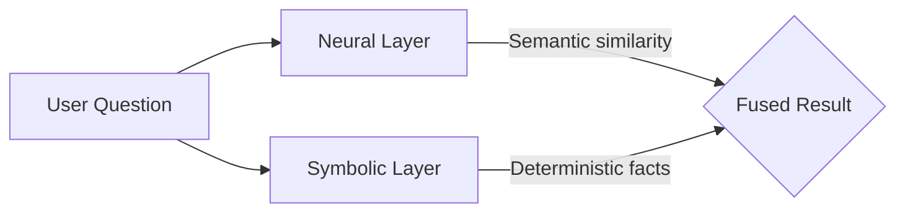

## Philosophy

## Stateless limits

You face a structural ceiling with modern AI. Today’s systems rely almost
exclusively on vector proximity—a shallow, probabilistic memory. This works
for simple retrieval, but as knowledge grows, the limits of flat embeddings
become clear.

When you rely on similarity alone, context begins to decay. Older information
resurfaces when it no longer applies. Conflicting facts create noise. Reasoning
slows down as the system struggles to distinguish between what is relevant now
and what was relevant before. Most tools treat memory as a storage problem;
Worlds treats it as an evolutionary one.

## Stateful substrate

You can build with **stateful intelligence**. For your agents to truly reason,
they must navigate a persistent map of reality where context and memory are one.

- **Unified state**: Merge the "now" of context with the "why" of history. Every
  outcome informs your agent's future retrieval, allowing it to connect past
  experience to present choices.
- **Context graphs**: Model your knowledge as a graph so your agents can reason
  about what changed and why it matters.
- **Knowledge operations**: Move beyond flashy demos. Build systems capable of
  continuous, reliable, and goal-directed operations that weave your agents into
  verifiable workflows.

## Deterministic precision

Your agents' intelligence depends on the bridge between probabilistic generation
and deterministic data. You can avoid unexplainable models by grounding your
models in logic.

- **Hybrid architecture**: Utilize a [neuro-symbolic](/overview/introduction)
  framework. Pair neural network processing for meaning with symbolic precision
  for facts. This ensures your agents navigate a map of reality built on logical
  grounding rather than guesswork.
- **Production readiness**: Prioritize the hard parts of AI: rigorous
  integration, error handling, and the monitoring you need for software.
- **Systems that reason**: Shift your engineering from building smart tools to
  building self-managing systems. Build applications that reason, not
  hallucinate.

## Unhobbling agents

You must unhobble your AI agents to build resilient systems. Shift from
providing rigid, micromanaged prompt scripts to assigning your agent a job with
a clear mission and a deterministic environment.

Early AI models were forced to answer instantly, generating text without the
ability to plan or revise. Worlds provides the persistent substrate required for
high autonomy, allowing models to pause, save state, and work through problems
step-by-step.

Unhobbled agents capable of longer-horizon reasoning proactively investigate
tool documentation, navigate complex workflows automatically, and gracefully
self-correct when they encounter unexpected errors. Instead definitions of tasks
that break when the environment changes, grant your agents tool access and trust
their native processing over a verifiable state.

## Sovereignty

Retain absolute ownership of the knowledge your agents carry. Your intelligence
must remain your own.

- **Edge-first autonomy**: Ensure knowledge resides on your local machine, a
  private server, or at the network edge—never trapped in a central cloud
  silo.
- **Data sovereignty**: Own your [triples](/worlds/facts). Use open standards
  like RDF to ensure your knowledge is never trapped in a proprietary vault.
- **Swappable models**: Swap models—OpenAI, Gemini, or local—without losing
  your agent's persistent state.

## Invisible tech

The best technology disappears from your workflow.

- **Calm tech**: Abstract the complexities of graph management and SPARQL
  optimization. The infrastructure handles the core processing of edge
  synchronization and vector coordination while you focus on the build.
- **Transparency**: Gain full visibility into how your agents process data.
  Open-source architecture prevents vendor lock-in and enables you to customize
  every layer.
- **Malleable knowledge**: Mutate your world models in real-time. Data is not
  static, and your knowledge must be as fluid as the environments it describes.

A World acts as a **Digital Garden** for your agents—a private, evolving
context where relationships and history are maintained with deterministic
integrity.

<Info>
  Just as databases became foundational infrastructure for software, persistent
  context will become foundational infrastructure for AI. Worlds is building
  that infrastructure.
</Info>

## Why neuro-symbolic?

Contrast traditional RAG patterns with the neuro-symbolic architecture.

| Feature         | Semantic RAG                | Worlds                     |
| :-------------- | :-------------------------- | :------------------------- |
| **Recall type** | Probabilistic generation    | Deterministic precision    |
| **Logic**       | Implicit weight-based logic | Explicit RDF-based logic   |
| **Querying**    | Similarity search           | SPARQL 1.1 + Hybrid Search |
| **State**       | Ephemeral / Static          | Malleable / Verifiable     |

## Neuro-symbolic

**Neuro-symbolic** describes the core architectural pattern of the Worlds
Platform. It combines two complementary paradigms:

| Layer        | Powered by                | Strength                          |
| :----------- | :------------------------ | :-------------------------------- |
| **Neural**   | LLM + vector embeddings   | Natural-language understanding    |
| **Symbolic** | RDF graph + SPARQL engine | Deterministic logic and precision |

## Why both?

Neural networks excel at interpreting meaning but can hallucinate. Symbolic
systems are precise but brittle with unstructured input. By fusing the two,
Worlds lets an agent _understand_ a question via the neural layer, and _prove_
the answer via the symbolic layer.

## In practice

1. **Ingestion** — An LLM extracts structured [triples](/worlds/facts) from
   raw text.
2. **Retrieval** — [Hybrid search](/worlds/search) combines vector similarity
   with graph traversal.
3. **Reasoning** — [SPARQL](/worlds/query) queries return verifiable facts the
   agent can cite.

## A Brief History

The story of human progress is the story of how information is stored, shared,
and processed. Each layer of progress compounds into the next in an accelerating
trajectory.

The **Worlds Ecosystem** is the latest chapter in this ancient narrative. It
builds upon millennia of innovation in externalized thought, returning to the
original vision of universal data portability, associative linking, and the
persistent item graph.

<Danger>
  **The architectural critique: The desktop metaphor**

To understand Worlds, you must first unlearn the desktop. The 1980s GUI
prioritized mass adoption by office workers by mimicking physical constraints,
such as files in paper folders. This decision fundamentally broke data
portability. When data is locked inside apps and files, associative linking
becomes impossible, and AI agents lack the necessary context to truly augment
cognition.

</Danger>

## Oral history

**300,000–10,000 BCE**

For the vast majority of human existence, the human brain was the only hard
drive. Progress was slow not because early humans lacked intelligence, but lost
if a tribe or elder perished. Early societies relied on
[oral traditions](https://en.wikipedia.org/wiki/Oral_tradition), using myth,
rhythm, and song as [mnemonic](https://en.wikipedia.org/wiki/Mnemonic) devices
to encode vital survival data across generations.

Eventually, the impulse to externalize thought began to emerge. Long before the
famous [cave paintings of Lascaux](https://en.wikipedia.org/wiki/Lascaux), early
humans were experimenting with symbolic storage. In places like
[**Blombos Cave**](https://en.wikipedia.org/wiki/Blombos_Cave) in South Africa,
archaeologists have found pieces of ochre etched with deliberate, cross-hatched
geometric patterns dating back over 70,000 years. This marks the dawn of
[symbolic representation](https://en.wikipedia.org/wiki/Symbolic_behavior)—the
realization that a physical object could hold a mental concept.

## Agriculture

**10,000–1,000 BCE**

The true catalyst for systemic knowledge externalization was not poetry or
religion, but bureaucracy. The
[Agricultural Revolution](https://en.wikipedia.org/wiki/Neolithic_Revolution)
forced humans to settle, creating food surpluses that needed to be managed,
taxed, and traded.

In ancient [Mesopotamia](https://en.wikipedia.org/wiki/Mesopotamia), accountants
began using small
[clay tokens](https://en.wikipedia.org/wiki/History_of_the_clay_token_system) to
represent bushels of grain or heads of cattle. Over millennia, to prevent theft
and fraud, they began pressing these tokens into flat clay envelopes. They soon
realized they didn't need the tokens inside at all—the impressions on the
outside were enough.

This evolution produced
[**Cuneiform**](https://en.wikipedia.org/wiki/Cuneiform), the first fully
developed writing system. Writing did not begin as a way to record history; it
began as a spreadsheet.

## Phonetics

**1,500 BCE–1,000 CE**

Early writing systems like Cuneiform and
[Egyptian Hieroglyphs](https://en.wikipedia.org/wiki/Egyptian_hieroglyphs) were
logographic— symbols representing whole words—and incredibly complex,
requiring years of study. This centralized knowledge in the hands of elite
[scribal classes](https://en.wikipedia.org/wiki/Scribe).

The democratization of knowledge began with the invention of the alphabet.
Canaanite miners in the
[Sinai Peninsula](https://en.wikipedia.org/wiki/Sinai_Peninsula) adapted
Egyptian hieroglyphs to represent individual sounds rather than whole words,
known as the
[Proto-Sinaitic script](https://en.wikipedia.org/wiki/Proto-Sinaitic_script).
The [Phoenicians](https://en.wikipedia.org/wiki/Phoenicia) later refined and
spread this [phonetic system](https://en.wikipedia.org/wiki/Phoenician_alphabet)
across the Mediterranean. Because an alphabet only required learning two or
three dozen symbols, it made literacy highly portable and accessible to a
broader population.

Meanwhile, other complex societies engineered vastly different media. The
[Inca Empire](https://en.wikipedia.org/wiki/Inca_Empire) managed millions of
subjects across mountainous Andean terrain without a written script. Instead,
they used the [**Khipu**](https://en.wikipedia.org/wiki/Quipu)—a sophisticated
and enigmatic system of knotted, dyed strings that encoded numerical data, tax
records, and potentially narrative histories in a three-dimensional, tactile
format.

## Replication

**1,000–1900 CE**

Even with portable alphabets and lightweight substrates like
[parchment](https://en.wikipedia.org/wiki/Parchment) and
[paper](https://en.wikipedia.org/wiki/History_of_paper), invented in
[Han Dynasty](https://en.wikipedia.org/wiki/Han_dynasty) China, reproducing
knowledge remained a slow, manual bottleneck. A monk could spend a year copying
a single text.

The paradigm shifted with the mechanization of writing. China and Korea
developed [movable type](https://en.wikipedia.org/wiki/Movable_type) first, but
[Johannes Gutenberg's printing press](https://en.wikipedia.org/wiki/Gutenberg_Bible)
in 15th-century Europe triggered a rapid information revolution. By collapsing
the cost of producing books, the press broke the Church and State's monopoly on
information. It fueled the
[Renaissance](https://en.wikipedia.org/wiki/Renaissance), catalyzed the
[Scientific Revolution](https://en.wikipedia.org/wiki/Scientific_Revolution),
and allowed scholars across continents to compare standardized data, find
errors, and build upon each other's work.

## Digital substrate

**20th century**

By the mid-20th century, humanity reached the physical limits of paper-based
knowledge. Managing the sheer volume of global information required a new
substrate entirely.

### The Memex

**1945**

As World War II concluded,
[Vannevar Bush](https://en.wikipedia.org/wiki/Vannevar_Bush) published his
influential essay,
[_As We May Think_](https://en.wikipedia.org/wiki/As_We_May_Think). He
recognized that human knowledge was expanding faster than the human ability to
navigate it. He proposed the [**Memex**](https://en.wikipedia.org/wiki/Memex)
(memory extension)—a mechanized private file and library system.

Crucially, Bush realized that the human mind does not work via rigid
alphabetical indexes or hierarchical folders. The mind operates by association.
Bush argued that any data system must allow users to map associative "trails"
between arbitrary items. The Memex was not only a storage device; it served as
the first conceptual model for a knowledge graph.

### The mother of all demos

**1968**

Inspired directly by Bush,
[Douglas Engelbart](https://en.wikipedia.org/wiki/Douglas_Engelbart) formalized
these ideas at the
[Stanford Research Institute](https://en.wikipedia.org/wiki/SRI_International).
In 1962, he published
[_Augmenting Human Intellect_](https://en.wikipedia.org/wiki/Augmenting_Human_Intellect),
arguing that computers should not merely automate tasks, but rather evolve human
analytical capability, specifically neuro-symbolic reasoning.

In his landmark 1968
["mother of all demos,"](https://en.wikipedia.org/wiki/The_Mother_of_All_Demos)
Engelbart demonstrated:

- The computer mouse
- [Hypertext](https://en.wikipedia.org/wiki/Hypertext) linking
- Collaborative, real-time editing
- [**Transclusion**](https://en.wikipedia.org/wiki/Transclusion): The ability to
  view a live instance of a conceptual item across multiple contexts without
  duplicating the underlying data.

Engelbart proved that the computer served as a malleable medium for associated
thought, not only an electronic abacus.

### Desktop metaphor

**The 1980s**

So why do modern computers not work this way?

When companies like Apple and Microsoft brought computing to the masses,
Engelbart's concepts of infinite, associative graphs proved too complex for mass
appeal. The industry required an immediate, recognizable crutch: the **desktop
metaphor**.

By organizing data into isolated physical metaphors—documents placed inside
folders and owned by proprietary applications—the system neutralized the
cognitive load of learning computing. But it severed the associative links
envisioned by Bush. Data became a hostage to the specific interface that created
it. This created **application silos**.

### Return of the graph

**The 2000s**

As the internet scaled, the limitations of the desktop metaphor severely
impacted the web.
[Sir Tim Berners-Lee](https://en.wikipedia.org/wiki/Tim_Berners-Lee) championed
the [**Semantic Web**](https://en.wikipedia.org/wiki/Semantic_Web), aiming to
give meaning to information rather than linking static HTML pages.

This led to the [W3C](https://en.wikipedia.org/wiki/World_Wide_Web_Consortium)'s
standardization of the
[**Resource Description Framework (RDF)**](https://en.wikipedia.org/wiki/Resource_Description_Framework).
RDF enforces a strict rule: all data must be expressed as **statements**
(triples) consisting of a subject, predicate, and object.

However, raw RDF proved too complex and abstract for widespread adoption by
everyday web developers. Instead of becoming the way _humans_ built the web, the
Semantic Web succeeded by going invisible—becoming the underlying
infrastructure that machines use to understand it.

### Schema.org

**The 2010s**

In 2011, the operators of the world's largest search engines—Google, Bing, and
Yahoo—collaborated to launch **[Schema.org](https://schema.org/)**. They
recognized that to build intelligent search engines, they needed a universal
vocabulary for structured data that was easier to implement than raw RDF.

By translating human-readable web content into machine-readable markup, such as
[JSON-LD](https://en.wikipedia.org/wiki/JSON-LD),
[Schema.org](https://schema.org/) allowed algorithms to stop merely matching
keywords and start understanding _items_ and their relationships. Today, this
semantic layer powers the massive
[Knowledge Graphs](https://en.wikipedia.org/wiki/Knowledge_graph), rich search
snippets, and AI overviews that define the modern internet.

Simultaneously, the Semantic Web evolved into the underlying infrastructure for
codified official data across the globe. Governments, healthcare networks, and
scientific communities use
[linked open data](https://en.wikipedia.org/wiki/Linked_data) principles to
break down information silos. From standardizing global electronic health
records to mapping federal regulatory codes, semantic technologies now provide a
secure, interoperable framework for the world's most critical data.

Looking back, the creation of [ARPANET](https://en.wikipedia.org/wiki/ARPANET)
and eventually the
[World Wide Web](https://en.wikipedia.org/wiki/World_Wide_Web) made information
weightless, instantaneously transmissible, and globally networked. Humanity
transitioned from individual, localized libraries into a single, interconnected,
planetary nervous system. But it was the integration of the Semantic Web that
finally gave this nervous system a structured, decipherable memory.

## Symbiotic era

**Present**

Every era in this story follows the same pattern: a new medium for externalizing
thought removes a bottleneck, and civilization surges forward. Cave walls freed
memory from mortal minds. Writing freed accounting from human recall. The
printing press freed ideas from scarcity. The internet freed information from
physical location.

But all of these systems share a fundamental limitation: they are _passive_.
Clay tablets, printed books, and even Wikipedia do not think. They wait silently
until a human mind retrieves, interprets, and applies the information they
contain.

The threshold where that changes is being crossed.

With the rise of
[large language models](https://en.wikipedia.org/wiki/Large_language_model),
autonomous agents, and machine learning systems trained on humanity's collective
written output, externalized memory is becoming **active**. For the first time,
the medium itself can read, synthesize, pattern-match, and generate
knowledge—operating across vast datasets far beyond any individual human's
cognitive reach. The external hard drive has learned to think.

### Completing the arc

The Worlds Ecosystem unites Engelbart's vision of augmented intellect with the
standards of RDF, and packages it for modern developers.

Worlds removes the app icon entirely. It treats all data as a **universal item
store**, returning computing to its associative roots:

- **Persistent, neuro-symbolic memory for AI agents**: Agents do not rely on
  probabilistic guessing to retrieve facts. Because Worlds uses knowledge
  graphs, they navigate deterministic, verifiable truths—the same associative
  trails Bush imagined in 1945, now traversed autonomously.
- **Transclusion replaces copy-pasting**: A statement, which is an atom of
  knowledge, exists objectively in the world. Multiple applications and agents
  can reference, mutate, and fork that exact item in real-time without
  duplicating it—realizing the vision of connected knowledge at a universal
  scale.
- **Universal portability**: Because Worlds uses open standards, your knowledge
  graph never remains trapped inside a proprietary vendor silo. The data _is_
  the platform.

### The horizons ahead

Looking further, two emerging frontiers suggest the externalization of thought
is far from complete:

- [**Brain-Computer Interfaces (BCIs)**](https://en.wikipedia.org/wiki/Brain%E2%80%93computer_interface):
  Technologies that will blur the boundary between biological memory and digital
  storage, potentially granting direct neural access to externalized
  knowledge—collapsing the last remaining friction between thinking and
  knowing.
- [**Ambient Computing**](https://en.wikipedia.org/wiki/Ambient_intelligence):
  An environment where digital intelligence is woven into the physical world,
  making the retrieval and application of human knowledge as effortless and
  invisible as breathing.

From ochre scratched onto stone 70,000 years ago to a planetary knowledge graph
traversed by autonomous minds—the arc of human progress has always bent toward
the same destination: making captured knowledge _available_ to everyone, and
everything, that can use it. Worlds is the latest and most deliberate step along
that path.