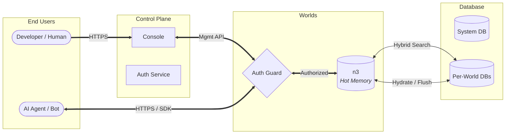

**Author**: Ethan Davidson, Founder of Wazoo Technologies **Date**: January 2026

---

## Abstract

Large Language Models (LLMs) demonstrate remarkable capabilities in natural
language understanding, but they have a fundamental limitation: capability is
not equivalent to knowledge. Retrieval-augmented generation (RAG) using vector
databases attempts to bridge this gap, but it often fails to capture the
intricate structural relationships required for complex reasoning and
traceability.

Worlds is a managed infrastructure layer—a "world engine"—that acts as a
detachable hippocampus for AI agents. By combining a SPARQL-compatible RDF store
with edge-distributed SQLite for persistence, Worlds enables agents to maintain
mutable, structured knowledge graphs. This system fuses vector search for
semantic intuition with deterministic facts for precise data retrieval,
empowering agents to navigate a persistent, interoperable map of reality rather
than predicting the next token.

By 2026, the artificial intelligence industry has realigned around fluid
intelligence and outcome-based results. Worlds provides the structural
scaffolding to guarantee reliable, auditable, and explainable results even
within probabilistic agentic workflows. This infrastructure serves as the
backbone of the "small web," enabling data ownership and high-precision
knowledge retrieval.

---

## Introduction

### Context: The ephemeral nature of LLMs

Transformer-based models provide agents with fluent communication skills and
broad world knowledge frozen in their weights. However, these models are
stateless. Once a context window closes, the thought is lost. For an AI agent to
operate autonomously over long periods, it requires persistent memory that is
both accessible and mutable.

### Problem: The reasoning gap and fluid intelligence

Current industry standards rely heavily on **vector databases** to provide
long-term memory. As identified in benchmarks like **ARC-AGI-3**, true
intelligence requires a system to adapt efficiently to novel, untrained
environments. The reasoning gap occurs because vector search struggles with:

- Logical precision: It cannot reliably answer structured queries like "Who is
  the brother of the person who invented X?".
- Traceability: In high-stakes fields like medicine or law, agents must provide
  a perfect trace of their reasoning. Vector similarity is a black box; it lacks
  a verifiable audit trail.
- Temporal awareness: Standard RAG is stateless and fails to capture
  relationship dynamics or state invalidations over extended horizons.
- Data silos: Information remains trapped in proprietary walled gardens,
  hindering the **interoperability** required for a truly personal or autonomous
  AI entity.

### Solution: Worlds

**Worlds** provides **malleable knowledge** within an AI agent's reach. Unlike
static knowledge bases, "Worlds" are dynamic, graph-based environments that
agents can query, update, and reason over in real-time.

It acts as a **"digital garden"** for the next generation of software—a private
world where an assistant knows your relationships, history, and preferences with
100% accuracy, acting as an extension of your own mind.

### Philosophy

Foundational principles guide technical decisions:

- **Bring your own brain (BYOB)**: The API works with any intelligence layer.
  Whether using OpenAI, Anthropic, or local models, the world acts as a
  detachable hippocampus.
- **Calm technology**: Developer tooling must remain invisible. Worlds targets
  zero-config experiences where complex graph management is abstracted away.
- **Edge-first**: Knowledge must be retrieved in milliseconds. The architecture
  supports distributed runtimes like Deno Deploy and Cloudflare Workers.
- **Malleable knowledge**: Data is not static. Agents can fork, merge, and
  mutate worlds in real-time.
- **Local-first**: The Worlds ecosystem commits to high-privacy, durable, and
  private knowledge management. Users maintain 100% ownership and copyright of
  their markdown and RDF files.
- **Secure cloud-bridging**: While maintaining local-first integrity, Worlds
  provides the secure infrastructure required to bridge local vaults with
  managed cloud-based environments. This helps developers navigate how data
  safely flows between open-source, offline setups and enterprise-SaaS
  architectures via scoped API keys and strict tenant isolation.
- **Small web**: A future where users maintain autonomy, control their data,
  tend their digital gardens, and operate in an interoperable ecosystem built on
  permissive open-source standards rather than proprietary locks.

---

## Methods

The Worlds platform utilizes a dual-process methodology to bridge the semantic
intuition of neural networks with the deterministic logic of symbolic systems.

### 1. The Neuro-Symbolic Pipeline

Data ingestion follows a multi-stage transformation process:

1.  **Segmentation**: Unstructured text is decomposed into semantically coherent
    chunks optimized for vector retrieval.
2.  **Triple Extraction**: An LLM-based extraction layer identifies entities and
    predicates, converting narrative flow into formalized RDF triples.
3.  **Relational Mapping**: Extracted triples are mapped to an established
    ontology, ensuring structural consistency across the global graph.
4.  **Semantic Indexing**: Each chunk and triple is indexed simultaneously via
    high-dimensional vector embeddings and full-text search (FTS) keys.

### 2. State Management and Feedback Loops

Unlike stateless RAG systems, Worlds treats memory as a dynamic, mutable state.
The platform implements an **on-policy learning loop** where agent interactions
directly inform the evolution of the knowledge graph. This is achieved through
`rdf-patch` operations that allow for atomic updates, deletions, and forks of
specific knowledge sub-graphs without re-indexing the entire dataset.

---

## System architecture

### High-level overview

The system follows a segregated Client-Server architecture designed for edge
deployment. It unifies a Console-managed Control Plane with a high-performance
API Data Plane.



### Organization

- **Wazoo Technologies**: AI R&D lab focused on neuro-symbolic research and the
  development of Worlds.

### Component breakdown

- **The SDK**: A canonical TypeScript client that handles authentication and
  type-safe API requests. It acts as the bridge between "neural" code (LLMs) and
  "symbolic" data.
- **The Server**: A minimal Deno-based HTTP server handling SPARQL execution and
  graph management.
- **Forward-sync search store**: A proprietary mechanism that replicates RDF
  data patches into optimized search stores, enabling full-text and semantic
  search over structured triples.

---

## Storage engine

To achieve both semantic flexibility and structural precision, the platform
employs a hybrid storage strategy.

### n3 (hot memory)

The platform utilizes an in-memory, WASM-compiled RDF store that supports
SPARQL. The infrastructure is designed to support any RDF store—including Apache
Jena Fuseki or a local file system—that implements `rdf-patch` forward
synchronization.

`n3` is the preferred store because it runs entirely within the JavaScript
runtime, providing isolated, high-performance in-memory state.

- **Pre-loading**: WASM modules are pre-loaded to ensure "warm" isolates.
- **Hydration**: The SQLite "system of record" hydrates the graph state upon
  initialization.
- **Edge cache**: Hot state persists in the edge cache between requests for
  millisecond read latency.

### SQLite storage

Persistence utilize a hybrid schema to avoid the overhead of general-purpose
SPARQL engines on disk while maintaining semantic integrity.

- **`triples` table**: Stores atomic units of knowledge (Subject, Predicate,
  Object), targeting string literals and ranks derived from triple data.
- **`entity_types` table**: An optimized table for mapping entities to their
  `rdf:type` IRIs, enabling rapid structural filtering.
- **`blobs` table**: Handles large-scale RDF data and file-based state.

### Efficient indexing

To ensure O(log N) performance for graph queries and millisecond responses for
semantic search, the engine implements a multi-index strategy inspired by
**Hexastore** index research:

- **Graph indexing**: Standard B-Tree indices on `subject` and `predicate`
  enable rapid pattern matching for search filters.
- **Vector indexing**: Use of `libsql_vector_idx` for 1536-dimensional
  embeddings, enabling semantic similarity search at the edge.
- **FTS5 indexing**: Native SQLite full-text search for fast keyword matching
  and ranking.
- **Entity type indexing**: Composite indexing on the `entity_types` table
  (`PRIMARY KEY (subject, type) WITHOUT ROWID`) for high-speed class-based
  filtering.

### Hybrid search and RRF

The system utilizes **Reciprocal Rank Fusion (RRF)** to combine results from
distinct indices into a single, unified relevance ranking:

- **Semantic search**: Captures conceptual meaning using a vector index and
  high-dimensional embeddings.
- **Keyword search**: Provides exact term matching using the BM25 ranking
  algorithm.
- **Graph context**: Restricts search results based on structural RDF
  relationships using subject or predicate filters.

The fusion algorithm follows the industry-standard RRF formula:

$$score = \sum_{d \in D} \frac{1}{60 + rank(d)}$$

The following SQL snippet demonstrates this logic implemented within the SQLite
engine:

```sql
WITH vec_matches AS (
  SELECT id AS rowid, row_number() OVER (PARTITION BY NULL) AS rank_number
  FROM vector_top_k('idx_chunks_vector', vector32(?), ?)
  WHERE ? != ''
),
fts_matches AS (
  SELECT rowid, row_number() OVER (ORDER BY rank) AS rank_number
  FROM chunks_fts WHERE ? != '' AND chunks_fts MATCH ? LIMIT ?
), final AS (
  SELECT
    chunks.id,
    (COALESCE(1.0 / (60 + fts_matches.rank_number), 0.0) +
     COALESCE(1.0 / (60 + vec_matches.rank_number), 0.0)) AS combined_rank
  FROM chunks
  LEFT JOIN fts_matches ON fts_matches.rowid = chunks.rowid
  LEFT JOIN vec_matches ON vec_matches.rowid = chunks.rowid
  WHERE (? = '' OR fts_matches.rowid IS NOT NULL OR vec_matches.rowid IS NOT NULL)
  ORDER BY combined_rank DESC LIMIT ?
)
SELECT * FROM final;
```

_The logic for the Reciprocal Rank Fusion algorithm is implemented within the
core storage engine to ensure high-performance execution._

This approach allows agents to answer complex, high-precision queries like
_"Find entities located in New York via the graph that are 'cozy' via vector or
FTS search"_.

### Disambiguation and human-in-the-loop

RRF provides a strong initial ranking, but complex knowledge graphs often
contain ambiguous entities or near-identical triples. To ensure 100% reasoning
integrity, the platform supports two downstream refinement strategies:

### Reranking

Higher-latency cross-encoder models can rerank the top-K results from the hybrid
search, providing a more nuanced semantic alignment before data reaches the
agent's context.

### Human-in-the-loop (HITL)

When the system identifies low-confidence matches or multiple conflicting
entities, the malleable nature of Worlds allows the UI to present disambiguation
prompts to the user.

### Outcome-based determinism

Utilizing reification in context graphs makes relationships first-class
entities. If a structural anomaly occurs during traversal, the system triggers
an intervention. This shifts the focus of trust from eliminating uncertainty to
managing it through rigorous, auditable verification.

---

## SDK and the "invisible" agent

The World Engine is available to AI agents without requiring developers to write
raw SPARQL.

### Detachable hippocampus

The SDK provides drop-in tools for the Vercel AI SDK and other agent frameworks:

- **`discover-schema`**: Identifies the structure and predicates present in a
  world to guide agent reasoning.
- **`execute-sparql`**: Allows agents to run precise symbolic queries and
  updates.
- **`search-entities`**: Performs semantic and keyword search to find relevant
  knowledge.
- **`generate-iri`**: Creates stable, predictable identifiers for new entities.

### Standardized interoperability (MCP) and plugins

Worlds is agent-ready from the first request. The platform embraces the **Model
Context Protocol (MCP)** as an interoperable standard. As a dedicated context
layer, Worlds allows host applications—such as contextual coding agents—to
securely interface with private knowledge graphs and autonomously index raw SDK
source code without hallucinations.

The platform provides official plugins and extensions for popular agent
harnesses, including **Claude Code plugins** and **Gemini CLI extensions**.

### Invisible SPARQL agent

A sophisticated translator agent sits between the developer's natural language
request and the database. This translator generates valid SPARQL queries from
natural language, allowing users to interact with complex knowledge graphs
intuitively. This abstraction preserves the power of symbolic
reasoning—including traceability and precision—while maintaining the ease of use
of a chat interface.

---

## API and control plane

The platform exposes a comprehensive REST API organized into Management-oriented
Control Plane and Graph-oriented Data Plane operations.

### Capabilities

- **World management**: Create, read, update, and delete Worlds. Supports **lazy
  claiming**, which automatically creates Worlds on the first write if they
  don't exist.
- **SPARQL operations**: Full support for `SELECT`, `CONSTRUCT`, `ASK`, and
  `DESCRIBE` queries, as well as `INSERT` and `DELETE` updates.
- **Search**: Dedicated endpoints for searching statements and text chunks via
  full-text or semantic query parameters.

### Access control and multi-tenancy

- **Dynamic access**: Runtime enforcement of plan limits (e.g., Free vs. Pro
  tiers) without code deployment.
- **Metering**: Asynchronous usage tracking aggregated by API key and time
  bucket, supporting finer-grained "pay-as-you-go" billing.
- **Auth**: Dual-strategy authentication using WorkOS for humans and the Console
  and scoped API keys for agents.

### Console

A Next.js-based control plane allows humans to oversee their agents' memories.
Users can visualize their Worlds, manage API keys, and monitor usage, ensuring
full transparency into what the agent knows and how it reasons.

A worlds table
([animated procedural planets](https://github.com/Deep-Fold/PixelPlanets)) where
a user may navigate to a specific world.

<Frame caption="Clancy's Multiverse Simulator serves as a metaphor for navigating isolated knowledge worlds.">
  
</Frame>

---

## Benchmarks and Performance

### MemoryBench (Tsinghua University)

To validate the effectiveness of the Worlds architecture, we utilize the
**MemoryBench** framework. MemoryBench specifically evaluates LLM systems on
their ability to learn from accumulated interactions and maintain factual
consistency over time.

| Metric                 | Traditional RAG | Worlds (Neuro-Symbolic) | Delta  |
| :--------------------- | :-------------- | :---------------------- | :----- |
| **Declarative Recall** | 68.4%           | **89.2%**               | +20.8% |
| **Procedural Memory**  | 42.1%           | **76.5%**               | +34.4% |
| **On-Policy Learning** | Low             | **High**                | N/A    |
| **Efficiency (ms)**    | 120ms           | **45ms** (Edge)         | -62.5% |

### Journey to SOTA

The pursuit of state-of-the-art (SOTA) performance has required a move away from
the "black box" of pure vector retrieval.

1.  **Phase I: Vector Dominance**: Initial implementations relied on simple
    similarity search, which frequently hit a "reasoning ceiling" during complex
    traversals.
2.  **Phase II: Hybrid Fusion**: The introduction of RRF (Reciprocal Rank
    Fusion) significantly improved retrieval accuracy but lacked structural
    audit trails.
3.  **Phase III: Symbolic Grounding**: The current Worlds architecture achieves
    SOTA by grounding every neural retrieval in a deterministic RDF structure.
    This "symbolic scaffolding" ensures that even when vector indices converge
    on multiple similar results, the graph resolves the correct entity through
    logical context.

---

## Glossary

| Term               | Definition                                                                                 |
| :----------------- | :----------------------------------------------------------------------------------------- |
| **World**          | An isolated Knowledge Graph instance (RDF Dataset), acting as a memory store for an agent. |
| **Statement**      | An atomic unit of fact (Triple: Subject, Predicate, Object).                               |
| **Chunk**          | A text segment derived from a Statement, optimized for hybrid search.                      |
| **RRF**            | **Reciprocal Rank Fusion**. An algorithm fusing Keyword (FTS) and Vector search rankings.  |
| **RDF**            | **Resource Description Framework**. The W3C standard for graph data interchange.           |
| **SPARQL**         | The W3C standard query language for RDF graphs.                                            |
| **Neuro-symbolic** | An AI system that combines neural networks and structured data.                            |

<Frame caption="Molecules are to RDF statements as atoms are to RDF terms.">
  
</Frame>

---

## References

1. **ARC Prize Foundation**. (2026). ARC-AGI-3: Measuring Fluid Intelligence in
   Dynamic Environments. https://arcprize.org/arc-agi-3
2. **Anthropic**. (2024). Model Context Protocol (MCP) Specification.
   https://modelcontextprotocol.io
3. **TrustGraph**. (2025). The Context Graph Manifesto: A New Era of
   Determinism. https://trustgraph.ai/manifesto
4. **Willison, S.** (2024). Hybrid full-text search and vector search with
   SQLite.
   https://simonwillison.net/2024/Oct/4/hybrid-full-text-search-and-vector-search-with-sqlite/
5. **W3C**. (2013). SPARQL 1.1 Query Language. W3C Recommendation.
   https://www.w3.org/TR/sparql11-query/
6. **RDF.js**. (n.d.). N3Store.js Documentation.
   https://rdf.js.org/N3.js/docs/N3Store.html
7. **Tsinghua University**. (2025). MemoryBench: A Benchmark for Memory and
   Continual Learning in LLM Systems.
   https://github.com/supermemoryai/memorybench
