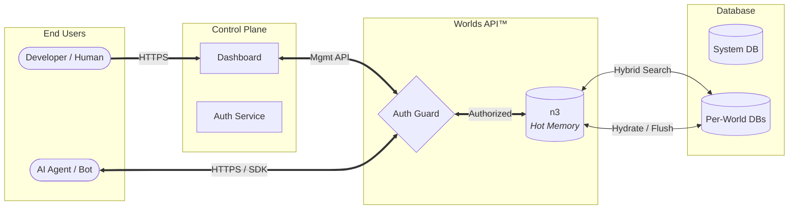

# Worlds API: Malleable Knowledge at the Edge for Neuro-Symbolic Agents

**Author**: EthanThatOneKid (Founder, FartLabs) **Date**: January 2026
**Institution**: FartLabs Research at Wazoo Technologies

---

## Abstract

Large Language Models (LLMs) have demonstrated remarkable capabilities in
natural language understanding, yet they suffer from a fundamental limitation:
capability is not equivalent to knowledge. While Retrieval-Augmented Generation
(RAG) using vector databases attempts to bridge this gap, it often fails to
capture the intricate structural relationships required for complex reasoning
and "traceability" of facts.

**Worlds API™** is a managed neuro-symbolic infrastructure layer—a "World
Engine"—that acts as a detachable hippocampus for AI agents. By combining an
in-memory SPARQL-compatible RDF store (n3) with edge-distributed SQLite for
persistence, Worlds API enables agents to maintain mutable, structured knowledge
graphs. This system implements a hybrid architecture fusing **Vector Search**
(semantic intuition) with **Symbolic Logic** (RDF/SPARQL precision), empowering
agents to navigate a persistent, interoperable map of reality rather than just
predicting the next token. This infrastructure is the backbone of the "Small
Web," enabling true data ownership and breaking down the walled gardens of
proprietary AI silos.

---

## 1. Introduction

### 1.1 The Context: The Ephemeral Nature of LLMs

The rise of Transformer-based models has revolutionized artificial intelligence,
providing agents with fluent communication skills and broad "world knowledge"
frozen in their weights. However, these models are fundamentally stateless. Once
a context window closes, the "thought" is lost. For an AI agent to operate
autonomously over long periods, it requires persistent memory that is both
accessible and mutable.

### 1.2 The Problem: The Reasoning Gap

Current industry standards rely heavily on **Vector Databases** to provide
long-term memory. This approach converts text into high-dimensional embedding
vectors. While effective for semantic similarity (finding documents _about_
"cats"), vector search struggles with:

1. **Logical Precision**: It cannot reliability answer structured queries like
   "Who is the brother of the person who invented X?".
2. **Traceability**: In high-stakes fields like medicine or law, agents need to
   provide a perfect trace of their reasoning. Vector similarity is black-box;
   it lacks a verifiable audit trail.
3. **Data Silos**: Information remains trapped in proprietary "walled gardens,"
   hindering the interoperability required for a truly personal AI assistant.

### 1.3 The Solution: Worlds API

We propose **Worlds API**, a system designated to provide **Malleable
Knowledge** within arm's reach of the AI agent. Unlike static knowledge bases,
"Worlds" are dynamic, graph-based environments that agents can query, update,
and reason over in real-time.

It acts as a **"Digital Garden"** for the next generation of software—a private
"World" where an assistant knows your relationships, history, and preferences
with 100% accuracy, acting as an extension of your own mind.

### 1.4 Philosophy

We adhere to core philosophical pillars to guide technical decisions:

- **Bring Your Own Brain (BYOB)**: The API is agnostic to the intelligence
  layer. Whether using OpenAI, Anthropic, or local models, the "World" acts as a
  detachable hippocampus.
- **Calm Technology**: Developer tooling should be invisible. We target
  "Zero-Config" experiences where complex graph management is abstracted away.
- **Edge-First**: Knowledge must be retrieved in milliseconds. The architecture
  is designed for distributed runtimes (Deno Deploy, Cloudflare Workers).
- **Malleable Knowledge**: Data is not static. "Worlds" are designed to be
  forked, merged, and mutated by agents in real-time.
- **The "Small Web"**: A future where users maintain autonomy, control their
  data/privacy, and chose applications that serve them, built on open standards
  (RDF) rather than proprietary locks.

---

## 2. System Architecture

### 2.1 High-Level Overview

The system follows a segregated Client-Server architecture designed for edge
deployment. It unifies a Control Plane (Dashboard) with a high-performance Data
Plane (API).

### 2.2 Organization

- **Wazoo Technologies**: The parent company providing enterprise-grade
  stability.
- **FartLabs**: The R&D division (Subsidiary) focused on neuro-symbolic research
  and the development of the Worlds API.

### 2.3 Component Breakdown

1. **The SDK**: A canonical TypeScript client that handles authentication and
   type-safe API requests. It acts as the bridge between "neural" code (LLMs)
   and "symbolic" data.
2. **The Server**: A minimal Deno-based HTTP server handling SPARQL execution
   and graph management.
3. **Forward-Sync Search Store**: A proprietary mechanism that replicates RDF
   data patches into optimized search stores, enabling full-text and semantic
   search over structured triples.

---

## 3. Storage Engine

To achieve both semantic flexibility and structural precision, we employ a
hybrid storage strategy.

### 3.1 n3 (Hot Memory)

An in-memory, WASM-compiled RDF store that supports SPARQL 1.1. This allows for
complex graph pattern matching (e.g., recursive queries, property paths) that
SQL and Vectors cannot easily handle.

- **Pre-loading**: WASM modules are pre-loaded to ensure "warm" isolates.
- **Hydration**: Graph state is hydrated from the SQLite "System of Record" upon
  initialization.
- **Edge Cache**: Hot state persists in the Edge Cache between requests for
  millisecond read latency.

### 3.2 Normalized SQLite (Cold Storage)

We utilize a **Normalized Schema** for persistence to avoid the overhead of
general-purpose SPARQL engines on disk while maintaining semantic integrity.

- **`terms` Table**: Deduplicates IRIs, Literals, and Blank Nodes.
- **`statements` Table**: Stores relationships as integer triples referencing
  the `terms` table.
- **`chunks` Table**: The source of truth for text segments, optimized for
  search.

### 3.3 Hexastore Indexing

To ensure O(log N) performance for any RDF triple pattern, we implement a
**Hexastore** strategy using SQLite's "covered indices". We maintain three
permutation tables (`spo`, `pos`, `osp`) to ensure that queries matching any
pattern (Subject, Predicate, or Object) can leverage an optimal index.

### 3.4 Hybrid Search & RRF

We utilize **Reciprocal Rank Fusion (RRF)** to combine results from distinct
indices:

1. **Vector Index**: For semantic similarity (512-dim embeddings).
2. **Full-Text Search (FTS5)**: For exact keyword matching (BM25).
3. **SPARQL Graph Queries**: For structural relationships.

The fusion algorithm normalizes scores from these sources to provide a unified
relevance ranking, allowing agents to answer queries like _"Find entities
located in New York (Graph) that are 'cozy' (Vector/FTS)"_.

---

## 4. The "Invisible" Agent & SDK

Our goal is to make the "World" seamlessly available to AI agents without
requiring developers to write raw SPARQL.

### 4.1 The Detachable Hippocampus

The SDK provides drop-in tools for the Vercel AI SDK and other agent frameworks:

- **`remember`**: Ingests facts or unstructured text into the World.
- **`recall`**: Searches the World using Hybrid Search.
- **`forget`**: Removes specific knowledge via cascading deletes.

### 4.2 The Invisible SPARQL Agent

We implement a sophisticated translator agent that sits between the developer's
natural language request and the database. This "Invisible Agent" generates
valid SPARQL queries from natural language, allowing users to interact with
complex knowledge graphs intuitively. This abstraction preserves the power of
symbolic reasoning (traceability, precision) while maintaining the ease of use
of a chat interface.

---

## 5. API & Control Plane

The platform exposes a comprehensive REST API organized into Control Plane
(Management) and Data Plane (Graph) operations.

### 5.1 Capabilities

- **World Management**: Create, read, update, and delete Worlds. Supports **Lazy
  Claiming**, automatically creating Worlds on the first write if they don't
  exist.
- **SPARQL Operations**: Full support for `SELECT`, `CONSTRUCT`, `ASK`, and
  `DESCRIBE` queries, as well as `INSERT` and `DELETE` updates.
- **Search**: Dedicated endpoints for searching Statements and Text Chunks via
  full-text or semantic query parameters.

### 5.2 Access Control & Multi-tenancy

- **Dynamic Access**: Runtime enforcement of plan limits (e.g., Free vs. Pro
  tiers) without code deployment.
- **Metering**: Asynchronous usage tracking aggregated by API Key and time
  bucket, supporting finer-grained "Pay-as-you-go" billing.
- **Auth**: Dual-strategy authentication using WorkOS (for Humans/Dashboard) and
  Scoped API Keys (for Agents).

### 5.3 The Dashboard

A Next.js-based control plane allows humans to oversee their agents' memories.
Users can visualize their Worlds, manage API keys, and monitor usage, ensuring
full transparency into what the agent knows and how it reasons.

A worlds grid
([animated procedural planets](https://github.com/Deep-Fold/PixelPlanets)) where
a user may navigate to a specific world.

---

## 6. Glossary

| Term               | Definition                                                                                  |
| :----------------- | :------------------------------------------------------------------------------------------ |
| **World**          | An isolated Knowledge Graph instance (RDF Dataset), acting as a memory store for an agent.  |
| **Statement**      | An atomic unit of fact (Quad: Subject, Predicate, Object, Graph).                           |
| **Chunk**          | A text segment derived from a Statement's Object, treating the Statement as a RAG document. |
| **RRF**            | **Reciprocal Rank Fusion**. An algorithm fusing Keyword (FTS) and Vector search rankings.   |
| **RDF**            | **Resource Description Framework**. The W3C standard for graph data interchange.            |
| **SPARQL**         | The W3C standard query language for RDF graphs.                                             |
| **Neuro-symbolic** | An AI system that combines the strengths of neural networks and structured data.            |

---

## 7. References

1. **Oxigraph**. (n.d.). Oxigraph: SPARQL graph database. GitHub.
   https://github.com/oxigraph/oxigraph
2. **RDF.js**. (n.d.). N3Store.js. RDF.js Documentation.
   https://rdf.js.org/N3.js/docs/N3Store.html
3. **Willison, S.** (2024, October 4). Hybrid full-text search and vector search
   with SQLite. Simon Willison's Weblog.
   https://simonwillison.net/2024/Oct/4/hybrid-full-text-search-and-vector-search-with-sqlite/
4. **W3C**. (2013). SPARQL 1.1 Query Language. W3C Recommendation.
   https://www.w3.org/TR/sparql11-query/
5. **Ha, D., & Schmidhuber, J.** (2018). World Models. arXiv preprint
   arXiv:1803.10122. https://worldmodels.github.io/
6. **Worlds API™**. (2025). Worlds API™ Design Document. GitHub.
   https://github.com/EthanThatOneKid/worlds-design
7. **Arxiv**. (2024). Thinking with Knowledge Graphs.
   https://arxiv.org/abs/2412.10654
8. **Arxiv**. (2025). Jelly: RDF Serialization Format.
   https://arxiv.org/abs/2506.11298
