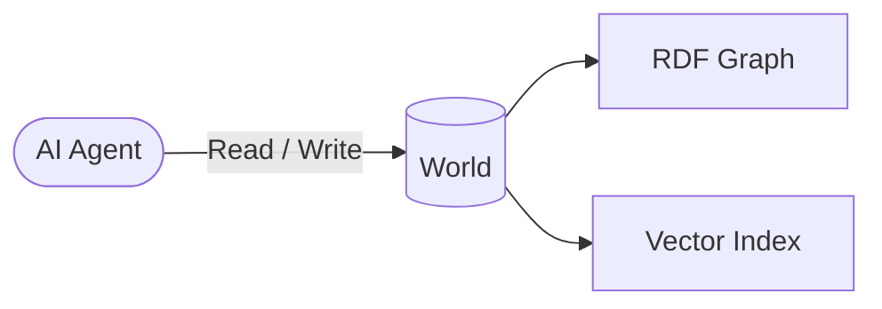
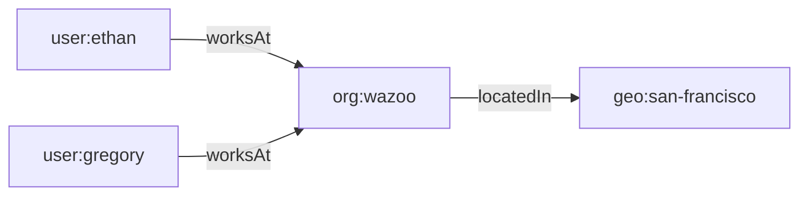

A **World** is the foundational resource of the Worlds Platform. It is an
isolated container for your agents to store and query context. Every world has
its own dedicated SQLite database.

<Note>
  You'll need an [API Key](/reference#authentication) and the [Worlds SDK](/quickstart)
  installed to run these examples.
</Note>

<CodeGroup>

```typescript TypeScript
import { WorldsClient } from "@wazoo/worlds-sdk";

const client = new WorldsClient({ token: process.env.WORLDS_API_KEY });

// Create a new isolated world
const world = await client.worlds.create({
  slug: "assistant-context",
  label: "Assistant Context",
  description: "Core knowledge graph primitives",
});

console.log(`Created world: ${world.id}`);
```

```python Python
from worlds import WorldsClient
import os

client = WorldsClient(token=os.environ.get("WORLDS_API_KEY"))

# Create a new isolated world
world = client.worlds.create(
    slug="assistant-context",
    label="Assistant Context",
    description="Persistent memory for personal assistant agent."
)

print(f"Created world: {world.id}")
```

```bash HTTP API
curl -X POST "https://api.wazoo.dev/v1/worlds" \
  -H "Authorization: Bearer $WORLDS_API_KEY" \
  -H "Content-Type: application/json" \
  -d '{
    "slug": "assistant-context",
    "label": "Assistant Context",
    "description": "Persistent memory for personal assistant agent."
  }'
```

</CodeGroup>

## Core methods

| Method   | Description                                        |
| :------- | :------------------------------------------------- |
| `create` | Provision a new isolated world container.          |
| `get`    | Retrieve metadata and status of an existing world. |
| `list`   | List all worlds associated with your account.      |
| `delete` | Permanently destroy a world and all its memory.    |

## Deep dive

### Key properties

| Property         | Description                                                                 |
| :--------------- | :-------------------------------------------------------------------------- |
| **Isolation**    | Each World has its own database — zero cross-contamination.                 |
| **Portability**  | Memory persists across model swaps, from OpenAI to Gemini or a local model. |
| **Statefulness** | Facts are mutable and versioned, not static snapshots.                      |

### How it works

A World pairs an **RDF dataset**, functioning as the symbolic layer, with a
**vector search index**, which acts as the neural layer. Together they allow an
agent to reason over structured facts _and_ perform natural-language retrieval
within the same container.



Inside every World, the knowledge graph is constructed entirely of **Items**
connected by **Facts**.

### Items

An **Item**, also known as an Entity in broader RDF contexts, is any distinct
"thing" in your world—a person, a piece of code, a company, or a concept.

Every item is represented as a node in the Worlds knowledge graph.

#### Attributes of an item

- **Identification**: A unique **IRI**, or Internationalized Resource
  Identifier, identifies every item.
- **Classes**: Items are categorized by their type using standard properties
  like `rdf:type`, such as `User`, `Project`, or `Task`.

Items are connected to each other via properties to form a [Triple](#facts),
establishing a fact in the world.

### Facts

Every world starts empty. You populate it by adding facts.

A **triple** is the smallest piece of information stored in a World. Every fact
is expressed as three components:

| Component     | Role                         | Example          |
| :------------ | :--------------------------- | :--------------- |
| **Subject**   | The item being described     | `user:ethan`     |
| **Predicate** | The relationship or property | `schema:worksAt` |
| **Object**    | The target value or item     | `org:wazoo`      |

Together they read as a single statement: **Ethan works at Wazoo.**

#### Anatomy of a triple


A triple statement is built from fundamental components called **RDF Terms**.
There are two primary types of nodes that make up these terms:

- **Named nodes (URIs/IRIs)**: Unique identifiers that point to specific, global
  items or properties. Subjects and Predicates must always be named nodes,
  allowing them to explicitly link to other parts of the graph.
- **Literal nodes (Values)**: Raw data values, such as strings, numbers, or
  dates like `"Ethan"` or `42`. Literals can only ever be Objects. They sit at
  the edge of the graph and cannot have outbound relationships.

When an object named node is connected to a subject named node via a predicate
named node, the graph expands. When it connects to a literal node, the path
terminates.

### Etymology

A fact is a statement that is represented in a computer as a triple, in other
literature also called a triplet, tuple, statement, quad, or edge. The term
"triple" is used to emphasize that every fact is composed of three components.

### Why triples?

Triples follow the
**[RDF (Resource Description Framework)](https://www.w3.org/TR/rdf-primer/)**
standard. Because every fact shares the same structure, triples compose
naturally into a graph—no schema migrations, no table joins.



As the graph grows, the agent can traverse relationships to infer new knowledge,
for example, that Ethan and Gregory share the same work location.

## Learn more

- [Academy: Symbolic graph architecture](/contribute/architecture) — building
  graphs from triples
- [Knowledge Graphs guide](/guides/knowledge-graphs) — advanced graph topologies

<CardGroup cols={2}>
  <Card title="CLI Guide" icon="terminal" href="/reference/cli">
    Manage Worlds directly from your terminal.
  </Card>
  <Card title="API Reference" icon="code" href="/reference">
    Explore the exhaustive OpenAPI specifications.
  </Card>
</CardGroup>
