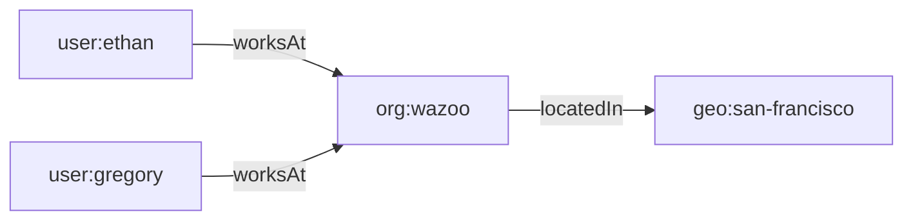

A **World** is the foundational resource of the Worlds Platform. It is an
isolated container where an agent's relationships, history, and facts live as a
queryable graph.

## Key properties

| Property         | Description                                                                 |
| :--------------- | :-------------------------------------------------------------------------- |
| **Isolation**    | Each World has its own database — zero cross-contamination.                 |
| **Portability**  | Memory persists across model swaps, from OpenAI to Gemini or a local model. |
| **Statefulness** | Facts are mutable and versioned, not static snapshots.                      |

## How it works

A World pairs an **RDF dataset**, functioning as the symbolic layer, with a
**vector search index**, which acts as the neural layer. Together they allow an
agent to reason over structured facts _and_ perform natural-language retrieval
within the same container.

Inside every World, the knowledge graph is constructed entirely of **Items**
connected by **Facts**.

## Items

An **Item** (also known as an Entity in broader RDF contexts) is any distinct
"thing" in your world—a person, a piece of code, a company, or a concept.

Every item is represented as a node in the Worlds knowledge graph.

### Attributes of an Item

- **Identification**: A unique **IRI**, or Internationalized Resource
  Identifier, identifies every item.
- **Classes**: Items are categorized by their type using standard properties
  like `rdf:type` (e.g., `User`, `Project`, or `Task`).

Items are connected to each other via properties to form a [Triple](/worlds),
establishing a fact in the world.

## Facts

Every world starts empty. You populate it by adding facts.

A **triple** is the smallest piece of information stored in a World. Every fact
is expressed as three components:

| Component     | Role                         | Example          |
| :------------ | :--------------------------- | :--------------- |
| **Subject**   | The item being described     | `user:ethan`     |
| **Predicate** | The relationship or property | `schema:worksAt` |
| **Object**    | The target value or item     | `org:wazoo`      |

Together they read as a single statement: **Ethan works at Wazoo.**

#### Anatomy of a triple

A triple statement is built from fundamental components called **RDF Terms**.
There are two primary types of nodes that make up these terms:

- **Named nodes (URIs/IRIs)**: Unique identifiers that point to specific, global
  items or properties. Subjects and Predicates must always be named nodes,
  allowing them to explicitly link to other parts of the graph.
- **Literal nodes (Values)**: Raw data values, such as strings, numbers, or
  dates (e.g., `"Ethan"`, `42`). Literals can only ever be Objects. They sit at
  the edge of the graph and cannot have outbound relationships.

When a named node (Object) is connected to another named node (Subject) via a
named node (Predicate), the graph expands. When it connects to a literal node,
the path terminates.

### Etymology

A fact is a statement that is represented in a computer as a triple, in other
literature also called a triplet, tuple, statement, quad, or edge. The term
"triple" is used to emphasize that every fact is composed of three components.

### Why triples?

Triples follow the
**[RDF (Resource Description Framework)](https://www.w3.org/TR/rdf-primer/)**
standard. Because every fact shares the same structure, triples compose
naturally into a graph—no schema migrations, no table joins.

As the graph grows, the agent can traverse relationships to infer new knowledge
(for example, that Ethan and Gregory share the same work location).

### Learn more

- [Academy: Symbolic graph architecture](/contribute/architecture) — building
  graphs from triples
- [Knowledge Graphs guide](/guides/knowledge-graphs) — advanced graph topologies
